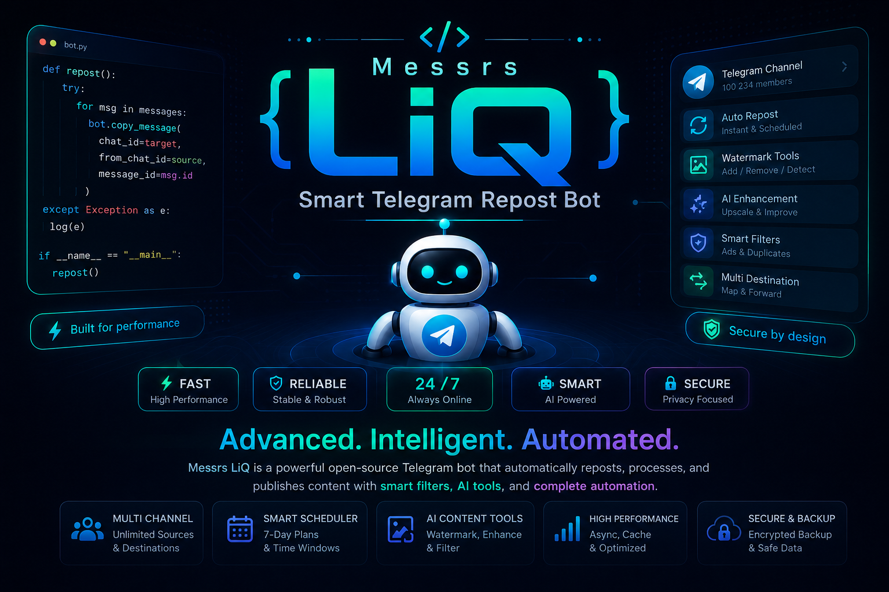
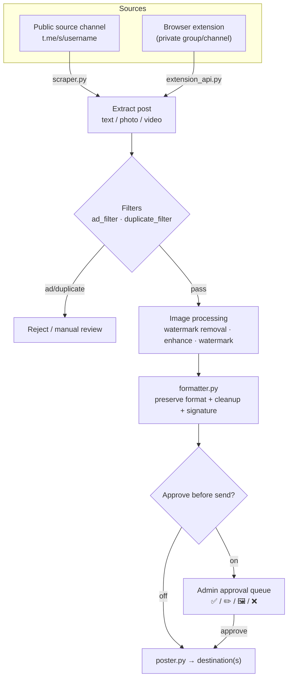

<a id="top"></a>

<div align="center">

🇮🇷 [فارسی](README.md) | 🇬🇧 **English** | 🇷🇺 [Русский](README.ru_RU.md) | 🇨🇳 [中文](README.zh_CN.md)



<h3>Smart reposting, AI image processing, and complete Telegram channel automation — all from inside the bot.</h3>

[](CHANGELOG.md)
[](tests/)
[](https://www.python.org/)
[](LICENSE)
[](https://core.telegram.org/bots/api)
[](#architecture)
[-FF7139?style=flat-square&logo=googlechrome&logoColor=white)](browser-extension/)
[](https://github.com/LiQTeam/telegram-repost/commits)
[](CONTRIBUTING.md)
[](#)

</div>

---

<a id="introduction"></a>

## 📖 Introduction

**A complete Telegram channel automation engine — not just a "copy-paste" bot.**

Messrs LiQ is a smart **Python** Telegram repost bot that reads posts from source channels, processes and cleans them (watermarks, AI quality enhancement, link/ad removal), and delivers them to destination channels on your schedule — all controlled from inside the bot via inline glass buttons, with no separate web panel.

Unlike a simple repost bot, it **preserves the original post formatting** (bold/italic/links/spoilers), runs images through an **AI image pipeline** (watermark removal with LaMa and quality enhancement with Real-ESRGAN), **automatically filters** ad and duplicate posts, and offers an **approve-before-send queue** to review and edit each post before it goes live.

Posts are read from Telegram's public web preview (`t.me/s/username`), so the bot works with just a bot token and needs no Telegram session or API ID (MTProto) — simple, safe setup, at the cost of source channels needing to be public. For private channels, a **browser extension** is included.

<a id="toc"></a>

## 📑 Table of Contents

<table align="center" width="100%">
<tr>
  <td align="center" width="25%">📖 <a href="#introduction">Introduction</a></td>
  <td align="center" width="25%">⚠️ <a href="#important">Important</a></td>
  <td align="center" width="25%">✨ <a href="#features">Features</a></td>
  <td align="center" width="25%">🏗 <a href="#architecture">Architecture</a></td>
</tr>
<tr>
  <td align="center">🚀 <a href="#quick-start">Quick Start</a></td>
  <td align="center">⚙️ <a href="#configuration">Configuration</a></td>
  <td align="center">🖥 <a href="#requirements">Requirements</a></td>
  <td align="center">📦 <a href="#structure">Project Structure</a></td>
</tr>
<tr>
  <td align="center">⚠️ <a href="#limitations">Limitations</a></td>
  <td align="center">🤝 <a href="#contributing">Contributing</a></td>
  <td align="center">📄 <a href="#license">License</a></td>
  <td align="center">⭐ <a href="#support">Support</a></td>
</tr>
</table>

<a id="important"></a>

## ⚠️ Important (read before installing)

> [!IMPORTANT]
> - **Source channels must be public** — content is read from `t.me/s/username`. For private channels/groups, use the **browser extension**.
> - **This is not a Userbot/MTProto client** — it works with just a bot token; so "instant" mode has up to a 30-second delay, not exactly at publish time.
> - **AI features are optional** — watermark removal (LaMa) and quality enhancement (Real-ESRGAN) need model files (~220MB) and `torch`; without them the bot runs fully and only these two are disabled.
> - **AI adjudication and image generation need API keys** — without keys, the filter falls back to its local logic (keywords/links/mentions).
> - **Do not expose the extension API to the open internet** — the token travels as plain text; enable it only behind a firewall.

<a id="features"></a>

## ✨ Features

Every feature is drawn straight from the source, with the relevant module named.

### 📡 Channel Management
- **Multiple source & destination channels** — any number of public sources and destinations, each independently toggleable. `database.py`
- **Arbitrary source ↔ destination mapping** — one source to many destinations, one destination from many sources (full fan-out). `scheduler.py`
- **Custom channel names** — a readable label in lists instead of the raw username. `handlers/inputs.py`

### ⏱ Scheduling & Delivery
- **Seven-slot hourly schedule** — each source has seven independent slots (Tehran time), each separately toggleable and re-timeable. `scheduler.py`
- **Three send modes** — scheduled, instant (30s polling), or interval (every N minutes); one active per source. `scheduler.py`
- **Downtime catch-up** — a slot's pending post is sent once as soon as the bot comes back. `scheduler.py`
- **Instant send of the last 10/20/30 posts** — under that channel's approval rule. `manual_poster.py`

### 🛡 Content Approval
- **Approve-before-send queue** — a preview of each post with four buttons: **✅ Approve**, **✏️ Edit caption**, **🖼 Replace photo**, **❌ Reject**. `poster.py`
- **Per-user dedicated approval channel** — each operator has their own queue in a separate channel. `cli.py`

### 🖼 Image Processing & Watermark
- **AI image quality enhancement** — sharpen/upscale with `SRVGGNetCompact` (Real-ESRGAN family), CPU-tuned. `sr_model.py`
- **Independent Telegram & Instagram watermarks** — text, 6 positions, solid/gradient color (10 presets), opacity, size, and a live preview. `custom_watermark.py`
- **AI watermark removal** — detection via Template Matching and corner heuristics, inpainting with **LaMa** and automatic fallback to `cv2.inpaint`. `ai_watermark.py` · `lama_model.py`

### 🤖 Artificial Intelligence
- **Text-adjudication router** — auto-selects between **Mistral** and **Groq** by text length/type. `ai_router.py`
- **Image generation with a failover chain** — Pollinations → DeepAI → Stable Horde. `image_router.py`

### 🧠 Smart Filtering
- **Ad-post filter (v3)** — context-aware analysis (keywords, link/mention counts, collection mode, VPN/proxy config files) + optional AI adjudication; action is "reject" or "manual review." `ad_filter.py`
- **Duplicate-post filter** — exact (hash) matching + a fuzzy layer for the same news with different signatures. `duplicate_filter.py`
- **Formatting preservation & cleanup** — Telegram-safe HTML + automatic removal of the source's links/mentions/phone numbers and an end-of-post signature. `formatter.py`

### 📰 Auto-Publishing (isolated module)
- **News, prices & ads** — a separate subsystem with its own database (`auto_poster.db`): prices (fiat/crypto/gold/markets), scheduled ads, and news with an approval queue. `bot/auto_poster/`

### 🛠 Operations & Resilience
- **Encrypted backup & restore** — password-protected backups, send-to-channel, and restore with a per-table SAVEPOINT. `backup_manager.py`
- **Cache & concurrency** — download cache with TTL, and heavy work on a separate thread under a semaphore. `cache.py` · `concurrency.py`
- **Monitoring & notifications** — CPU/RAM/disk monitoring, admin notifications to a private channel, and a public report channel. `resource_monitor.py` · `notification_manager.py` · `public_report_channel.py`
- **Filter feedback report (+ Excel)** — filter performance stats and details as an Excel file. `ad_feedback_report.py`

### 🌐 Browser Extension & Tools
- **Telegram Web connector (Chrome MV3)** — reads content from an open private group/channel in your logged-in tab and sends it to the bot via a local API. `browser-extension/` · `extension_api.py`
- **Full panel + CLI** — colored inline buttons (Bot API 9.4) and a command-line tool to add channels/users, list, view stats, and back up. `button_style.py` · `cli.py`

<a id="architecture"></a>

## 🏗 Architecture

The path of a single post from source to destination:



Heavy work runs on a separate thread under a semaphore so the bot never locks up.

<a id="quick-start"></a>

## 🚀 Quick Start

On a Linux server (Ubuntu / Debian / CentOS), install with one command:

```bash
curl -fsSL https://raw.githubusercontent.com/LiQTeam/telegram-repost/main/install.sh | sudo bash
```

The installer is **interactive** and prompts for:

| Prompt | Description |
|---|---|
| Bot token | from [@BotFather](https://t.me/BotFather) |
| Admin ID(s) | from [@userinfobot](https://t.me/userinfobot), comma-separated |
| Default destination channel | optional — can be added later |
| Mistral / Groq key | optional — for AI adjudication |

It then installs prerequisites, a `virtualenv`, dependencies and AI models, writes `.env`, and runs the bot as a **systemd** service (always-on + auto-restart, timezone `Asia/Tehran`). Finally, send `/start` to the bot in Telegram.

<details>
<summary><b>Service management & manual install</b></summary>

<br/>

**Service management:**

```bash
systemctl status  mrliq-bot     # status
systemctl restart mrliq-bot     # restart (after editing .env)
journalctl -u mrliq-bot -f      # live logs
```

**Manual install:**

```bash
git clone https://github.com/LiQTeam/telegram-repost.git
cd telegram-repost
python3 -m venv venv && source venv/bin/activate
pip install -r requirements.txt --extra-index-url https://download.pytorch.org/whl/cpu
cp .env.example .env      # then fill .env with your token/IDs
python3 main.py
```

> Docker is not supported; the official deployment is via systemd.

</details>

<a id="configuration"></a>

## ⚙️ Configuration

All variables are read from `.env` (sample: [`.env.example`](.env.example)). Only `BOT_TOKEN` and `ADMIN_IDS` are required.

| Variable | Required | Default | Description |
|---|:---:|---|---|
| `BOT_TOKEN` | ✅ | — | Bot token from @BotFather |
| `ADMIN_IDS` | ✅ | — | Admin numeric IDs, comma-separated |
| `TARGET_CHAT_ID` | — | — | Default destination channel |
| `DB_PATH` | — | `data/bot.sqlite` | SQLite database path |
| `TIMEZONE` | — | `Asia/Tehran` | Timezone for scheduling |
| `MAX_CONCURRENT_HEAVY_JOBS` | — | `3` | Max images processed concurrently |
| `DOWNLOAD_CACHE_MAX_ITEMS` | — | `200` | Download-cache item cap |
| `DOWNLOAD_CACHE_TTL_SECONDS` | — | `1800` | Cache item retention (seconds) |
| `DOWNLOAD_CACHE_MAX_BYTES` | — | `157286400` | Total cache cap (bytes, 150MB) |
| `MAX_DOWNLOAD_BYTES` | — | `62914560` | Per-file download cap (60MB) |
| `AD_FILTER_CACHE_MAX_ITEMS` | — | `2000` | AI-result cache cap |
| `AD_FILTER_CACHE_TTL_SECONDS` | — | `21600` | Ad-filter cache TTL (seconds) |
| `TEMPLATE_MATCH_THRESHOLD` | — | `0.75` | Watermark template-match threshold |
| `MAX_WATERMARK_AREA_RATIO` | — | `0.3` | Max inpaint region area ratio |
| `MISTRAL_API_KEY` / `GROQ_API_KEY` | — | — | AI adjudication keys (optional) |
| `POLLINATIONS_API_KEY` / `DEEPAI_API_KEY` / `STABLEHORDE_API_KEY` | — | — | Image-gen keys (optional) |
| `EXTENSION_API_ENABLED` | — | `false` | Enable the extension API |
| `EXTENSION_API_HOST` / `EXTENSION_API_PORT` | — | `0.0.0.0` / `8843` | Extension API host and port |
| `EXTENSION_API_TOKEN` | — | — | Shared bot ↔ extension token |

<a id="requirements"></a>

## 🖥 Requirements

| Item | Minimum / Recommended |
|---|---|
| **Python** | 3.10 or newer |
| **OS** | Linux (Ubuntu / Debian / CentOS and derivatives) |
| **RAM** | 1GB minimum; **2GB+ recommended** with AI features enabled |
| **Disk** | ~500MB core + **~220MB** AI models (`big-lama.pt` ~200MB, `realesr-general-x4v3.pth` ~17MB) |

**Key dependencies:** `python-telegram-bot 21.6`, `aiohttp`, `beautifulsoup4`, `Pillow`, `opencv-python-headless`, `torch 2.4.1 (CPU)`, `cryptography`, `psutil`, `jdatetime`. Full list in [`requirements.txt`](requirements.txt).

<a id="structure"></a>

## 📦 Project Structure

```
telegram-repost/
├── main.py                  # entry point: bot + scheduler + monitor + extension API
├── cli.py                   # command-line tool (channels/users, list, stats, backup)
├── install.sh               # automatic VPS install (systemd, model downloads)
├── requirements.txt · .env.example · CHANGELOG.md
├── assets/                  # banners and donate button
├── fonts/                   # Persian Vazirmatn font (watermark)
├── data/                    # SQLite DB + logs (created at runtime)
├── docs/                    # extra docs (deployment, debug)
├── scripts/                 # banner/button generators (Pillow)
├── tests/                   # automated tests — python3 tests/run_all.py
├── browser-extension/       # Telegram Web connector (Chrome MV3)
└── bot/
    ├── config.py · database.py · scraper.py · formatter.py
    ├── poster.py · scheduler.py · smart_scheduler.py · manual_poster.py
    ├── watermark.py · custom_watermark.py · ai_watermark.py · lama_model.py · sr_model.py
    ├── image_router.py · ai_router.py · ad_filter.py · duplicate_filter.py · ad_feedback_report.py
    ├── cache.py · concurrency.py · backup_manager.py · extension_api.py
    ├── resource_monitor.py · notification_manager.py · public_report_channel.py
    ├── button_style.py · button_config.py · jdatetime_utils.py · utils.py · keyboards.py
    ├── handlers/            # menu.py · inputs.py · common.py
    └── auto_poster/         # isolated "prices/ads/news" module (separate DB)
```

<a id="limitations"></a>

## ⚠️ Known Limitations

- Source channels must be public (private only via the extension).
- Instant mode has up to a 30s delay (no MTProto/Userbot).
- Large videos sometimes have no direct link on the public preview and are skipped.
- Source image quality is already compressed by Telegram; "AI enhancement" partially compensates, it doesn't restore the original.
- In scheduled mode, a source's daily send ceiling equals its active slots (up to 7).
- Button colors are visible only in up-to-date Telegram apps (three colors: blue/green/red).
- AI models and API keys are optional; without them the related features are gracefully disabled.

<a id="contributing"></a>

## 🤝 Contributing

Contributions are welcome! Please read [`CONTRIBUTING.md`](CONTRIBUTING.md) before opening a Pull Request. In short: fork the repo, work on a separate branch, run the tests with `python3 tests/run_all.py`, and open a PR with a clear description.

<a id="license"></a>

## 📄 License

Released under the **MIT** license — see [`LICENSE`](LICENSE).

<a id="support"></a>

## ⭐ Support

If this project helped you, give it a ⭐ — it's the best motivation to keep developing.

<div align="center">
<br/>
<!-- Replace with your own donation link -->
<a href="https://github.com/LiQTeam/telegram-repost"></a>
<br/><br/>
<sub><a href="#top">⬆️ Back to top</a></sub>
</div>
