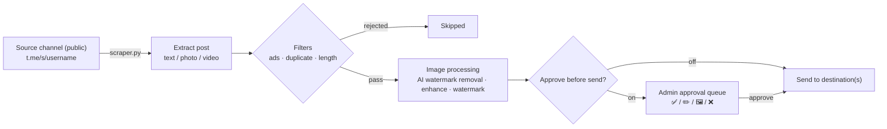

<div align="center">

[فارسی](README.md) | **English**


[](CHANGELOG.md)
[](tests/)
[](https://www.python.org/)
[](LICENSE)
[](#)

</div>

A smart Telegram repost bot (Python) with a complete admin panel **inside the bot itself**: multiple source and destination channels with arbitrary mapping between them, a seven-slot hourly schedule per source channel (Tehran time), graphical watermarks on images, AI-based quality enhancement and watermark removal, and an approve-before-send queue. This is a full rewrite of the previous PHP panel — instead of a separate web panel, everything is controlled through inline glass buttons inside the bot, and the original message formatting (bold/italic/links/…) is preserved (not just raw text like the old PHP version).

> [!IMPORTANT]
> Posts are read from Telegram's **public web preview** (`t.me/s/username`), so every **source channel must be public**. This project is not a full Userbot/MTProto client; that's why it needs no Telegram session or API ID and works with just a bot token — but as a result, "instant" mode happens with up to a 30-second delay (the bot's polling interval), not exactly at publish time.

## ✨ Features

- **Multiple source & destination channels** — any number of public source channels and destinations, each independently toggleable.
- **Arbitrary source ↔ destination mapping** — one source can fan out to many destinations, and one destination can receive from many sources.
- **Seven-slot hourly schedule** — each source channel has seven independent hourly slots (Tehran time), each separately toggleable and re-timeable.
- **Three send modes** — seven-slot schedule, instant (30s polling), or interval (every N minutes); chosen per source channel.
- **Approve before send** — a final preview of each post with ✅ approve / ✏️ edit caption / 🖼 replace photo / ❌ reject, before it reaches the destination.
- **Independent graphical watermark** — separate watermarks for Telegram and Instagram, with fully configurable text/position/gradient color/opacity/size and a live preview.
- **AI watermark removal** — detection via Template Matching and corner heuristics, then inpainting with the **LaMa** model (with automatic fallback to OpenCV inpaint).
- **AI image quality enhancement** — sharpen/upscale low-quality images with the lightweight `SRVGGNetCompact` model (Real-ESRGAN family), tuned for CPU.
- **Formatting preservation + smart cleanup** — carries over bold/italic/links/spoilers, plus automatic removal of the source channel's links/mentions/phone numbers and a linked signature at the end of each post.
- **Automatic ad-post filter** — detection by keywords, link/mention counts and collection mode; with reject or send-for-manual-review options (+ optional AI adjudication).
- **Full in-bot admin panel** — every setting via inline glass buttons with meaningful colors (Bot API 9.4), no separate web panel needed.
- **"News & Prices" module** — an isolated subsystem for auto-publishing prices, scheduled ads, and news (with an admin approval queue).
- **Browser extension** — connect open private Telegram Web groups/channels to the bot via a local API.
- **Encrypted backups** — safe database backup with a per-table SAVEPOINT and encryption.
- **One-click VPS install** — the `install.sh` script sets up the virtualenv, dependencies, `.env` file, and a systemd service automatically.

## 📸 Screenshots

<details>
<summary>Click to expand</summary>

<!-- Add bot panel screenshots here -->
<!-- e.g.


-->

</details>

## 🚀 Quick Start

One-line install on a Linux server (Ubuntu / Debian / CentOS):

```bash
curl -fsSL https://raw.githubusercontent.com/LiQTeam/telegram-repost/main/install.sh | sudo bash
```

> Prefer to clone the repo manually:
> ```bash
> git clone https://github.com/LiQTeam/telegram-repost.git
> cd telegram-repost
> sudo bash install.sh
> ```

The installer is **interactive** and prompts you for these values at runtime:

1. **Bot token** (from [@BotFather](https://t.me/BotFather))
2. **Admin numeric ID(s)** (from [@userinfobot](https://t.me/userinfobot)) — comma-separate multiple admins
3. **Default destination channel ID** (optional — leave empty and add any number of destinations later from inside the bot)
4. **Mistral / Groq API keys** (optional — for the ad filter's AI adjudication)

It then installs prerequisites, creates a virtualenv, installs the libraries, writes the `.env` file, and runs the bot as a **systemd** service (always-on + auto-restart). The default timezone is `Asia/Tehran`.

After install, send `/start` to the bot in Telegram. To change `.env` values manually, restart the service afterward:

```bash
nano .env
systemctl restart mrliq-bot      # apply changes
systemctl status  mrliq-bot      # status
journalctl -u mrliq-bot -f       # live logs
```

> **Persian font (for watermarks):** the `Vazirmatn` fonts ship inside the `fonts/` folder; to use a different font, drop its `.ttf` into that folder and restart the service.

## ⚙️ Configuration

All variables are read from the `.env` file (sample: [`.env.example`](.env.example)). Only `BOT_TOKEN` and `ADMIN_IDS` are required; everything else has a safe default.

| Variable | Default | Description |
|---|---|---|
| `BOT_TOKEN` | — | **(required)** Bot token from @BotFather |
| `ADMIN_IDS` | — | **(required)** Admin numeric IDs, comma-separated |
| `TARGET_CHAT_ID` | — | Default destination channel ID (optional) |
| `DB_PATH` | `data/bot.sqlite` | SQLite database path |
| `TIMEZONE` | `Asia/Tehran` | Timezone used for schedule calculations |
| `MAX_CONCURRENT_HEAVY_JOBS` | `3` | Max images processed concurrently (watermark/AI) |
| `DOWNLOAD_CACHE_MAX_ITEMS` | `200` | Max items in the download cache |
| `DOWNLOAD_CACHE_TTL_SECONDS` | `1800` | Cache item retention (seconds) |
| `DOWNLOAD_CACHE_MAX_BYTES` | `157286400` | Total download-cache cap (bytes, 150MB) |
| `MAX_DOWNLOAD_BYTES` | `62914560` | Per-file download cap (bytes, 60MB) |
| `AD_FILTER_CACHE_MAX_ITEMS` | `2000` | Max items in the ad-filter AI-result cache |
| `AD_FILTER_CACHE_TTL_SECONDS` | `21600` | Ad-filter cache TTL (seconds) |
| `TEMPLATE_MATCH_THRESHOLD` | `0.75` | Template-match threshold for watermark detection |
| `MAX_WATERMARK_AREA_RATIO` | `0.3` | Max area ratio of an inpaintable watermark region |
| `MISTRAL_API_KEY` | — | Mistral key (optional, AI adjudication) |
| `GROQ_API_KEY` | — | Groq key (optional, AI adjudication) |
| `POLLINATIONS_API_KEY` | — | Pollinations image-gen key (optional) |
| `DEEPAI_API_KEY` | — | DeepAI image-gen key (optional) |
| `STABLEHORDE_API_KEY` | — | Stable Horde image-gen key (optional) |
| `IMAGE_GEN_TIMEOUT` | `30` | Image generation timeout (seconds) |
| `IMAGE_GEN_MAX_RETRIES` | `2` | Max image-generation retries |
| `STABLEHORDE_POLL_TIMEOUT` | `180` | Stable Horde poll timeout |
| `STABLEHORDE_POLL_INTERVAL` | `5` | Stable Horde poll interval (seconds) |
| `EXTENSION_API_ENABLED` | `false` | Enable the browser-extension API |
| `EXTENSION_API_HOST` | `0.0.0.0` | Extension API host |
| `EXTENSION_API_PORT` | `8843` | Extension API port |
| `EXTENSION_API_TOKEN` | — | Shared bot ↔ extension token (behind a firewall) |

## 🏗 Architecture

The path of a single post from source to destination:



## 📦 Project Structure

```
telegram-repost/
├── main.py                     # bot entry point
├── cli.py                      # command-line tool (add source/dest channels, …)
├── install.sh                  # automatic VPS install (systemd)
├── requirements.txt
├── .env.example                # configuration sample
├── CHANGELOG.md
├── assets/
│   ├── banner.png              # README banner (built by scripts/make_banner.py)
│   └── badges/                 # watermark badge icons (Telegram/Instagram)
├── fonts/                      # Persian font (Vazirmatn) for watermarks
├── data/                       # SQLite DB + logs (created at runtime)
├── docs/                       # extra docs (deployment, debug report)
├── scripts/
│   └── make_banner.py          # README banner generator
├── tests/                      # automated tests (python3 tests/run_all.py)
├── browser-extension/          # Telegram Web connector (Chrome MV3)
│   ├── manifest.json
│   ├── background.js · content.js · popup.* · options.html
│   └── icons/
└── bot/
    ├── config.py               # reads settings from .env
    ├── database.py             # SQLite layer: channels, mappings, slots, logs
    ├── scraper.py              # fetches posts from t.me/s/username
    ├── formatter.py            # raw HTML → Telegram-safe HTML
    ├── watermark.py            # builds the watermark box with Pillow
    ├── custom_watermark.py     # independent Telegram/Instagram watermarks
    ├── ai_watermark.py         # watermark detection (OpenCV) + removal orchestration
    ├── lama_model.py           # watermark inpainting with LaMa (TorchScript)
    ├── sr_model.py             # quality enhancement (SRVGGNetCompact / Real-ESRGAN)
    ├── image_router.py         # image-processing router
    ├── ad_filter.py            # ad-post filter
    ├── ai_router.py            # AI adjudication (Mistral / Groq)
    ├── duplicate_filter.py     # duplicate-post filter
    ├── poster.py               # builds the final caption + sends to one destination
    ├── scheduler.py            # scheduler tick + fan-out to destinations
    ├── smart_scheduler.py      # smart scheduling
    ├── manual_poster.py        # manual / instant "send last posts"
    ├── cache.py                # download cache
    ├── concurrency.py          # semaphore + thread for heavy jobs
    ├── backup_manager.py       # encrypted backups
    ├── extension_api.py        # API server for the browser extension
    ├── notification_manager.py · resource_monitor.py · public_report_channel.py
    ├── keyboards.py · button_config.py · button_style.py · utils.py · jdatetime_utils.py
    ├── handlers/
    │   ├── menu.py             # button router + menu texts
    │   ├── inputs.py           # admin text/number input processing
    │   └── common.py           # admin check + safe message edit
    └── auto_poster/            # isolated "News & Prices" module (separate DB)
        ├── config.py · db.py · scheduler.py
        ├── ads.py              # ads module
        ├── menu.py · keyboards.py
```

## ⚠️ Known Limitations

- **Source channels must be public** — the source is read from `t.me/s/username`; private channels are unsupported (except via the browser extension).
- **Instant-mode delay** — since there's no Userbot/MTProto, "instant" means up to a 30-second delay (the bot's polling interval), not real-time with publishing.
- **Large videos** — sometimes have no direct link on the public preview page and are skipped (a Telegram limitation, not a bug).
- **Source image quality** — Telegram pre-compresses preview-page images; "AI enhancement" partially compensates, but the original is unavailable.
- **Daily send ceiling** — in seven-slot mode, each source channel posts at most as many times per day as its active slots (up to 7).
- **Button colors** — Telegram offers only three predefined colors (blue/green/red), visible only in up-to-date apps; older versions show the normal gray button (no error).
- **Album photo editing** — in the approval preview only the first (cover) photo can be replaced; the rest of the album is left untouched.
- **AI models are optional** — if the LaMa / Real-ESRGAN weights aren't downloaded, the bot runs fully and only these two features are gracefully disabled.

For deeper technical details and the full debug report, see [`docs/DEBUG_REPORT_FA.md`](docs/DEBUG_REPORT_FA.md), [`docs/DEPLOYMENT_GUIDE_FA.md`](docs/DEPLOYMENT_GUIDE_FA.md), and [`CHANGELOG.md`](CHANGELOG.md).

## 🤝 Contributing

Contributions are welcome! Please read [`CONTRIBUTING.md`](CONTRIBUTING.md) before opening a Pull Request. In short: fork the repo, work on a separate branch, run the tests with `python3 tests/run_all.py`, and open a PR with a clear description. Open an Issue for bugs and suggestions.

## 📄 License

Released under the **MIT** license — see [`LICENSE`](LICENSE).
