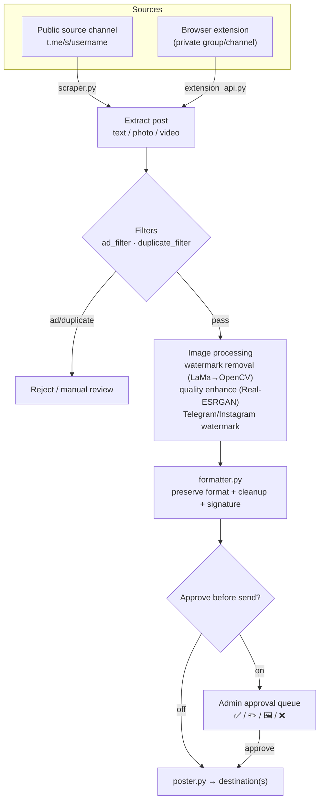

<a id="top"></a>

<div align="center">

🇮🇷 [فارسی](README.md) | 🇬🇧 **English** | 🇷🇺 [Русский](README.ru_RU.md) | 🇨🇳 [中文](README.zh_CN.md)


<h3>Smart reposting, AI image processing, and complete Telegram channel automation — all from inside the bot.</h3>

[](CHANGELOG.md)
[](tests/)
[](https://www.python.org/)
[](LICENSE)
[](https://core.telegram.org/bots/api)
[](#architecture)
[-FF7139?style=flat-square&logo=googlechrome&logoColor=white)](browser-extension/)
[](https://github.com/LiQTeam/telegram-repost/commits)
[](CONTRIBUTING.md)
[](#)

</div>

---

<a id="introduction"></a>

## 📖 Introduction

**A complete Telegram channel automation engine — not just a "copy-paste" bot.**

Messrs LiQ (internally MR LiQ) is a smart Python Telegram repost bot that reads posts from source channels, processes and cleans them (watermarks, AI quality enhancement, link/ad removal), and delivers them to destination channels on your schedule — with every setting controlled from inside the bot via inline glass buttons, no separate web panel required.

It is a full rewrite of a previous PHP panel, but its difference from a simple repost bot is fundamental: instead of merely forwarding text, it **preserves the original post formatting** (bold/italic/links/spoilers), runs images through an **AI-based image pipeline** (previous-watermark removal with the LaMa model and quality enhancement with Real-ESRGAN), **automatically filters** ad and duplicate posts, and offers an **approve-before-send queue** that lets you review and edit each post before it goes live.

Because the source is Telegram's public web preview (`t.me/s/username`), the bot works with just a bot token and needs no Telegram session or API ID (MTProto) — meaning simple, safe setup, at the cost of source channels needing to be public. For private channels, a **browser extension** is included that reads content from your own logged-in Telegram Web tab.

<a id="toc"></a>

## 📑 Table of Contents

| | |
|---|---|
| 📖 [Introduction](#introduction) | 🖼 [Screenshots](#screenshots) |
| ⚠️ [Important](#important) | 🚀 [Quick Start](#quick-start) |
| ✨ [Features](#features) | ⚙️ [Configuration](#configuration) |
| 🏗 [Architecture](#architecture) | 🖥 [Requirements](#requirements) |
| 📦 [Project Structure](#structure) | ⚠️ [Known Limitations](#limitations) |
| 🌐 [Languages & Fonts](#languages) | 🤝 [Contributing](#contributing) |
| 📄 [License](#license) | ⭐ [Support](#support) |

<a id="important"></a>

## ⚠️ Important (read before installing)

> [!IMPORTANT]
> - **Source channels must be public.** The source is read from the public `t.me/s/username` preview page. For private channels/groups, use the **browser extension**.
> - **This is not a Userbot/MTProto client.** It works with just a bot token; therefore "instant" mode happens with up to a 30-second delay (the bot's polling interval), not exactly at publish time.
> - **AI features are optional.** Watermark removal (LaMa) and quality enhancement (Real-ESRGAN) need model files (~220MB) and `torch`. Without them the bot runs fully and only these two features are gracefully disabled.
> - **The ad filter's AI adjudication and image generation need API keys** (Mistral/Groq and Pollinations/DeepAI/Stable Horde). Without keys, the filter falls back to its local logic (keywords/links/mentions).
> - **Do not expose the extension API to the open internet.** The token travels as plain text; enable it only behind a firewall or on a trusted network.
> - **AI image processing is CPU-heavy.** On small VPSes, keep `MAX_CONCURRENT_HEAVY_JOBS` low.

<a id="features"></a>

## ✨ Features

Every feature below is drawn straight from the source, with the relevant module(s) named.

### 📡 Channel Management
- **Multiple source & destination channels** — any number of public sources and destinations, each independently toggleable. `database.py`
- **Arbitrary source ↔ destination mapping** — one source to many destinations, one destination from many sources; full fan-out. `scheduler.py`
- **Custom channel names** — a readable label in lists instead of the raw username. `handlers/inputs.py`

### ⏱ Scheduling & Delivery
- **Seven-slot hourly schedule** — each source has seven independent slots (Tehran time), each separately toggleable and re-timeable. `scheduler.py`
- **Three send modes** — seven-slot schedule, instant (30s polling), or interval (every N minutes); exactly one is active per source. `scheduler.py`
- **Downtime catch-up** — if the bot was down when a slot was due, it sends the pending post once as soon as it comes back. `scheduler.py`
- **Instant send of the last 10/20/30 posts** — grab a channel's latest posts and dispatch them under that channel's approval rule. `manual_poster.py`
- **Smart scheduling (experimental)** — analyzes stats and suggests the best time (limited by Bot API data). `smart_scheduler.py`

### 🛡 Content Approval
- **Approve-before-send queue** — a final preview of each post with four buttons: **✅ Approve & send**, **✏️ Edit caption**, **🖼 Replace photo**, **❌ Reject**. `poster.py`
- **Per-user dedicated approval channel** — each operator can have their own approval queue in a separate channel/group. `cli.py add-user`

### 🖼 Image Processing
- **AI image quality enhancement** — sharpen/upscale low-quality images with `SRVGGNetCompact` (Real-ESRGAN family, reimplemented standalone on raw torch, no `basicsr`), CPU-tuned. `sr_model.py`
- **Processing router with controlled concurrency** — all heavy work runs on a separate thread under a semaphore. `image_router.py` · `concurrency.py`

### 🎨 Watermark System
- **Independent graphical watermarks for Telegram & Instagram** — text, 6 positions, solid/gradient color from 10 presets, opacity, font size, edge margin, and a live preview. `custom_watermark.py` · `watermark.py`
- **Owner-driven, fully configurable from inside the bot** — no code edits. `button_config.py`

### 🤖 AI Pipeline
- **AI watermark removal** — detection via Template Matching (`data/watermark_templates/`) and corner heuristics, then local inpainting with the **LaMa** model (TorchScript, `torch.jit`), with **automatic fallback to `cv2.inpaint`** if the model is missing or errors. `ai_watermark.py` · `lama_model.py`
- **AI text-adjudication router** — auto-selects between **Mistral** and **Groq** by text length/type. `ai_router.py`
- **Image generation with a failover chain** — Pollinations → DeepAI → Stable Horde; errors/timeouts/rate-limits auto-switch to the next provider. `image_router.py`

### 🧠 Smart Filtering
- **Ad-post filter (v3 engine)** — context-aware analysis by keywords, link/mention counts, collection mode, and VPN/proxy config-file detection, plus **optional per-post AI adjudication**; action is "reject" or "send for manual review." `ad_filter.py`
- **Duplicate-post filter** — exact (hash) matching plus a **fuzzy** layer for the same news carried with different marks/signatures across sources. `duplicate_filter.py`
- **Formatting preservation + smart cleanup** — carries over Telegram-safe HTML and removes the source channel's links/mentions/phone numbers, plus a linked end-of-post signature. `formatter.py`
- **Filter feedback report (+ Excel export)** — filter performance stats and details as a downloadable two-sheet workbook. `ad_feedback_report.py`

### 📰 Auto-Publishing (isolated module)
- **News, prices & ads** — a fully separate subsystem with its own database (`auto_poster.db`): automatic price publishing (fiat/crypto/gold/markets), scheduled ads with glass buttons, and news with an admin approval queue. `bot/auto_poster/`

### 🛠 Operations & Resilience
- **Encrypted backup & full restore** — password-protected backups, send-to-channel, and restore with a per-table SAVEPOINT. `backup_manager.py`
- **Download cache** — temporary file retention with TTL and count/byte caps. `cache.py`
- **Resource monitor** — live CPU/RAM/disk monitoring with automatic alerts. `resource_monitor.py`
- **Notification manager** — routes admin notifications to a separate private channel. `notification_manager.py`
- **Public report channel** — transparent success reports, inactivity warnings (tagging the responsible operator) and threaded thank-yous. `public_report_channel.py`

### 🌐 Browser Extension
- **Telegram Web connector (Chrome MV3)** — reads content from an open private group/channel in your logged-in tab and sends it to the bot via a local API (`aiohttp`), with a live connection-status view and queueing during network outages. `browser-extension/` · `extension_api.py`

### 🖥 Panel, CLI & Tools
- **Full in-bot panel** — colored inline buttons (Bot API 9.4: blue/green/red, injected via `api_kwargs`), meaningful and time-window-aware coloring. `button_style.py` · `button_config.py`
- **Command-line tool (CLI)** — `add-source`, `add-destination`, `add-user`, `list-sources`, `list-destinations`, `stats`, `backup`. `cli.py`
- **Jalali (Persian) calendar** — full Persian date/time rendering. `jdatetime_utils.py`

<a id="architecture"></a>

## 🏗 Architecture

The path of a single post from source to destination:



Heavy work (`concurrency.py`) runs on a separate thread under a semaphore so the bot never locks up. The `auto_poster/` module (prices/ads/news) runs alongside this path, fully separate and with its own database.

<a id="screenshots"></a>

## 🖼 Screenshots

<details>
<summary><b>Click to expand</b></summary>

<br/>

<!-- Add bot panel and browser-extension screenshots here -->
<!--


-->

_No screenshots added yet._

</details>

<a id="quick-start"></a>

## 🚀 Quick Start

### One-line install (recommended)

On a Linux server (Ubuntu / Debian / CentOS):

```bash
curl -fsSL https://raw.githubusercontent.com/LiQTeam/telegram-repost/main/install.sh | sudo bash
```

The installer is **interactive** and prompts for:

| Prompt | Description |
|---|---|
| Bot token | from [@BotFather](https://t.me/BotFather) |
| Admin ID(s) | from [@userinfobot](https://t.me/userinfobot), comma-separated |
| Default destination channel | optional — can be added later from inside the bot |
| Mistral / Groq key | optional — for the ad filter's AI adjudication |

It then installs prerequisites, a `virtualenv`, the dependencies (including CPU `torch` and the LaMa/Real-ESRGAN model files), writes `.env`, and runs the bot as a **systemd** service (always-on + auto-restart, timezone `Asia/Tehran`).

### Service management

```bash
systemctl status  mrliq-bot     # status
systemctl restart mrliq-bot     # restart (after editing .env)
journalctl -u mrliq-bot -f      # live logs
```

### Manual install (alternative)

```bash
git clone https://github.com/LiQTeam/telegram-repost.git
cd telegram-repost
python3 -m venv venv && source venv/bin/activate
pip install -r requirements.txt --extra-index-url https://download.pytorch.org/whl/cpu
cp .env.example .env      # then fill .env with your token/IDs
python3 main.py
```

After install, send `/start` to the bot in Telegram to open the admin panel.

> [!NOTE]
> Docker is not currently supported; the official deployment is via systemd.

<a id="configuration"></a>

## ⚙️ Configuration

All variables are read from `.env` (full sample: [`.env.example`](.env.example)). Only `BOT_TOKEN` and `ADMIN_IDS` are required.

| Variable | Required | Default | Description |
|---|:---:|---|---|
| `BOT_TOKEN` | ✅ | — | Bot token from @BotFather |
| `ADMIN_IDS` | ✅ | — | Admin numeric IDs, comma-separated |
| `TARGET_CHAT_ID` | — | — | Default destination channel |
| `DB_PATH` | — | `data/bot.sqlite` | SQLite database path |
| `TIMEZONE` | — | `Asia/Tehran` | Timezone for scheduling |
| `MAX_CONCURRENT_HEAVY_JOBS` | — | `3` | Max images processed concurrently |
| `DOWNLOAD_CACHE_MAX_ITEMS` | — | `200` | Download-cache item cap |
| `DOWNLOAD_CACHE_TTL_SECONDS` | — | `1800` | Cache item retention (seconds) |
| `DOWNLOAD_CACHE_MAX_BYTES` | — | `157286400` | Total cache cap (bytes, 150MB) |
| `MAX_DOWNLOAD_BYTES` | — | `62914560` | Per-file download cap (bytes, 60MB) |
| `AD_FILTER_CACHE_MAX_ITEMS` | — | `2000` | AI-result cache cap |
| `AD_FILTER_CACHE_TTL_SECONDS` | — | `21600` | Ad-filter cache TTL (seconds) |
| `TEMPLATE_MATCH_THRESHOLD` | — | `0.75` | Watermark template-match threshold |
| `MAX_WATERMARK_AREA_RATIO` | — | `0.3` | Max inpaint region area ratio |
| `MISTRAL_API_KEY` | — | — | Mistral key (AI adjudication) |
| `GROQ_API_KEY` | — | — | Groq key (AI adjudication) |
| `POLLINATIONS_API_KEY` | — | — | Pollinations image-gen key |
| `DEEPAI_API_KEY` | — | — | DeepAI image-gen key |
| `STABLEHORDE_API_KEY` | — | — | Stable Horde image-gen key |
| `IMAGE_GEN_TIMEOUT` | — | `30` | Image-gen timeout (seconds) |
| `IMAGE_GEN_MAX_RETRIES` | — | `2` | Max image-gen retries |
| `STABLEHORDE_POLL_TIMEOUT` | — | `180` | Stable Horde poll timeout |
| `STABLEHORDE_POLL_INTERVAL` | — | `5` | Poll interval (seconds) |
| `EXTENSION_API_ENABLED` | — | `false` | Enable the extension API |
| `EXTENSION_API_HOST` | — | `0.0.0.0` | Extension API host |
| `EXTENSION_API_PORT` | — | `8843` | Extension API port |
| `EXTENSION_API_TOKEN` | — | — | Shared bot ↔ extension token |

<a id="requirements"></a>

## 🖥 Requirements

| Item | Minimum / Recommended |
|---|---|
| **Python** | 3.10 or newer |
| **OS** | Linux (Ubuntu / Debian / CentOS and derivatives); auto-install via `apt`/`yum`/`dnf` |
| **RAM** | 1GB minimum for the core; **2GB+ recommended** with AI features (torch + models) enabled |
| **Disk** | ~500MB for core + deps; **+~220MB** for AI model files (`big-lama.pt` ~200MB, `realesr-general-x4v3.pth` ~17MB) |
| **Network** | access to `api.telegram.org` and (for model downloads) `github.com` |

**Key dependencies:** `python-telegram-bot 21.6`, `aiohttp`, `beautifulsoup4` + `lxml`, `Pillow`, `numpy`, `opencv-python-headless`, `torch 2.4.1 (CPU)`, `cryptography`, `psutil`, `jdatetime` + `tzdata`, `arabic-reshaper` + `python-bidi`, `openpyxl`. Full list in [`requirements.txt`](requirements.txt).

> AI features (LaMa, Real-ESRGAN) are CPU-heavy; they run slower on weak servers but never block reposting (automatic fallback).

<a id="structure"></a>

## 📦 Project Structure

```
telegram-repost/
├── main.py                     # entry point: bot + scheduler + monitor + auto/manual poster + extension API
├── cli.py                      # command-line tool (add channels/users, list, stats, backup)
├── install.sh                  # automatic VPS install (systemd, model downloads)
├── requirements.txt
├── .env.example                # full configuration sample
├── CHANGELOG.md
├── assets/                     # banner, donate button, watermark badge icons
├── fonts/                      # Persian Vazirmatn font (correct RTL watermark rendering)
├── data/                       # SQLite DB + logs (created at runtime)
├── docs/                       # extra docs (deployment guide, debug report)
├── scripts/                    # donate-button generator (Pillow)
├── tests/                      # automated tests — python3 tests/run_all.py
├── browser-extension/          # Telegram Web connector (Chrome MV3): background/content/popup/options
└── bot/
    ├── config.py               # reads settings from .env
    ├── database.py             # SQLite layer: channels, mappings, slots, logs
    ├── scraper.py              # fetch posts from t.me/s/username (+ pagination, video recovery)
    ├── formatter.py            # raw HTML → Telegram-safe HTML + link/mention/phone cleanup
    ├── poster.py               # final caption, approval queue, send to one destination
    ├── scheduler.py            # scheduler tick: seven-slot/instant/interval + fan-out
    ├── smart_scheduler.py      # smart scheduling (analysis + time suggestion)
    ├── manual_poster.py        # manual/instant send + queue management (manual: prefix)
    ├── watermark.py            # builds the watermark box with Pillow
    ├── custom_watermark.py     # independent Telegram/Instagram watermarks
    ├── ai_watermark.py         # watermark detection (Template + OpenCV) + removal orchestration
    ├── lama_model.py           # LaMa inpainting (TorchScript) + OpenCV fallback
    ├── sr_model.py             # quality enhancement (SRVGGNetCompact / Real-ESRGAN)
    ├── image_router.py         # image generation with a failover chain
    ├── ai_router.py            # AI text adjudication (Mistral / Groq)
    ├── ad_filter.py            # ad filter (v3, context-aware + AI)
    ├── duplicate_filter.py     # duplicate filter (hash + fuzzy)
    ├── ad_feedback_report.py   # filter feedback report + Excel export
    ├── cache.py                # download cache
    ├── concurrency.py          # semaphore + thread for heavy jobs
    ├── backup_manager.py       # encrypted backup + restore
    ├── extension_api.py        # aiohttp server for the browser extension
    ├── resource_monitor.py     # CPU/RAM/disk monitor + alerts
    ├── notification_manager.py # admin notifications to a separate private channel
    ├── public_report_channel.py# public transparency report channel
    ├── button_style.py         # colored buttons (Bot API 9.4 via api_kwargs)
    ├── button_config.py        # central button color/text/schedule config
    ├── jdatetime_utils.py      # Jalali (Persian) date utilities
    ├── utils.py · keyboards.py
    ├── handlers/               # menu.py (button router) · inputs.py (admin input) · common.py
    └── auto_poster/            # isolated "prices/ads/news" module, separate DB (auto_poster.db)
        └── config.py · db.py · scheduler.py · ads.py · menu.py · keyboards.py
```

<a id="limitations"></a>

## ⚠️ Known Limitations

- **Source channels must be public** (except via the browser extension for private cases).
- **~30s delay in instant mode** — because there is no MTProto/Userbot.
- **Large videos** sometimes have no direct link on the public preview page and are skipped (a Telegram limitation).
- **Source image quality** is already compressed by Telegram; "AI enhancement" partially compensates, it does not restore the original.
- **Daily send ceiling** in scheduled mode equals the number of active slots (up to 7) per day.
- **Smart scheduling** is effectively limited without view data — Telegram's Bot API doesn't expose message views.
- **Button colors** offer only three options (blue/green/red) and are visible only in up-to-date Telegram apps; older versions show the normal gray button (no error).
- **Album photo editing** in the approval preview only replaces the first (cover) photo.
- **AI models and API keys are optional**; without them, the related features are gracefully disabled.

<a id="languages"></a>

## 🌐 Languages & Fonts

- **Bot UI language:** Persian (with the Jalali/Persian calendar from `jdatetime_utils.py`).
- **Documentation:** 🇮🇷 فارسی · 🇬🇧 English · 🇷🇺 Русский · 🇨🇳 中文.
- **Watermark font:** the Persian **Vazirmatn** font (Bold/Medium) ships in `fonts/`. For correct Persian/Arabic rendering (letter joining + right-to-left), `arabic-reshaper` and `python-bidi` are used; without the Persian font, Latin text is fine but Persian may render incompletely.

<a id="contributing"></a>

## 🤝 Contributing

Contributions are welcome! Please read [`CONTRIBUTING.md`](CONTRIBUTING.md) before opening a Pull Request. In short: fork the repo, work on a separate branch, run the tests with `python3 tests/run_all.py`, and open a PR with a clear description. Open an Issue for bugs and suggestions.

<a id="license"></a>

## 📄 License

Released under the **MIT** license — see [`LICENSE`](LICENSE).

<a id="support"></a>

## ⭐ Support

If this project helped you, give it a ⭐ — it's the best motivation to keep developing.

<div align="center">
<br/>
<!-- Replace with your own donation link -->
<a href="https://github.com/LiQTeam/telegram-repost"></a>
<br/><br/>
<sub><a href="#top">⬆️ Back to top</a></sub>
</div>
