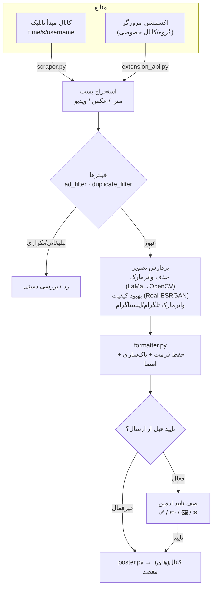

<a id="top"></a>

<div align="center">

🇮🇷 **فارسی** | 🇬🇧 [English](README.en.md) | 🇷🇺 [Русский](README.ru_RU.md) | 🇨🇳 [中文](README.zh_CN.md)


<h3>ری‌پستِ هوشمند، پردازشِ تصویر با هوش مصنوعی، و اتوماسیونِ کاملِ کانالِ تلگرام — همه از داخلِ خودِ ربات.</h3>

[](CHANGELOG.md)
[](tests/)
[](https://www.python.org/)
[](LICENSE)
[](https://core.telegram.org/bots/api)
[](#architecture)
[-FF7139?style=flat-square&logo=googlechrome&logoColor=white)](browser-extension/)
[](https://github.com/LiQTeam/telegram-repost/commits)
[](CONTRIBUTING.md)
[](#)

</div>

---

<a id="introduction"></a>

## 📖 معرفی

**یک موتورِ اتوماسیونِ کاملِ کانالِ تلگرام، نه صرفاً یک ربات «کپی‌پیست».**

Messrs LiQ (با نامِ داخلی MR LiQ) یک ربات تلگرامیِ ری‌پستِ هوشمند به زبانِ پایتون است که پست‌های کانال‌های مبدأ را می‌خواند، آن‌ها را پردازش و تمیز می‌کند (واترمارک، بهبودِ کیفیت با AI، حذفِ لینک/تبلیغات) و طبقِ زمان‌بندیِ دلخواهِ شما به کانال‌های مقصد می‌فرستد — و تمامِ این تنظیمات از داخلِ خودِ ربات با دکمه‌های شیشه‌ایِ اینلاین کنترل می‌شوند، بدونِ نیاز به هیچ پنلِ وبِ جدا.

این پروژه بازنویسیِ کاملِ پنلِ PHP قبلی است، اما تفاوتِ آن با یک ربات ری‌پستِ ساده بنیادی است: به‌جای فقط فوروارد کردنِ متن، **فرمت‌بندیِ اصلیِ پست حفظ می‌شود** (بولد/ایتالیک/لینک/اسپویلر)، عکس‌ها با یک **خطِ لوله‌ی پردازشِ تصویرِ مبتنی بر AI** (حذفِ واترمارکِ قبلی با مدلِ LaMa و بهبودِ کیفیت با Real-ESRGAN) عبور می‌کنند، پست‌های تبلیغاتی و تکراری **به‌صورت خودکار فیلتر** می‌شوند، و یک **صفِ تاییدِ قبل از ارسال** به شما اجازه می‌دهد هر پست را پیش از انتشار ببینید و ویرایش کنید.

از آن‌جا که منبع، صفحه‌ی پیش‌نمایشِ عمومیِ وبِ تلگرام (`t.me/s/username`) است، ربات فقط با یک توکنِ بات کار می‌کند و به session یا API ID تلگرام (MTProto) نیازی ندارد؛ این یعنی نصبِ ساده و امن، به‌بهای این‌که کانالِ مبدأ باید پابلیک باشد. برای کانال‌های خصوصی هم یک **اکستنشنِ مرورگر** ارائه شده که محتوا را از تبِ لاگین‌شده‌ی خودتان در تلگرام‌وب می‌خواند.

<a id="toc"></a>

## 📑 فهرست مطالب

| | |
|---|---|
| 📖 [معرفی](#introduction) | 🖼 [اسکرین‌شات‌ها](#screenshots) |
| ⚠️ [نکات مهم](#important) | 🚀 [نصب سریع](#quick-start) |
| ✨ [امکانات](#features) | ⚙️ [پیکربندی](#configuration) |
| 🏗 [معماری](#architecture) | 🖥 [پیش‌نیازها](#requirements) |
| 📦 [ساختار پروژه](#structure) | ⚠️ [محدودیت‌ها](#limitations) |
| 🌐 [زبان‌ها و فونت‌ها](#languages) | 🤝 [مشارکت](#contributing) |
| 📄 [لایسنس](#license) | ⭐ [حمایت](#support) |

<a id="important"></a>

## ⚠️ نکات مهم (پیش از نصب بخوانید)

> [!IMPORTANT]
> - **کانالِ مبدأ باید پابلیک باشد.** منبع از صفحه‌ی پیش‌نمایشِ عمومیِ `t.me/s/username` خوانده می‌شود. برای کانال/گروهِ خصوصی، از **اکستنشنِ مرورگر** استفاده کنید.
> - **این یک Userbot/MTProto نیست.** فقط با توکنِ بات کار می‌کند؛ به همین دلیل «ارسالِ لحظه‌ای» با تاخیرِ حداکثر ۳۰ ثانیه‌ای (فاصله‌ی چکِ ربات) انجام می‌شود، نه دقیقاً هم‌زمان با انتشار.
> - **قابلیت‌های AI اختیاری‌اند.** حذفِ واترمارک (LaMa) و بهبودِ کیفیت (Real-ESRGAN) به فایل‌های مدل (~۲۲۰MB) و `torch` نیاز دارند. اگر دانلود نشوند، ربات کامل کار می‌کند و فقط این دو قابلیت به‌صورتِ graceful غیرفعال می‌شوند.
> - **داوریِ AI فیلترِ تبلیغات و تولیدِ تصویر به کلیدِ API نیاز دارند** (Mistral/Groq و Pollinations/DeepAI/Stable Horde). بدونِ کلید، فیلتر به منطقِ محلیِ خود (کلیدواژه/لینک/منشن) برمی‌گردد.
> - **API اکستنشن را روی اینترنتِ باز نگذارید.** توکن به‌صورتِ متنِ ساده رد و بدل می‌شود؛ آن را فقط پشتِ فایروال یا روی شبکه‌ی قابل‌اعتماد فعال کنید.
> - **پردازشِ تصویرِ AI روی CPU سنگین است.** روی VPSهای کوچک، `MAX_CONCURRENT_HEAVY_JOBS` را پایین نگه دارید.

<a id="features"></a>

## ✨ امکانات

هر قابلیت مستقیماً از سورس استخراج شده و نامِ ماژول(های) مرتبط ذکر شده است.

### 📡 مدیریتِ کانال
- **چند کانال مبدأ و مقصد** — هر تعداد کانالِ مبدأ (پابلیک) و مقصد، هرکدام جدا فعال/غیرفعال. `database.py`
- **نگاشتِ دلخواهِ مبدأ ↔ مقصد** — هر مبدأ به چند مقصد، و هر مقصد از چند مبدأ؛ fan-out کامل. `scheduler.py`
- **اسمِ دلخواه برای کانال‌ها** — به‌جای یوزرنیمِ خام، یک برچسبِ خوانا در لیست‌ها. `handlers/inputs.py`

### ⏱ زمان‌بندی و ارسال
- **زمان‌بندیِ هفت‌گانه‌ی ساعتی** — هر کانال مبدأ هفت اسلاتِ مستقل (به وقت تهران)، هرکدام جدا فعال/غیرفعال و قابلِ تغییرِ ساعت. `scheduler.py`
- **سه حالتِ ارسال** — زمان‌بندیِ هفت‌گانه، لحظه‌ای (چکِ هر ۳۰ ثانیه)، یا بازه‌ای (هر N دقیقه)؛ دقیقاً یکی برای هر مبدأ فعال است. `scheduler.py`
- **جبرانِ خاموشی** — اگر ربات موقعِ سررسیدِ یک اسلات خاموش بوده، همان لحظه که بالا بیاید پستِ عقب‌مانده را یک‌بار می‌فرستد. `scheduler.py`
- **ارسالِ فوریِ ۱۰/۲۰/۳۰ پستِ آخر** — گرفتنِ آخرین پست‌های یک کانال و ارسالشان طبقِ قانونِ تاییدِ همان کانال. `manual_poster.py`
- **زمان‌بندیِ هوشمند (آزمایشی)** — تحلیلِ آمار و پیشنهادِ بهترین زمان (محدود به دیتای در دسترسِ Bot API). `smart_scheduler.py`

### 🛡 تاییدِ محتوا
- **صفِ تاییدِ قبل از ارسال** — پیش‌نمایشِ نهاییِ هر پست با چهار دکمه: **✅ تایید و ارسال**، **✏️ ویرایشِ کپشن**، **🖼 تغییرِ عکس**، **❌ رد**. `poster.py`
- **کانالِ تاییدِ اختصاصی به‌ازای کاربر** — هر اپراتور می‌تواند صفِ تاییدِ خود را در یک کانال/گروهِ جدا داشته باشد. `cli.py add-user`

### 🖼 پردازشِ تصویر
- **بهبودِ کیفیتِ تصویر با AI** — تیزتر/بزرگ‌ترکردنِ عکس‌های کم‌کیفیت با `SRVGGNetCompact` (خانواده‌ی Real-ESRGAN، بازنویسیِ مستقل با torchِ خام، بدونِ `basicsr`)، بهینه برای CPU. `sr_model.py`
- **مسیریابِ پردازش با همزمانیِ کنترل‌شده** — همه‌ی کارهای سنگین در تردِ جدا و زیرِ Semaphore. `image_router.py` · `concurrency.py`

### 🎨 سیستمِ واترمارک
- **واترمارکِ گرافیکیِ مستقل برای تلگرام و اینستاگرام** — متن، ۶ موقعیت، رنگِ تک/گرادیانی از ۱۰ رنگِ آماده، شفافیت، اندازه‌ی فونت، فاصله از لبه، و پیش‌نمایشِ زنده. `custom_watermark.py` · `watermark.py`
- **مالک‌محور و کاملاً قابل‌تنظیم از داخلِ ربات** — بدونِ ویرایشِ کد. `button_config.py`

### 🤖 خطِ لوله‌ی AI
- **حذفِ واترمارکِ قبلی با AI** — تشخیص با Template Matching (الگوهای `data/watermark_templates/`) و heuristicِ گوشه‌ها، سپس ترمیمِ محلی با مدلِ **LaMa** (نسخه‌ی TorchScript، `torch.jit`)، با **fallbackِ خودکار به `cv2.inpaint`** در صورتِ نبودِ مدل یا خطا. `ai_watermark.py` · `lama_model.py`
- **مسیریابِ داوریِ متنیِ AI** — انتخابِ خودکار بینِ **Mistral** و **Groq** بر اساسِ طول/نوعِ متن. `ai_router.py`
- **تولیدِ تصویر با زنجیره‌ی Failover** — Pollinations → DeepAI → Stable Horde؛ خطا/تایم‌اوت/ریت‌لیمیت خودکار به سرویسِ بعدی سوییچ می‌شود. `image_router.py`

### 🧠 فیلترینگِ هوشمند
- **فیلترِ پست‌های تبلیغاتی (موتور نسخه ۳)** — تحلیلِ بافت‌محور بر اساسِ کلیدواژه، تعدادِ لینک/منشن، حالتِ کالکشن و تشخیصِ فایل‌های کانفیگِ VPN/پروکسی، به‌همراهِ **داوریِ اختیاریِ AI روی هر پست**؛ با اقدامِ «رد» یا «ارسال برای بررسیِ دستی». `ad_filter.py`
- **فیلترِ پستِ تکراری** — تطابقِ دقیق (هش) به‌علاوه‌ی یک لایه‌ی **تشخیصِ فازی** برای خبرهای یکسان با نشانه/امضای متفاوت بینِ کانال‌های مبدأ. `duplicate_filter.py`
- **حفظِ فرمت + پاک‌سازیِ هوشمند** — انتقالِ HTML امنِ تلگرام و حذفِ خودکارِ لینک/منشن/شماره‌تلفنِ کانالِ مبدأ و امضای لینک‌دارِ پایانِ پست. `formatter.py`
- **گزارشِ فیدبکِ فیلتر (+ خروجیِ اکسل)** — آمار و جزئیاتِ عملکردِ فیلتر با دو برگه‌ی اکسلِ قابل‌دانلود. `ad_feedback_report.py`

### 📰 انتشارِ خودکار (ماژولِ ایزوله)
- **اخبار، قیمت‌ها و تبلیغات** — زیرسیستمِ کاملاً جدا با دیتابیسِ مستقل (`auto_poster.db`): انتشارِ خودکارِ قیمت‌ها (فیات/کریپتو/طلا/بازار)، تبلیغاتِ زمان‌بندی‌شده با دکمه‌های شیشه‌ای، و اخبار با صفِ تاییدِ ادمین. `bot/auto_poster/`

### 🛠 عملیات و پایداری
- **بکاپِ رمزنگاری‌شده و بازیابیِ کامل** — بکاپ با رمزِ عبور، ارسال به کانال، و Restore با SAVEPOINT به‌ازای هر جدول. `backup_manager.py`
- **کشِ دانلود** — نگه‌داریِ موقتِ فایل‌ها با TTL و سقفِ تعداد/بایت. `cache.py`
- **مانیتورِ منابع** — پایشِ لحظه‌ایِ CPU/RAM/دیسک و هشدارِ خودکار. `resource_monitor.py`
- **مدیرِ اعلان‌ها** — تفکیکِ اعلان‌های ادمین به یک کانالِ خصوصیِ جدا. `notification_manager.py`
- **کانالِ گزارشِ عمومی** — گزارشِ شفافِ موفقیت، هشدارِ عدمِ فعالیت (با تگ‌کردنِ مسئول) و تشکرِ ریپلای‌شده. `public_report_channel.py`

### 🌐 اکستنشنِ مرورگر
- **کانکتورِ تلگرام‌وب (Chrome MV3)** — خواندنِ محتوای گروه/کانالِ خصوصیِ باز از تبِ لاگین‌شده و ارسال به ربات از طریقِ یک API محلی (`aiohttp`)، با نمایشِ زنده‌ی وضعیتِ اتصال و صف‌بندی در قطعیِ شبکه. `browser-extension/` · `extension_api.py`

### 🖥 پنل، CLI و ابزارها
- **پنلِ کاملِ داخلِ ربات** — دکمه‌های اینلاینِ رنگی (Bot API 9.4: آبی/سبز/قرمز، تزریق از راهِ `api_kwargs`)، رنگ‌بندیِ معنادار و زمان‌بندی‌شده. `button_style.py` · `button_config.py`
- **ابزارِ خط‌فرمان (CLI)** — `add-source`, `add-destination`, `add-user`, `list-sources`, `list-destinations`, `stats`, `backup`. `cli.py`
- **تاریخِ شمسی (جلالی)** — نمایشِ تاریخ/زمان به‌صورتِ کاملِ فارسی. `jdatetime_utils.py`

<a id="architecture"></a>

## 🏗 معماری

مسیرِ یک پست از کانالِ مبدأ تا کانالِ مقصد:



پردازش‌های سنگین (`concurrency.py`) در تردِ جدا و زیرِ Semaphore اجرا می‌شوند تا ربات هیچ‌وقت قفل نشود. ماژولِ `auto_poster/` (قیمت/تبلیغات/اخبار) کاملاً جدا و با دیتابیسِ مستقل کنار همین مسیر اجرا می‌شود.

<a id="screenshots"></a>

## 🖼 اسکرین‌شات‌ها

<details>
<summary><b>برای نمایش کلیک کنید</b></summary>

<br/>

<!-- اسکرین‌شات‌های پنلِ ربات و اکستنشنِ مرورگر را اینجا اضافه کنید -->
<!--


-->

_هنوز اسکرین‌شاتی اضافه نشده._

</details>

<a id="quick-start"></a>

## 🚀 نصب سریع

### نصبِ یک‌خطی (توصیه‌شده)

روی سرورِ لینوکسی (Ubuntu / Debian / CentOS):

```bash
curl -fsSL https://raw.githubusercontent.com/LiQTeam/telegram-repost/main/install.sh | sudo bash
```

اسکریپت **تعاملی** است و موقعِ اجرا این مقادیر را می‌پرسد:

| پرسش | توضیح |
|---|---|
| توکنِ ربات | از [@BotFather](https://t.me/BotFather) |
| آیدیِ ادمین(ها) | از [@userinfobot](https://t.me/userinfobot)، با کاما جدا |
| کانالِ مقصدِ پیش‌فرض | اختیاری — بعداً از داخلِ ربات هم می‌شود اضافه کرد |
| کلیدِ Mistral / Groq | اختیاری — برای داوریِ AI فیلترِ تبلیغات |

سپس خودش پیش‌نیازها، `virtualenv`، وابستگی‌ها (شاملِ `torch` نسخه‌ی CPU و فایل‌های مدلِ LaMa/Real-ESRGAN) را نصب می‌کند، `.env` را می‌سازد و ربات را به‌عنوان سرویسِ **systemd** (همیشه‌روشن + ری‌استارتِ خودکار، با منطقه‌ی زمانیِ `Asia/Tehran`) اجرا می‌کند.

### مدیریتِ سرویس

```bash
systemctl status  mrliq-bot     # وضعیت
systemctl restart mrliq-bot     # ری‌استارت (بعد از ویرایش .env)
journalctl -u mrliq-bot -f      # لاگِ زنده
```

### نصبِ دستی (جایگزین)

```bash
git clone https://github.com/LiQTeam/telegram-repost.git
cd telegram-repost
python3 -m venv venv && source venv/bin/activate
pip install -r requirements.txt --extra-index-url https://download.pytorch.org/whl/cpu
cp .env.example .env      # سپس .env را با توکن/آیدی پر کنید
python3 main.py
```

بعد از نصب، در تلگرام به ربات `/start` بدهید تا پنلِ مدیریت باز شود.

> [!NOTE]
> در حالِ حاضر نصبِ Docker پشتیبانی نمی‌شود؛ استقرارِ رسمی روی systemd است.

<a id="configuration"></a>

## ⚙️ پیکربندی

همه‌ی متغیرها از `.env` خوانده می‌شوند (نمونه‌ی کامل: [`.env.example`](.env.example)). فقط `BOT_TOKEN` و `ADMIN_IDS` ضروری‌اند.

| متغیر | ضروری | پیش‌فرض | توضیح |
|---|:---:|---|---|
| `BOT_TOKEN` | ✅ | — | توکنِ ربات از @BotFather |
| `ADMIN_IDS` | ✅ | — | آیدیِ عددیِ ادمین‌ها، با کاما جدا |
| `TARGET_CHAT_ID` | — | — | کانالِ مقصدِ پیش‌فرض |
| `DB_PATH` | — | `data/bot.sqlite` | مسیرِ دیتابیسِ SQLite |
| `TIMEZONE` | — | `Asia/Tehran` | منطقه‌ی زمانیِ زمان‌بندی |
| `MAX_CONCURRENT_HEAVY_JOBS` | — | `3` | حداکثر عکسِ هم‌زمانِ در حالِ پردازش |
| `DOWNLOAD_CACHE_MAX_ITEMS` | — | `200` | سقفِ تعداد آیتمِ کش |
| `DOWNLOAD_CACHE_TTL_SECONDS` | — | `1800` | مدتِ نگه‌داریِ هر آیتم (ثانیه) |
| `DOWNLOAD_CACHE_MAX_BYTES` | — | `157286400` | سقفِ کلِ کش (بایت، ۱۵۰MB) |
| `MAX_DOWNLOAD_BYTES` | — | `62914560` | سقفِ حجمِ هر فایلِ دانلودی (بایت، ۶۰MB) |
| `AD_FILTER_CACHE_MAX_ITEMS` | — | `2000` | سقفِ کشِ نتیجه‌ی داوریِ AI |
| `AD_FILTER_CACHE_TTL_SECONDS` | — | `21600` | TTL کشِ فیلترِ تبلیغات (ثانیه) |
| `TEMPLATE_MATCH_THRESHOLD` | — | `0.75` | آستانه‌ی تطبیقِ الگوی واترمارک |
| `MAX_WATERMARK_AREA_RATIO` | — | `0.3` | حداکثر نسبتِ مساحتِ ناحیه‌ی ترمیم |
| `MISTRAL_API_KEY` | — | — | کلیدِ Mistral (داوریِ AI) |
| `GROQ_API_KEY` | — | — | کلیدِ Groq (داوریِ AI) |
| `POLLINATIONS_API_KEY` | — | — | کلیدِ تولیدِ تصویر Pollinations |
| `DEEPAI_API_KEY` | — | — | کلیدِ تولیدِ تصویر DeepAI |
| `STABLEHORDE_API_KEY` | — | — | کلیدِ تولیدِ تصویر Stable Horde |
| `IMAGE_GEN_TIMEOUT` | — | `30` | تایم‌اوتِ تولیدِ تصویر (ثانیه) |
| `IMAGE_GEN_MAX_RETRIES` | — | `2` | حداکثر تلاشِ مجدد |
| `STABLEHORDE_POLL_TIMEOUT` | — | `180` | تایم‌اوتِ Pollingِ Stable Horde |
| `STABLEHORDE_POLL_INTERVAL` | — | `5` | فاصله‌ی Polling (ثانیه) |
| `EXTENSION_API_ENABLED` | — | `false` | فعال‌سازیِ API اکستنشن |
| `EXTENSION_API_HOST` | — | `0.0.0.0` | هاستِ API اکستنشن |
| `EXTENSION_API_PORT` | — | `8843` | پورتِ API اکستنشن |
| `EXTENSION_API_TOKEN` | — | — | توکنِ اشتراکیِ ربات ↔ اکستنشن |

<a id="requirements"></a>

## 🖥 پیش‌نیازها

| مورد | حداقل / پیشنهادی |
|---|---|
| **Python** | نسخه‌ی ۳٫۱۰ یا بالاتر |
| **سیستم‌عامل** | لینوکس (Ubuntu / Debian / CentOS / و مشتقات)؛ نصبِ خودکار با `apt`/`yum`/`dnf` |
| **RAM** | حداقل ۱GB برای هسته؛ **۲GB+ پیشنهادی** اگر قابلیت‌های AI (torch + مدل‌ها) فعال باشند |
| **دیسک** | ~۵۰۰MB برای هسته و وابستگی‌ها؛ **+~۲۲۰MB** برای فایل‌های مدلِ AI (`big-lama.pt` ~۲۰۰MB، `realesr-general-x4v3.pth` ~۱۷MB) |
| **شبکه** | دسترسی به `api.telegram.org` و (برای دانلودِ مدل‌ها) `github.com` |

**وابستگی‌های کلیدی:** `python-telegram-bot 21.6`، `aiohttp`، `beautifulsoup4` + `lxml`، `Pillow`، `numpy`، `opencv-python-headless`، `torch 2.4.1 (CPU)`، `cryptography`، `psutil`، `jdatetime` + `tzdata`، `arabic-reshaper` + `python-bidi`، `openpyxl`. فهرستِ کامل در [`requirements.txt`](requirements.txt).

> قابلیت‌های AI (LaMa، Real-ESRGAN) روی CPU سنگین‌اند؛ روی سرورهای ضعیف کندتر عمل می‌کنند اما هرگز باعثِ توقفِ ری‌پست نمی‌شوند (fallback خودکار).

<a id="structure"></a>

## 📦 ساختار پروژه

```
telegram-repost/
├── main.py                     # نقطه‌ی ورود: راه‌اندازی ربات + زمان‌بند + مانیتور + auto/manual poster + API اکستنشن
├── cli.py                      # ابزار خط‌فرمان (افزودن کانال/کاربر، لیست، آمار، بکاپ)
├── install.sh                  # نصب خودکار روی VPS (systemd، دانلود مدل‌ها)
├── requirements.txt
├── .env.example                # نمونه‌ی کامل تنظیمات
├── CHANGELOG.md
├── assets/                     # بنر، دکمه‌ی دونیت، آیکون نشان واترمارک
├── fonts/                      # فونت فارسی Vazirmatn (برای رندر صحیح RTL واترمارک)
├── data/                       # دیتابیس SQLite + لاگ (در زمان اجرا ساخته می‌شود)
├── docs/                       # مستندات تکمیلی (راهنمای استقرار، گزارش دیباگ)
├── scripts/                    # سازنده‌ی دکمه‌ی دونیت (Pillow)
├── tests/                      # تست‌های خودکار — python3 tests/run_all.py
├── browser-extension/          # کانکتور تلگرام‌وب (Chrome MV3): background/content/popup/options
└── bot/
    ├── config.py               # خواندن تنظیمات از .env
    ├── database.py             # لایه‌ی SQLite: کانال‌ها، نگاشت‌ها، اسلات‌ها، لاگ
    ├── scraper.py              # گرفتن پست از t.me/s/username (+ صفحه‌بندی، بازیابی ویدیو)
    ├── formatter.py            # HTML خام → HTML امن تلگرام + پاک‌سازی لینک/منشن/شماره
    ├── poster.py               # ساخت کپشن نهایی، صف تایید، ارسال به یک مقصد
    ├── scheduler.py            # تیک زمان‌بند: اسلات‌های هفت‌گانه/لحظه‌ای/بازه‌ای + fan-out
    ├── smart_scheduler.py      # زمان‌بندی هوشمند (تحلیل + پیشنهاد زمان)
    ├── manual_poster.py        # ارسال دستی/فوری + مدیریت صف (پیشوند manual:)
    ├── watermark.py            # ساخت کادر واترمارک با Pillow
    ├── custom_watermark.py     # واترمارک مستقل تلگرام/اینستاگرام
    ├── ai_watermark.py         # تشخیص واترمارک (Template + OpenCV) و ارکستریشن حذف
    ├── lama_model.py           # ترمیم واترمارک با LaMa (TorchScript) + fallback OpenCV
    ├── sr_model.py             # بهبود کیفیت (SRVGGNetCompact / Real-ESRGAN)
    ├── image_router.py         # تولید تصویر با زنجیره‌ی Failover
    ├── ai_router.py            # داوری متنی AI (Mistral / Groq)
    ├── ad_filter.py            # فیلتر تبلیغات (نسخه ۳، بافت‌محور + AI)
    ├── duplicate_filter.py     # فیلتر تکراری (هش + فازی)
    ├── ad_feedback_report.py   # گزارش فیدبک فیلتر + خروجی اکسل
    ├── cache.py                # کش دانلود
    ├── concurrency.py          # Semaphore + ترد کارهای سنگین
    ├── backup_manager.py       # بکاپ رمزنگاری‌شده + بازیابی
    ├── extension_api.py        # سرور aiohttp برای اکستنشن مرورگر
    ├── resource_monitor.py     # مانیتور CPU/RAM/دیسک + هشدار
    ├── notification_manager.py # اعلان‌های ادمین در کانال خصوصی جدا
    ├── public_report_channel.py# کانال گزارش عمومی/شفافیت
    ├── button_style.py         # دکمه‌های رنگی (Bot API 9.4 از راه api_kwargs)
    ├── button_config.py        # پیکربندی مرکزی رنگ/متن/زمان‌بندی دکمه‌ها
    ├── jdatetime_utils.py      # ابزار تاریخ شمسی (جلالی)
    ├── utils.py · keyboards.py
    ├── handlers/               # menu.py (روتر دکمه‌ها) · inputs.py (ورودی ادمین) · common.py
    └── auto_poster/            # ماژول ایزوله «قیمت/تبلیغات/اخبار» با DB جدا (auto_poster.db)
        └── config.py · db.py · scheduler.py · ads.py · menu.py · keyboards.py
```

<a id="limitations"></a>

## ⚠️ محدودیت‌ها

- **کانالِ مبدأ باید پابلیک باشد** (مگر از راهِ اکستنشنِ مرورگر برای موارد خصوصی).
- **تاخیرِ ~۳۰ ثانیه‌ای حالتِ لحظه‌ای** — به‌دلیلِ نبودِ MTProto/Userbot.
- **ویدیوهای حجیم** گاهی در صفحه‌ی پیش‌نمایشِ عمومی لینکِ مستقیم ندارند و رد می‌شوند (محدودیتِ تلگرام).
- **کیفیتِ عکسِ منبع** از قبل توسطِ تلگرام فشرده می‌شود؛ «بهبودِ AI» تا حدی جبران می‌کند، نه بازگرداندنِ اصل.
- **سقفِ ارسالِ روزانه** در حالتِ زمان‌بندی برابرِ تعدادِ اسلات‌های فعال (تا ۷) در روز است.
- **زمان‌بندیِ هوشمند** عملاً بدونِ دیتای بازدید محدود است — Bot API تلگرام بازدیدِ پیام را نمی‌دهد.
- **رنگِ دکمه‌ها** فقط سه گزینه (آبی/سبز/قرمز) و فقط در اپ‌های به‌روزِ تلگرام دیده می‌شود؛ نسخه‌های قدیمی دکمه‌ی خاکستریِ معمولی نشان می‌دهند (بدون خطا).
- **ویرایشِ عکسِ آلبوم** در پیش‌نمایشِ تایید فقط عکسِ اول (جلد) را عوض می‌کند.
- **مدل‌های AI و کلیدهای API اختیاری‌اند**؛ در نبودشان، قابلیت‌های مربوطه به‌صورتِ graceful غیرفعال می‌شوند.

<a id="languages"></a>

## 🌐 زبان‌ها و فونت‌ها

- **زبانِ رابطِ ربات:** فارسی (با تاریخِ شمسی/جلالی از `jdatetime_utils.py`).
- **مستندات:** 🇮🇷 فارسی · 🇬🇧 English · 🇷🇺 Русский · 🇨🇳 中文.
- **فونتِ واترمارک:** فونتِ فارسیِ **Vazirmatn** (Bold/Medium) همراهِ پروژه در `fonts/` است. برای رندرِ صحیحِ حروفِ فارسی/عربی (اتصالِ حروف + راست‌به‌چپ) از `arabic-reshaper` و `python-bidi` استفاده می‌شود؛ بدونِ فونتِ فارسی، متنِ لاتین سالم است ولی فارسی ممکن است ناقص دیده شود.

<a id="contributing"></a>

## 🤝 مشارکت

مشارکت خوش‌آمد است! پیش از ارسالِ Pull Request، [`CONTRIBUTING.md`](CONTRIBUTING.md) را بخوانید. به‌طورِ خلاصه: مخزن را fork کنید، روی شاخه‌ی جدا کار کنید، تست‌ها را با `python3 tests/run_all.py` اجرا کنید، و PR را با توضیحِ واضح باز کنید. برای باگ و پیشنهاد هم Issue باز کنید.

<a id="license"></a>

## 📄 لایسنس

تحتِ لایسنسِ **MIT** منتشر شده است — نگاه کنید به [`LICENSE`](LICENSE).

<a id="support"></a>

## ⭐ حمایت

اگر این پروژه به دردتان خورد، به آن یک ⭐ بدهید — بهترین انگیزه برای ادامه‌ی توسعه است.

<div align="center">
<br/>
<!-- لینکِ دونیتِ خود را جایگزین کنید -->
<a href="https://github.com/LiQTeam/telegram-repost"></a>
<br/><br/>
<sub><a href="#top">⬆️ بازگشت به بالا</a></sub>
</div>
