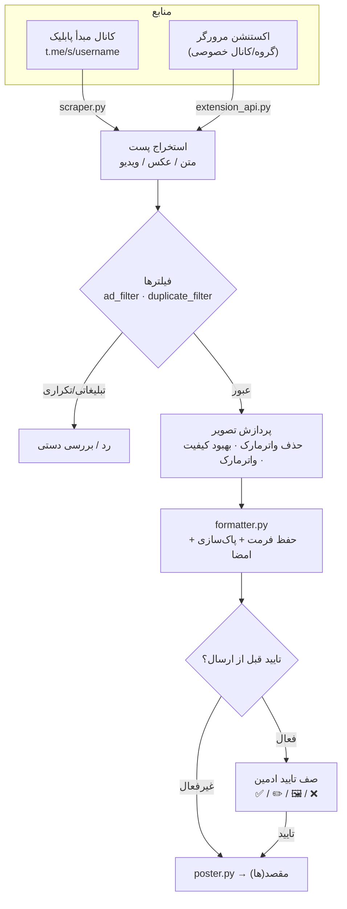

<a id="top"></a>

<div align="center">

🇮🇷 **فارسی** | 🇬🇧 [English](README.en.md) | 🇷🇺 [Русский](README.ru_RU.md) | 🇨🇳 [中文](README.zh_CN.md)


<h3>ری‌پستِ هوشمند، پردازشِ تصویر با هوش مصنوعی، و اتوماسیونِ کاملِ کانالِ تلگرام — همه از داخلِ خودِ ربات.</h3>

[](CHANGELOG.md)
[](tests/)
[](https://www.python.org/)
[](LICENSE)
[](https://core.telegram.org/bots/api)
[](#architecture)
[-FF7139?style=flat-square&logo=googlechrome&logoColor=white)](browser-extension/)
[](https://github.com/LiQTeam/telegram-repost/commits)
[](CONTRIBUTING.md)
[](#)

</div>

---

<a id="introduction"></a>

## 📖 معرفی

**یک موتورِ اتوماسیونِ کاملِ کانالِ تلگرام، نه صرفاً یک ربات «کپی‌پیست».**

Messrs LiQ یک ربات تلگرامیِ ری‌پستِ هوشمند به زبانِ **پایتون** است که پست‌های کانال‌های مبدأ را می‌خواند، پردازش و تمیز می‌کند (واترمارک، بهبودِ کیفیت با AI، حذفِ لینک/تبلیغات) و طبقِ زمان‌بندیِ دلخواهِ شما به کانال‌های مقصد می‌فرستد — همه از داخلِ خودِ ربات با دکمه‌های شیشه‌ایِ اینلاین، بدونِ نیاز به پنلِ وبِ جدا.

برخلافِ یک ربات ری‌پستِ ساده، اینجا فرمت‌بندیِ اصلیِ پست حفظ می‌شود (بولد/ایتالیک/لینک/اسپویلر)، عکس‌ها از یک خطِ لوله‌ی پردازشِ مبتنی بر AI عبور می‌کنند (حذفِ واترمارکِ قبلی با LaMa و بهبودِ کیفیت با Real-ESRGAN)، پست‌های تبلیغاتی و تکراری خودکار فیلتر می‌شوند، و یک صفِ تاییدِ قبل از ارسال اجازه می‌دهد هر پست را پیش از انتشار ببینید و ویرایش کنید.

منبعِ پست‌ها صفحه‌ی پیش‌نمایشِ عمومیِ وبِ تلگرام (`t.me/s/username`) است؛ پس ربات فقط با یک توکنِ بات کار می‌کند و به session یا API ID تلگرام (MTProto) نیاز ندارد — نصبی ساده و امن، به‌شرطِ پابلیک‌بودنِ کانالِ مبدأ. برای کانال‌های خصوصی هم یک **اکستنشنِ مرورگر** ارائه شده است.

<a id="toc"></a>

## 📑 فهرست مطالب

<table align="center" width="100%">
<tr>
  <td align="center" width="25%">📖 <a href="#introduction">معرفی</a></td>
  <td align="center" width="25%">⚠️ <a href="#important">نکات مهم</a></td>
  <td align="center" width="25%">✨ <a href="#features">امکانات</a></td>
  <td align="center" width="25%">🏗 <a href="#architecture">معماری</a></td>
</tr>
<tr>
  <td align="center">🚀 <a href="#quick-start">نصب سریع</a></td>
  <td align="center">⚙️ <a href="#configuration">پیکربندی</a></td>
  <td align="center">🖥 <a href="#requirements">پیش‌نیازها</a></td>
  <td align="center">📦 <a href="#structure">ساختار پروژه</a></td>
</tr>
<tr>
  <td align="center">⚠️ <a href="#limitations">محدودیت‌ها</a></td>
  <td align="center">🤝 <a href="#contributing">مشارکت</a></td>
  <td align="center">📄 <a href="#license">لایسنس</a></td>
  <td align="center">⭐ <a href="#support">حمایت</a></td>
</tr>
</table>

<a id="important"></a>

## ⚠️ نکات مهم (پیش از نصب بخوانید)

> [!IMPORTANT]
> - **کانالِ مبدأ باید پابلیک باشد** — منبع از `t.me/s/username` خوانده می‌شود. برای کانال/گروهِ خصوصی از **اکستنشنِ مرورگر** استفاده کنید.
> - **این یک Userbot/MTProto نیست** — فقط با توکنِ بات کار می‌کند؛ پس «ارسالِ لحظه‌ای» با تاخیرِ حداکثر ۳۰ ثانیه‌ای انجام می‌شود، نه دقیقاً هم‌زمان با انتشار.
> - **قابلیت‌های AI اختیاری‌اند** — حذفِ واترمارک (LaMa) و بهبودِ کیفیت (Real-ESRGAN) به فایل‌های مدل (~۲۲۰MB) و `torch` نیاز دارند؛ در نبودشان ربات کامل کار می‌کند و فقط این دو خاموش می‌شوند.
> - **داوریِ AI و تولیدِ تصویر به کلیدِ API نیاز دارند** — بدونِ کلید، فیلتر به منطقِ محلیِ خود (کلیدواژه/لینک/منشن) برمی‌گردد.
> - **API اکستنشن را روی اینترنتِ باز نگذارید** — توکن به‌صورتِ متنِ ساده رد و بدل می‌شود؛ فقط پشتِ فایروال فعالش کنید.

<a id="features"></a>

## ✨ امکانات

هر قابلیت مستقیماً از سورس استخراج شده و ماژولِ مرتبطش ذکر شده است.

### 📡 مدیریتِ کانال
- **چند کانال مبدأ و مقصد** — هر تعداد کانالِ مبدأ (پابلیک) و مقصد، هرکدام جدا فعال/غیرفعال. `database.py`
- **نگاشتِ دلخواهِ مبدأ ↔ مقصد** — هر مبدأ به چند مقصد و هر مقصد از چند مبدأ (fan-out کامل). `scheduler.py`
- **اسمِ دلخواه برای کانال‌ها** — برچسبِ خوانا در لیست‌ها به‌جای یوزرنیمِ خام. `handlers/inputs.py`

### ⏱ زمان‌بندی و ارسال
- **زمان‌بندیِ هفت‌گانه‌ی ساعتی** — هر مبدأ هفت اسلاتِ مستقل (به وقت تهران)، جدا فعال و قابلِ تغییرِ ساعت. `scheduler.py`
- **سه حالتِ ارسال** — زمان‌بندی، لحظه‌ای (چکِ هر ۳۰ ثانیه) یا بازه‌ای (هر N دقیقه)؛ برای هر مبدأ یکی فعال است. `scheduler.py`
- **جبرانِ خاموشی** — پستِ عقب‌مانده‌ی یک اسلات، پس از روشن‌شدنِ ربات یک‌بار فرستاده می‌شود. `scheduler.py`
- **ارسالِ فوریِ ۱۰/۲۰/۳۰ پستِ آخر** — طبقِ قانونِ تاییدِ همان کانال. `manual_poster.py`

### 🛡 تاییدِ محتوا
- **صفِ تاییدِ قبل از ارسال** — پیش‌نمایشِ هر پست با چهار دکمه: **✅ تایید**، **✏️ ویرایشِ کپشن**، **🖼 تغییرِ عکس**، **❌ رد**. `poster.py`
- **کانالِ تاییدِ اختصاصی به‌ازای کاربر** — هر اپراتور صفِ تاییدِ خود را در کانالی جدا دارد. `cli.py`

### 🖼 پردازشِ تصویر و واترمارک
- **بهبودِ کیفیتِ تصویر با AI** — تیزتر/بزرگ‌ترکردن با `SRVGGNetCompact` (خانواده‌ی Real-ESRGAN)، بهینه برای CPU. `sr_model.py`
- **واترمارکِ مستقلِ تلگرام و اینستاگرام** — متن، ۶ موقعیت، رنگِ تک/گرادیانی (۱۰ رنگِ آماده)، شفافیت، سایز و پیش‌نمایشِ زنده. `custom_watermark.py`
- **حذفِ واترمارکِ قبلی با AI** — تشخیص با Template Matching و heuristicِ گوشه‌ها، ترمیم با **LaMa** و fallbackِ خودکار به `cv2.inpaint`. `ai_watermark.py` · `lama_model.py`

### 🤖 هوش مصنوعی
- **مسیریابِ داوریِ متنی** — انتخابِ خودکار بینِ **Mistral** و **Groq** بر اساسِ طول/نوعِ متن. `ai_router.py`
- **تولیدِ تصویر با زنجیره‌ی Failover** — Pollinations → DeepAI → Stable Horde. `image_router.py`

### 🧠 فیلترینگِ هوشمند
- **فیلترِ پست‌های تبلیغاتی (نسخه ۳)** — تحلیلِ بافت‌محور (کلیدواژه، لینک/منشن، کالکشن، فایلِ کانفیگِ VPN/پروکسی) + داوریِ اختیاریِ AI؛ با اقدامِ «رد» یا «بررسیِ دستی». `ad_filter.py`
- **فیلترِ پستِ تکراری** — تطابقِ دقیق (هش) + لایه‌ی فازی برای خبرهای یکسان با امضای متفاوت. `duplicate_filter.py`
- **حفظِ فرمت و پاک‌سازی** — HTML امنِ تلگرام + حذفِ خودکارِ لینک/منشن/شماره‌ی کانالِ مبدأ و امضای پایانِ پست. `formatter.py`

### 📰 انتشارِ خودکار (ماژولِ ایزوله)
- **اخبار، قیمت‌ها و تبلیغات** — زیرسیستمی جدا با دیتابیسِ مستقل (`auto_poster.db`): قیمت‌ها (فیات/کریپتو/طلا/بازار)، تبلیغاتِ زمان‌بندی‌شده و اخبار با صفِ تایید. `bot/auto_poster/`

### 🛠 عملیات و پایداری
- **بکاپِ رمزنگاری‌شده و بازیابی** — بکاپ با رمز، ارسال به کانال و Restore با SAVEPOINT به‌ازای هر جدول. `backup_manager.py`
- **کش و همزمانی** — کشِ دانلود با TTL و پردازشِ سنگین در تردِ جدا زیرِ Semaphore. `cache.py` · `concurrency.py`
- **مانیتور و اعلان** — پایشِ CPU/RAM/دیسک، اعلانِ ادمین در کانالِ خصوصی، و کانالِ گزارشِ عمومی. `resource_monitor.py` · `notification_manager.py` · `public_report_channel.py`
- **گزارشِ فیدبکِ فیلتر (+ اکسل)** — آمار و جزئیاتِ عملکردِ فیلتر به‌صورتِ فایلِ اکسل. `ad_feedback_report.py`

### 🌐 اکستنشنِ مرورگر و ابزارها
- **کانکتورِ تلگرام‌وب (Chrome MV3)** — خواندنِ محتوای گروه/کانالِ خصوصیِ باز از تبِ لاگین‌شده و ارسال به ربات از راهِ یک API محلی. `browser-extension/` · `extension_api.py`
- **پنلِ کامل + CLI** — دکمه‌های اینلاینِ رنگی (Bot API 9.4) و ابزارِ خط‌فرمان برای افزودنِ کانال/کاربر، لیست، آمار و بکاپ. `button_style.py` · `cli.py`

<a id="architecture"></a>

## 🏗 معماری

مسیرِ یک پست از کانالِ مبدأ تا مقصد:



پردازش‌های سنگین در تردِ جدا و زیرِ Semaphore اجرا می‌شوند تا ربات هیچ‌وقت قفل نشود.

<a id="quick-start"></a>

## 🚀 نصب سریع

روی سرورِ لینوکسی (Ubuntu / Debian / CentOS)، با یک دستور نصب کنید:

```bash
curl -fsSL https://raw.githubusercontent.com/LiQTeam/telegram-repost/main/install.sh | sudo bash
```

اسکریپت **تعاملی** است و این مقادیر را می‌پرسد:

| پرسش | توضیح |
|---|---|
| توکنِ ربات | از [@BotFather](https://t.me/BotFather) |
| آیدیِ ادمین(ها) | از [@userinfobot](https://t.me/userinfobot)، با کاما جدا |
| کانالِ مقصدِ پیش‌فرض | اختیاری — بعداً هم می‌شود اضافه کرد |
| کلیدِ Mistral / Groq | اختیاری — برای داوریِ AI |

سپس پیش‌نیازها، `virtualenv`، وابستگی‌ها و مدل‌های AI را نصب می‌کند، `.env` را می‌سازد و ربات را به‌عنوان سرویسِ **systemd** (همیشه‌روشن + ری‌استارتِ خودکار، منطقه‌ی زمانیِ `Asia/Tehran`) اجرا می‌کند. در پایان، در تلگرام به ربات `/start` بدهید.

<details>
<summary><b>مدیریتِ سرویس و نصبِ دستی</b></summary>

<br/>

**مدیریتِ سرویس:**

```bash
systemctl status  mrliq-bot     # وضعیت
systemctl restart mrliq-bot     # ری‌استارت (بعد از ویرایش .env)
journalctl -u mrliq-bot -f      # لاگِ زنده
```

**نصبِ دستی:**

```bash
git clone https://github.com/LiQTeam/telegram-repost.git
cd telegram-repost
python3 -m venv venv && source venv/bin/activate
pip install -r requirements.txt --extra-index-url https://download.pytorch.org/whl/cpu
cp .env.example .env      # سپس .env را با توکن/آیدی پر کنید
python3 main.py
```

> نصبِ Docker پشتیبانی نمی‌شود؛ استقرارِ رسمی روی systemd است.

</details>

<a id="configuration"></a>

## ⚙️ پیکربندی

همه‌ی متغیرها از `.env` خوانده می‌شوند (نمونه: [`.env.example`](.env.example)). فقط `BOT_TOKEN` و `ADMIN_IDS` ضروری‌اند.

| متغیر | ضروری | پیش‌فرض | توضیح |
|---|:---:|---|---|
| `BOT_TOKEN` | ✅ | — | توکنِ ربات از @BotFather |
| `ADMIN_IDS` | ✅ | — | آیدیِ عددیِ ادمین‌ها، با کاما جدا |
| `TARGET_CHAT_ID` | — | — | کانالِ مقصدِ پیش‌فرض |
| `DB_PATH` | — | `data/bot.sqlite` | مسیرِ دیتابیسِ SQLite |
| `TIMEZONE` | — | `Asia/Tehran` | منطقه‌ی زمانیِ زمان‌بندی |
| `MAX_CONCURRENT_HEAVY_JOBS` | — | `3` | حداکثر عکسِ هم‌زمانِ در حالِ پردازش |
| `DOWNLOAD_CACHE_MAX_ITEMS` | — | `200` | سقفِ تعداد آیتمِ کش |
| `DOWNLOAD_CACHE_TTL_SECONDS` | — | `1800` | مدتِ نگه‌داریِ هر آیتم (ثانیه) |
| `DOWNLOAD_CACHE_MAX_BYTES` | — | `157286400` | سقفِ کلِ کش (بایت، ۱۵۰MB) |
| `MAX_DOWNLOAD_BYTES` | — | `62914560` | سقفِ حجمِ هر فایلِ دانلودی (۶۰MB) |
| `AD_FILTER_CACHE_MAX_ITEMS` | — | `2000` | سقفِ کشِ نتیجه‌ی داوریِ AI |
| `AD_FILTER_CACHE_TTL_SECONDS` | — | `21600` | TTL کشِ فیلترِ تبلیغات (ثانیه) |
| `TEMPLATE_MATCH_THRESHOLD` | — | `0.75` | آستانه‌ی تطبیقِ الگوی واترمارک |
| `MAX_WATERMARK_AREA_RATIO` | — | `0.3` | حداکثر نسبتِ مساحتِ ناحیه‌ی ترمیم |
| `MISTRAL_API_KEY` / `GROQ_API_KEY` | — | — | کلیدِ داوریِ AI (اختیاری) |
| `POLLINATIONS_API_KEY` / `DEEPAI_API_KEY` / `STABLEHORDE_API_KEY` | — | — | کلیدِ تولیدِ تصویر (اختیاری) |
| `EXTENSION_API_ENABLED` | — | `false` | فعال‌سازیِ API اکستنشن |
| `EXTENSION_API_HOST` / `EXTENSION_API_PORT` | — | `0.0.0.0` / `8843` | هاست و پورتِ API اکستنشن |
| `EXTENSION_API_TOKEN` | — | — | توکنِ اشتراکیِ ربات ↔ اکستنشن |

<a id="requirements"></a>

## 🖥 پیش‌نیازها

| مورد | حداقل / پیشنهادی |
|---|---|
| **Python** | نسخه‌ی ۳٫۱۰ یا بالاتر |
| **سیستم‌عامل** | لینوکس (Ubuntu / Debian / CentOS و مشتقات) |
| **RAM** | حداقل ۱GB؛ **۲GB+ پیشنهادی** با قابلیت‌های AI فعال |
| **دیسک** | ~۵۰۰MB هسته + **~۲۲۰MB** مدل‌های AI (`big-lama.pt` ~۲۰۰MB، `realesr-general-x4v3.pth` ~۱۷MB) |

**وابستگی‌های کلیدی:** `python-telegram-bot 21.6`، `aiohttp`، `beautifulsoup4`، `Pillow`، `opencv-python-headless`، `torch 2.4.1 (CPU)`، `cryptography`، `psutil`، `jdatetime`. فهرستِ کامل در [`requirements.txt`](requirements.txt).

<a id="structure"></a>

## 📦 ساختار پروژه

```
telegram-repost/
├── main.py                  # نقطه‌ی ورود: ربات + زمان‌بند + مانیتور + API اکستنشن
├── cli.py                   # ابزار خط‌فرمان (کانال/کاربر، لیست، آمار، بکاپ)
├── install.sh               # نصب خودکار روی VPS (systemd، دانلود مدل‌ها)
├── requirements.txt · .env.example · CHANGELOG.md
├── assets/                  # بنرها و دکمه‌ی دونیت
├── fonts/                   # فونت فارسی Vazirmatn (واترمارک)
├── data/                    # دیتابیس SQLite + لاگ (در زمان اجرا)
├── docs/                    # مستندات تکمیلی (استقرار، دیباگ)
├── scripts/                 # سازنده‌های بنر/دکمه (Pillow)
├── tests/                   # تست‌های خودکار — python3 tests/run_all.py
├── browser-extension/       # کانکتور تلگرام‌وب (Chrome MV3)
└── bot/
    ├── config.py · database.py · scraper.py · formatter.py
    ├── poster.py · scheduler.py · smart_scheduler.py · manual_poster.py
    ├── watermark.py · custom_watermark.py · ai_watermark.py · lama_model.py · sr_model.py
    ├── image_router.py · ai_router.py · ad_filter.py · duplicate_filter.py · ad_feedback_report.py
    ├── cache.py · concurrency.py · backup_manager.py · extension_api.py
    ├── resource_monitor.py · notification_manager.py · public_report_channel.py
    ├── button_style.py · button_config.py · jdatetime_utils.py · utils.py · keyboards.py
    ├── handlers/            # menu.py · inputs.py · common.py
    └── auto_poster/         # ماژول ایزوله «قیمت/تبلیغات/اخبار» (DB جدا)
```

<a id="limitations"></a>

## ⚠️ محدودیت‌ها

- کانالِ مبدأ باید پابلیک باشد (کانالِ خصوصی فقط از راهِ اکستنشن).
- حالتِ لحظه‌ای تا ۳۰ ثانیه تاخیر دارد (بدونِ MTProto/Userbot).
- ویدیوهای حجیم گاهی در پیش‌نمایشِ عمومی لینکِ مستقیم ندارند و رد می‌شوند.
- کیفیتِ عکسِ منبع از پیش توسطِ تلگرام فشرده شده؛ «بهبودِ AI» تا حدی جبران می‌کند، نه بازگرداندنِ اصل.
- در حالتِ زمان‌بندی، سقفِ ارسالِ روزانه‌ی هر مبدأ برابرِ تعدادِ اسلات‌های فعال (تا ۷) است.
- رنگِ دکمه‌ها فقط در اپ‌های به‌روزِ تلگرام دیده می‌شود (سه رنگِ آبی/سبز/قرمز).
- مدل‌های AI و کلیدهای API اختیاری‌اند؛ در نبودشان قابلیت‌های مربوطه graceful غیرفعال می‌شوند.

<a id="contributing"></a>

## 🤝 مشارکت

مشارکت خوش‌آمد است! پیش از ارسالِ Pull Request، [`CONTRIBUTING.md`](CONTRIBUTING.md) را بخوانید. خلاصه: مخزن را fork کنید، روی شاخه‌ی جدا کار کنید، تست‌ها را با `python3 tests/run_all.py` اجرا کنید و PR را با توضیحِ واضح باز کنید.

<a id="license"></a>

## 📄 لایسنس

تحتِ لایسنسِ **MIT** منتشر شده است — نگاه کنید به [`LICENSE`](LICENSE).

<a id="support"></a>

## ⭐ حمایت

اگر این پروژه به دردتان خورد، به آن یک ⭐ بدهید — بهترین انگیزه برای ادامه‌ی توسعه است.

<div align="center">
<br/>
<!-- لینکِ دونیتِ خود را جایگزین کنید -->
<a href="https://github.com/LiQTeam/telegram-repost"></a>
<br/><br/>
<sub><a href="#top">⬆️ بازگشت به بالا</a></sub>
</div>
