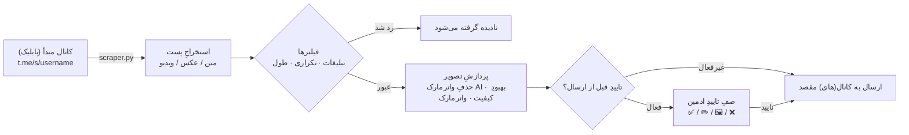

<div align="center">

**فارسی** | [English](README.en.md)


[](CHANGELOG.md)
[](tests/)
[](https://www.python.org/)
[](LICENSE)
[](#)

</div>

یک ربات تلگرامیِ ری‌پستِ هوشمند (پایتون) با پنلِ مدیریتِ کاملِ داخلِ خودِ ربات: چند کانال مبدأ و چند کانال مقصد با نگاشتِ دلخواه بین‌شان، زمان‌بندیِ هفت‌گانه‌ی ساعتی برای هر کانال مبدأ (به وقت تهران)، واترمارکِ گرافیکی روی عکس‌ها، بهبودِ کیفیت و حذفِ واترمارکِ قبلی با هوش مصنوعی، و صفِ تاییدِ قبل از ارسال. این نسخه بازنویسیِ کاملِ پنلِ PHP قبلی است — به‌جای پنلِ وبِ جدا، همه‌چیز با دکمه‌های شیشه‌ای اینلاین داخلِ خودِ ربات کنترل می‌شود و فرمت‌بندیِ متنِ اصلی (بولد/ایتالیک/لینک/...) نیز حفظ می‌شود (نه فقط متنِ خام مثل نسخه‌ی PHP).

> [!IMPORTANT]
> منبعِ پست‌ها از **صفحه‌ی پیش‌نمایشِ عمومیِ وبِ تلگرام** (`t.me/s/username`) خوانده می‌شود، پس هر **کانال مبدأ باید پابلیک باشد**. این پروژه یک Userbot/MTProto کامل نیست؛ به همین دلیل به session یا API ID تلگرام نیاز ندارد و فقط با توکنِ بات کار می‌کند — اما در نتیجه «ارسالِ لحظه‌ای» با تاخیرِ حداکثر ۳۰ ثانیه‌ای (فاصله‌ی چکِ ربات) انجام می‌شود، نه دقیقاً هم‌زمان با انتشار.

## ✨ Features

- **چند کانال مبدأ و چند کانال مقصد** — هر تعداد کانالِ مبدأ (پابلیک) و مقصد، هرکدام کاملاً مستقل و جدا قابلِ فعال/غیرفعال شدن.
- **نگاشتِ دلخواهِ مبدأ ↔ مقصد** — هر مبدأ می‌تواند به چند مقصد برود و هر مقصد از چند مبدأ پست بگیرد.
- **زمان‌بندیِ هفت‌گانه‌ی ساعتی** — هر کانال مبدأ هفت اسلاتِ ساعتیِ جدا (به وقت تهران) دارد که هرکدام مستقل فعال/غیرفعال و قابلِ تغییرِ ساعت است.
- **سه حالتِ ارسال** — زمان‌بندیِ هفت‌گانه، لحظه‌ای (چکِ هر ۳۰ ثانیه)، یا بازه‌ای (هر چند دقیقه)؛ برای هر کانال مبدأ جدا انتخاب می‌شود.
- **تاییدِ قبل از ارسال** — پیش‌نمایشِ نهاییِ هر پست با دکمه‌های ✅ تایید / ✏️ ویرایشِ کپشن / 🖼 تغییرِ عکس / ❌ رد، پیش از رسیدن به مقصد.
- **واترمارکِ گرافیکی مستقل** — واترمارکِ جداگانه برای تلگرام و اینستاگرام، با متن/موقعیت/رنگِ گرادیانی/شفافیت/سایزِ کاملاً قابل‌تنظیم و پیش‌نمایشِ زنده.
- **حذفِ واترمارکِ قبلی با AI** — تشخیص با Template Matching و heuristicِ گوشه‌ها، سپس ترمیم با مدلِ **LaMa** (و fallbackِ خودکار به OpenCV inpaint).
- **بهبودِ کیفیتِ تصویر با AI** — تیزتر/بزرگ‌ترکردنِ عکس‌های کم‌کیفیت با مدلِ سبکِ `SRVGGNetCompact` (خانواده‌ی Real-ESRGAN)، بهینه برای CPU.
- **حفظِ فرمت‌بندیِ متن + پاک‌سازیِ هوشمند** — انتقالِ بولد/ایتالیک/لینک/اسپویلر، به‌همراهِ حذفِ خودکارِ لینک/منشن/شماره‌تلفنِ کانالِ مبدأ و امضای لینک‌دارِ پایانِ پست.
- **فیلترِ خودکارِ پست‌های تبلیغاتی** — تشخیص بر اساسِ کلیدواژه، تعدادِ لینک/منشن و حالتِ کالکشن؛ با گزینه‌ی رد کردن یا ارسال برای بررسیِ دستی (+ داوریِ اختیاری با AI).
- **پنلِ کاملِ مدیریت داخلِ ربات** — همه‌ی تنظیمات با دکمه‌های شیشه‌ای اینلاین و رنگ‌بندیِ معنادار (Bot API 9.4)، بدونِ نیاز به پنلِ وبِ جدا.
- **ماژولِ «اخبار و قیمت‌ها»** — زیرسیستمِ ایزوله برای انتشارِ خودکارِ قیمت‌ها، تبلیغاتِ زمان‌بندی‌شده و اخبار (با صفِ تاییدِ ادمین).
- **اکستنشنِ مرورگر** — اتصالِ گروه‌ها/کانال‌های خصوصیِ بازِ تلگرام‌وب به ربات از طریقِ یک API محلی.
- **بکاپِ رمزنگاری‌شده** — بکاپ‌گیریِ امنِ دیتابیس با SAVEPOINT به‌ازای هر جدول و رمزنگاری.
- **نصبِ یک‌کلیکی روی VPS** — اسکریپتِ `install.sh` که virtualenv، وابستگی‌ها، فایلِ `.env` و سرویسِ systemd را خودکار می‌سازد.

## 📸 Screenshots

<details>
<summary>Click to expand</summary>

<!-- عکس‌های پنل ربات رو اینجا اضافه کن -->
<!-- مثال:


-->

</details>

## 🚀 Quick Start

نصبِ یک‌خطی روی سرورِ لینوکسی (Ubuntu / Debian / CentOS):

```bash
curl -fsSL https://raw.githubusercontent.com/LiQTeam/telegram-repost/main/install.sh | sudo bash
```

> اگر ترجیح می‌دهی مخزن را دستی کلون کنی:
> ```bash
> git clone https://github.com/LiQTeam/telegram-repost.git
> cd telegram-repost
> sudo bash install.sh
> ```

اسکریپتِ نصب **تعاملی** است و موقعِ اجرا این مقادیر را از تو می‌پرسد:

1. **توکنِ ربات** (از [@BotFather](https://t.me/BotFather))
2. **آیدیِ عددیِ ادمین(ها)** (از [@userinfobot](https://t.me/userinfobot)) — چند نفر را با کاما جدا کن
3. **آیدیِ عددیِ کانالِ مقصدِ پیش‌فرض** (اختیاری — می‌توانی خالی بگذاری و بعداً از داخلِ ربات هر تعداد مقصد اضافه کنی)
4. **کلیدهای Mistral / Groq** (اختیاری — برای داوریِ AI فیلترِ تبلیغات)

سپس خودش پیش‌نیازها را نصب می‌کند، virtualenv می‌سازد، کتابخانه‌ها را نصب می‌کند، فایلِ `.env` را می‌سازد و ربات را به‌عنوان یک سرویسِ **systemd** (همیشه‌روشن + ری‌استارتِ خودکار) اجرا می‌کند. منطقه‌ی زمانیِ پیش‌فرض `Asia/Tehran` است.

بعد از نصب، در تلگرام به ربات `/start` بده. اگر خواستی مقادیرِ `.env` را دستی تغییر دهی، بعد از ویرایش سرویس را ری‌استارت کن:

```bash
nano .env
systemctl restart mrliq-bot      # اعمالِ تغییرات
systemctl status  mrliq-bot      # وضعیت
journalctl -u mrliq-bot -f       # لاگِ زنده
```

> **فونتِ فارسی (برای واترمارک):** فونت‌های `Vazirmatn` داخلِ پوشه‌ی `fonts/` همراهِ پروژه هستند؛ اگر خواستی فونتِ دیگری بگذاری، فایلِ `.ttf` را در همان پوشه بریز و سرویس را ری‌استارت کن.

## ⚙️ Configuration

همه‌ی متغیرها از فایلِ `.env` خوانده می‌شوند (نمونه: [`.env.example`](.env.example)). فقط `BOT_TOKEN` و `ADMIN_IDS` ضروری‌اند؛ بقیه مقدارِ پیش‌فرضِ امن دارند.

| متغیر | پیش‌فرض | توضیح |
|---|---|---|
| `BOT_TOKEN` | — | **(ضروری)** توکنِ ربات از @BotFather |
| `ADMIN_IDS` | — | **(ضروری)** آیدیِ عددیِ ادمین‌ها، با کاما جدا |
| `TARGET_CHAT_ID` | — | آیدیِ کانالِ مقصدِ پیش‌فرض (اختیاری) |
| `DB_PATH` | `data/bot.sqlite` | مسیرِ دیتابیسِ SQLite |
| `TIMEZONE` | `Asia/Tehran` | منطقه‌ی زمانیِ محاسبه‌ی زمان‌بندی |
| `MAX_CONCURRENT_HEAVY_JOBS` | `3` | حداکثر عکسِ هم‌زمانِ در حالِ پردازش (واترمارک/AI) |
| `DOWNLOAD_CACHE_MAX_ITEMS` | `200` | سقفِ تعداد آیتم در کشِ دانلود |
| `DOWNLOAD_CACHE_TTL_SECONDS` | `1800` | مدتِ نگه‌داریِ هر آیتمِ کش (ثانیه) |
| `DOWNLOAD_CACHE_MAX_BYTES` | `157286400` | سقفِ کلِ کشِ دانلود (بایت، ۱۵۰MB) |
| `MAX_DOWNLOAD_BYTES` | `62914560` | سقفِ حجمِ هر فایلِ دانلودی (بایت، ۶۰MB) |
| `AD_FILTER_CACHE_MAX_ITEMS` | `2000` | سقفِ کشِ نتیجه‌ی داوریِ AI فیلترِ تبلیغات |
| `AD_FILTER_CACHE_TTL_SECONDS` | `21600` | TTL کشِ فیلترِ تبلیغات (ثانیه) |
| `TEMPLATE_MATCH_THRESHOLD` | `0.75` | آستانه‌ی تطبیقِ الگو در تشخیصِ واترمارک |
| `MAX_WATERMARK_AREA_RATIO` | `0.3` | حداکثر نسبتِ مساحتِ ناحیه‌ی واترمارکِ قابل‌ترمیم |
| `MISTRAL_API_KEY` | — | کلیدِ Mistral (اختیاری، داوریِ AI) |
| `GROQ_API_KEY` | — | کلیدِ Groq (اختیاری، داوریِ AI) |
| `POLLINATIONS_API_KEY` | — | کلیدِ تولیدِ تصویر Pollinations (اختیاری) |
| `DEEPAI_API_KEY` | — | کلیدِ تولیدِ تصویر DeepAI (اختیاری) |
| `STABLEHORDE_API_KEY` | — | کلیدِ تولیدِ تصویر Stable Horde (اختیاری) |
| `IMAGE_GEN_TIMEOUT` | `30` | تایم‌اوتِ تولیدِ تصویر (ثانیه) |
| `IMAGE_GEN_MAX_RETRIES` | `2` | حداکثر تلاشِ مجددِ تولیدِ تصویر |
| `STABLEHORDE_POLL_TIMEOUT` | `180` | تایم‌اوتِ Pollingِ Stable Horde |
| `STABLEHORDE_POLL_INTERVAL` | `5` | فاصله‌ی Pollingِ Stable Horde (ثانیه) |
| `EXTENSION_API_ENABLED` | `false` | فعال‌سازیِ API اکستنشنِ مرورگر |
| `EXTENSION_API_HOST` | `0.0.0.0` | هاستِ API اکستنشن |
| `EXTENSION_API_PORT` | `8843` | پورتِ API اکستنشن |
| `EXTENSION_API_TOKEN` | — | توکنِ اشتراکیِ ربات ↔ اکستنشن (پشتِ فایروال) |

## 🏗 Architecture

مسیرِ یک پست از کانالِ مبدأ تا کانالِ مقصد:



## 📦 Project Structure

```
telegram-repost/
├── main.py                     # نقطه‌ی ورودِ ربات
├── cli.py                      # ابزارِ خط‌فرمان (افزودنِ کانال مبدأ/مقصد و...)
├── install.sh                  # نصبِ خودکارِ VPS (systemd)
├── requirements.txt
├── .env.example                # نمونه‌ی تنظیمات
├── CHANGELOG.md
├── assets/
│   ├── banner.png              # بنرِ README (ساخته‌شده با scripts/make_banner.py)
│   └── badges/                 # آیکونِ نشانِ واترمارک (تلگرام/اینستاگرام)
├── fonts/                      # فونتِ فارسی (Vazirmatn) برای واترمارک
├── data/                       # دیتابیس SQLite + لاگ (در زمانِ اجرا ساخته می‌شود)
├── docs/                       # مستنداتِ تکمیلی (دیپلوی، گزارشِ دیباگ)
├── scripts/
│   └── make_banner.py          # سازنده‌ی بنرِ README
├── tests/                      # تست‌های خودکار (python3 tests/run_all.py)
├── browser-extension/          # اکستنشنِ کرومِ اتصالِ تلگرام‌وب (MV3)
│   ├── manifest.json
│   ├── background.js · content.js · popup.* · options.html
│   └── icons/
└── bot/
    ├── config.py               # خواندنِ تنظیمات از .env
    ├── database.py             # لایه‌ی SQLite: کانال‌ها، نگاشت‌ها، اسلات‌ها، لاگ
    ├── scraper.py              # گرفتنِ پست از t.me/s/username
    ├── formatter.py            # تبدیلِ HTML خام به HTML امنِ تلگرام
    ├── watermark.py            # ساختِ کادرِ واترمارک با Pillow
    ├── custom_watermark.py     # واترمارکِ مستقلِ تلگرام/اینستاگرام
    ├── ai_watermark.py         # تشخیصِ واترمارک (OpenCV) + orchestrationِ حذف
    ├── lama_model.py           # ترمیمِ واترمارک با مدلِ LaMa (TorchScript)
    ├── sr_model.py             # بهبودِ کیفیت (SRVGGNetCompact / Real-ESRGAN)
    ├── image_router.py         # مسیریابِ پردازشِ تصویر
    ├── ad_filter.py            # فیلترِ پست‌های تبلیغاتی
    ├── ai_router.py            # داوریِ AI (Mistral / Groq)
    ├── duplicate_filter.py     # فیلترِ پست‌های تکراری
    ├── poster.py               # ساختِ کپشنِ نهایی + ارسال به یک مقصد
    ├── scheduler.py            # تیکِ زمان‌بند + fan-out به مقصدها
    ├── smart_scheduler.py      # زمان‌بندیِ هوشمند
    ├── manual_poster.py        # ارسالِ دستی/فوریِ پست‌های آخر
    ├── cache.py                # کشِ دانلود
    ├── concurrency.py          # Semaphore + تردِ کارهای سنگین
    ├── backup_manager.py       # بکاپِ رمزنگاری‌شده
    ├── extension_api.py        # سرورِ API برای اکستنشنِ مرورگر
    ├── notification_manager.py · resource_monitor.py · public_report_channel.py
    ├── keyboards.py · button_config.py · button_style.py · utils.py · jdatetime_utils.py
    ├── handlers/
    │   ├── menu.py             # روترِ دکمه‌ها + متنِ منوها
    │   ├── inputs.py           # پردازشِ ورودیِ متنی/عددیِ ادمین
    │   └── common.py           # چکِ ادمین + ویرایشِ امنِ پیام
    └── auto_poster/            # ماژولِ ایزوله‌ی «اخبار و قیمت‌ها» (DB مجزا)
        ├── config.py · db.py · scheduler.py
        ├── ads.py              # ماژولِ تبلیغات
        ├── menu.py · keyboards.py
```

## ⚠️ Known Limitations

- **کانالِ مبدأ باید پابلیک باشد** — منبع از `t.me/s/username` خوانده می‌شود؛ کانالِ خصوصی پشتیبانی نمی‌شود (مگر از طریقِ اکستنشنِ مرورگر).
- **تاخیرِ حالتِ لحظه‌ای** — چون Userbot/MTProto نیست، «لحظه‌ای» یعنی حداکثر ۳۰ ثانیه تاخیر (فاصله‌ی چکِ ربات)، نه هم‌زمان با انتشار.
- **ویدیوهای حجیم** — گاهی در صفحه‌ی پیش‌نمایشِ عمومی لینکِ مستقیم ندارند و رد می‌شوند (محدودیتِ خودِ تلگرام، نه باگ).
- **کیفیتِ عکسِ منبع** — تلگرام عکس‌های صفحه‌ی پیش‌نمایش را از قبل فشرده می‌کند؛ «بهبودِ کیفیتِ AI» تا حدی جبران می‌کند ولی نسخه‌ی اصل در دسترس نیست.
- **سقفِ ارسالِ روزانه** — در حالتِ زمان‌بندیِ هفت‌گانه، هر کانالِ مبدأ حداکثر به تعدادِ اسلات‌های فعالش (تا ۷) در روز پست می‌فرستد.
- **رنگِ دکمه‌ها** — تلگرام فقط سه رنگِ از‌پیش‌تعریف‌شده (آبی/سبز/قرمز) می‌دهد و رنگ فقط در اپ‌های به‌روز دیده می‌شود؛ نسخه‌های قدیمی دکمه‌ی خاکستریِ معمولی نشان می‌دهند (بدون خطا).
- **ویرایشِ عکسِ آلبوم** — در پیش‌نمایشِ تایید فقط عکسِ اول (جلد) قابلِ تعویض است؛ بقیه‌ی عکس‌های آلبوم دست‌نخورده می‌مانند.
- **مدل‌های AI اختیاری‌اند** — اگر وزنِ مدل‌های LaMa / Real-ESRGAN دانلود نشوند، ربات کامل کار می‌کند و فقط این دو قابلیت به‌صورتِ graceful غیرفعال می‌شوند.

برای جزئیاتِ بیشترِ فنی و گزارشِ کاملِ دیباگ به [`docs/DEBUG_REPORT_FA.md`](docs/DEBUG_REPORT_FA.md) و [`docs/DEPLOYMENT_GUIDE_FA.md`](docs/DEPLOYMENT_GUIDE_FA.md) و [`CHANGELOG.md`](CHANGELOG.md) سر بزن.

## 🤝 Contributing

مشارکت خوش‌آمد است! لطفاً پیش از ارسالِ Pull Request فایلِ [`CONTRIBUTING.md`](CONTRIBUTING.md) را بخوان. به‌طورِ خلاصه: مخزن را fork کن، روی یک شاخه‌ی جدا کار کن، تست‌ها را با `python3 tests/run_all.py` اجرا کن، و PR را با توضیحِ واضح باز کن. برای باگ‌ها و پیشنهادها هم Issue باز کن.

## 📄 License

این پروژه تحتِ لایسنسِ **MIT** منتشر شده است — نگاه کن به [`LICENSE`](LICENSE).
