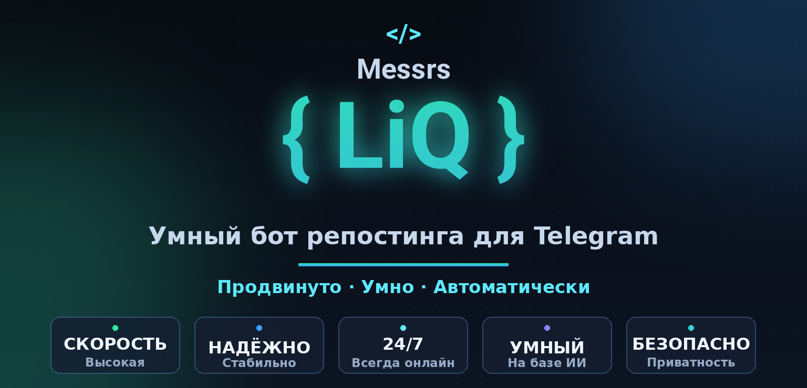
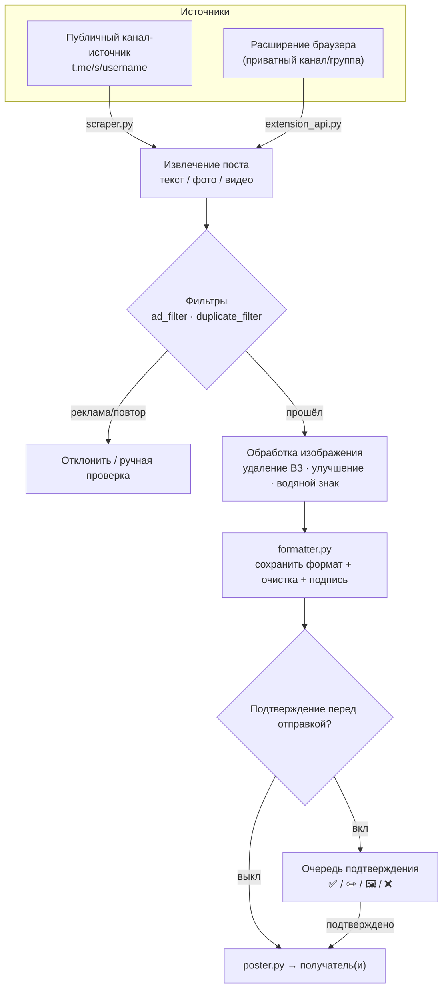

<a id="top"></a>

<div align="center">

🇮🇷 [فارسی](README.md) | 🇬🇧 [English](README.en.md) | 🇷🇺 **Русский** | 🇨🇳 [中文](README.zh_CN.md)



<h3>Умный репостинг, ИИ-обработка изображений и полная автоматизация Telegram-канала — всё из самого бота.</h3>

[](CHANGELOG.md)
[](tests/)
[](https://www.python.org/)
[](LICENSE)
[](https://core.telegram.org/bots/api)
[](#architecture)
[-FF7139?style=flat-square&logo=googlechrome&logoColor=white)](browser-extension/)
[](https://github.com/LiQTeam/telegram-repost/commits)
[](CONTRIBUTING.md)
[](#)

</div>

---

<a id="introduction"></a>

## 📖 Введение

**Полноценный движок автоматизации Telegram-канала, а не просто бот «скопировать-вставить».**

Messrs LiQ — умный Telegram-бот репостинга на **Python**, который читает публикации из каналов-источников, обрабатывает и очищает их (водяные знаки, ИИ-улучшение качества, удаление ссылок/рекламы) и доставляет в каналы-получатели по вашему расписанию — всё управляется прямо из бота через инлайн-кнопки, без отдельной веб-панели.

В отличие от простого бота-репостера, он **сохраняет исходное форматирование** (жирный/курсив/ссылки/спойлеры), пропускает изображения через **ИИ-конвейер** (удаление водяных знаков через LaMa и улучшение качества через Real-ESRGAN), **автоматически фильтрует** рекламные и повторяющиеся посты и предлагает **очередь подтверждения перед отправкой** для просмотра и правки каждого поста до публикации.

Публикации читаются из публичной веб-превью-страницы Telegram (`t.me/s/username`), поэтому боту нужен только токен и не нужны сессия или API ID (MTProto) — простая и безопасная установка ценой того, что каналы-источники должны быть публичными. Для приватных каналов включено **расширение для браузера**.

<a id="toc"></a>

## 📑 Содержание

<table align="center" width="100%">
<tr>
  <td align="center" width="25%">📖 <a href="#introduction">Введение</a></td>
  <td align="center" width="25%">⚠️ <a href="#important">Важное</a></td>
  <td align="center" width="25%">✨ <a href="#features">Возможности</a></td>
  <td align="center" width="25%">🏗 <a href="#architecture">Архитектура</a></td>
</tr>
<tr>
  <td align="center">🚀 <a href="#quick-start">Быстрый старт</a></td>
  <td align="center">⚙️ <a href="#configuration">Конфигурация</a></td>
  <td align="center">🖥 <a href="#requirements">Требования</a></td>
  <td align="center">📦 <a href="#structure">Структура</a></td>
</tr>
<tr>
  <td align="center">⚠️ <a href="#limitations">Ограничения</a></td>
  <td align="center">🤝 <a href="#contributing">Участие</a></td>
  <td align="center">📄 <a href="#license">Лицензия</a></td>
  <td align="center">⭐ <a href="#support">Поддержка</a></td>
</tr>
</table>

<a id="important"></a>

## ⚠️ Важное (прочитайте перед установкой)

> [!IMPORTANT]
> - **Каналы-источники должны быть публичными** — контент читается с `t.me/s/username`. Для приватных каналов/групп используйте **расширение для браузера**.
> - **Это не Userbot/MTProto-клиент** — работает только с токеном; поэтому «мгновенный» режим имеет задержку до 30 секунд, а не точно в момент публикации.
> - **ИИ-функции опциональны** — удаление водяных знаков (LaMa) и улучшение качества (Real-ESRGAN) требуют файлов моделей (~220 МБ) и `torch`; без них бот работает полностью, отключаются только эти две функции.
> - **ИИ-арбитраж и генерация изображений требуют API-ключей** — без ключей фильтр использует локальную логику (ключевые слова/ссылки/упоминания).
> - **Не открывайте API расширения в интернет** — токен передаётся открытым текстом; включайте только за файрволом.

<a id="features"></a>

## ✨ Возможности

Каждая возможность взята прямо из исходного кода с указанием соответствующего модуля.

### 📡 Управление каналами
- **Несколько каналов-источников и получателей** — любое число публичных источников и получателей, каждый отдельно включается. `database.py`
- **Произвольное сопоставление источник ↔ получатель** — один во многие и наоборот (полный fan-out). `scheduler.py`
- **Пользовательские имена каналов** — читаемая метка в списках вместо «сырого» username. `handlers/inputs.py`

### ⏱ Планирование и доставка
- **Семислотовое почасовое расписание** — у каждого источника семь независимых слотов (время Тегерана), каждый отдельно включается и перенастраивается. `scheduler.py`
- **Три режима отправки** — по расписанию, мгновенный (опрос каждые 30 с) или интервальный (каждые N минут); активен один на источник. `scheduler.py`
- **Наверстывание после простоя** — отложенный пост слота отправляется один раз сразу после запуска бота. `scheduler.py`
- **Мгновенная отправка последних 10/20/30 постов** — по правилу подтверждения канала. `manual_poster.py`

### 🛡 Подтверждение контента
- **Очередь подтверждения перед отправкой** — предпросмотр с четырьмя кнопками: **✅ Подтвердить**, **✏️ Изменить подпись**, **🖼 Заменить фото**, **❌ Отклонить**. `poster.py`
- **Выделенный канал подтверждения на пользователя** — у каждого оператора своя очередь в отдельном канале. `cli.py`

### 🖼 Обработка изображений и водяные знаки
- **ИИ-улучшение качества** — повышение чёткости/масштаба через `SRVGGNetCompact` (семейство Real-ESRGAN), оптимизировано под CPU. `sr_model.py`
- **Независимые водяные знаки Telegram и Instagram** — текст, 6 позиций, сплошной/градиентный цвет (10 пресетов), прозрачность, размер и живой предпросмотр. `custom_watermark.py`
- **ИИ-удаление водяных знаков** — обнаружение через Template Matching и угловые эвристики, восстановление через **LaMa** с автоматическим откатом к `cv2.inpaint`. `ai_watermark.py` · `lama_model.py`

### 🤖 Искусственный интеллект
- **Роутер текстового арбитража** — авто-выбор между **Mistral** и **Groq** по длине/типу текста. `ai_router.py`
- **Генерация изображений с цепочкой отказоустойчивости** — Pollinations → DeepAI → Stable Horde. `image_router.py`

### 🧠 Умная фильтрация
- **Фильтр рекламных постов (v3)** — контекстный анализ (ключевые слова, ссылки/упоминания, режим «коллекция», файлы конфигов VPN/прокси) + опциональный ИИ-арбитраж; действие «отклонить» или «ручная проверка». `ad_filter.py`
- **Фильтр повторов** — точное (хеш) сопоставление + нечёткий слой для одной новости с разными подписями. `duplicate_filter.py`
- **Сохранение форматирования и очистка** — безопасный для Telegram HTML + удаление ссылок/упоминаний/телефонов источника и подпись в конце поста. `formatter.py`

### 📰 Автопубликация (изолированный модуль)
- **Новости, цены и реклама** — отдельная подсистема со своей базой (`auto_poster.db`): цены (фиат/крипто/золото/рынки), запланированная реклама и новости с очередью подтверждения. `bot/auto_poster/`

### 🛠 Эксплуатация и устойчивость
- **Шифрованный бэкап и восстановление** — бэкапы с паролем, отправка в канал и восстановление с SAVEPOINT на каждую таблицу. `backup_manager.py`
- **Кэш и параллелизм** — кэш загрузок с TTL и тяжёлая работа в отдельном потоке под семафором. `cache.py` · `concurrency.py`
- **Мониторинг и уведомления** — мониторинг CPU/RAM/диска, уведомления администратора в приватный канал и публичный канал отчётов. `resource_monitor.py` · `notification_manager.py` · `public_report_channel.py`
- **Отчёт обратной связи фильтра (+ Excel)** — статистика и детали работы фильтра в виде файла Excel. `ad_feedback_report.py`

### 🌐 Расширение для браузера и инструменты
- **Коннектор Telegram Web (Chrome MV3)** — читает контент открытого приватного канала/группы в вашей вкладке и отправляет боту через локальный API. `browser-extension/` · `extension_api.py`
- **Полная панель + CLI** — цветные инлайн-кнопки (Bot API 9.4) и инструмент командной строки для добавления каналов/пользователей, списков, статистики и бэкапа. `button_style.py` · `cli.py`

<a id="architecture"></a>

## 🏗 Архитектура

Путь одного поста от источника к получателю:



Тяжёлая работа выполняется в отдельном потоке под семафором, чтобы бот никогда не зависал.

<a id="quick-start"></a>

## 🚀 Быстрый старт

На Linux-сервере (Ubuntu / Debian / CentOS) установите одной командой:

```bash
curl -fsSL https://raw.githubusercontent.com/LiQTeam/telegram-repost/main/install.sh | sudo bash
```

Установщик **интерактивный** и запрашивает:

| Запрос | Описание |
|---|---|
| Токен бота | от [@BotFather](https://t.me/BotFather) |
| ID администратора(ов) | от [@userinfobot](https://t.me/userinfobot), через запятую |
| Канал-получатель по умолчанию | опционально — можно добавить позже |
| Ключ Mistral / Groq | опционально — для ИИ-арбитража |

Затем он установит зависимости, `virtualenv`, пакеты и модели ИИ, создаст `.env` и запустит бота как сервис **systemd** (всегда включён + автоперезапуск, таймзона `Asia/Tehran`). В конце отправьте боту `/start` в Telegram.

<details>
<summary><b>Управление сервисом и ручная установка</b></summary>

<br/>

**Управление сервисом:**

```bash
systemctl status  mrliq-bot     # статус
systemctl restart mrliq-bot     # перезапуск (после правки .env)
journalctl -u mrliq-bot -f      # живые логи
```

**Ручная установка:**

```bash
git clone https://github.com/LiQTeam/telegram-repost.git
cd telegram-repost
python3 -m venv venv && source venv/bin/activate
pip install -r requirements.txt --extra-index-url https://download.pytorch.org/whl/cpu
cp .env.example .env      # затем заполните .env токеном/ID
python3 main.py
```

> Docker не поддерживается; официальное развёртывание — через systemd.

</details>

<a id="configuration"></a>

## ⚙️ Конфигурация

Все переменные читаются из `.env` (пример: [`.env.example`](.env.example)). Обязательны только `BOT_TOKEN` и `ADMIN_IDS`.

| Переменная | Обязат. | По умолчанию | Описание |
|---|:---:|---|---|
| `BOT_TOKEN` | ✅ | — | Токен бота от @BotFather |
| `ADMIN_IDS` | ✅ | — | Числовые ID администраторов, через запятую |
| `TARGET_CHAT_ID` | — | — | Канал-получатель по умолчанию |
| `DB_PATH` | — | `data/bot.sqlite` | Путь к базе SQLite |
| `TIMEZONE` | — | `Asia/Tehran` | Таймзона планирования |
| `MAX_CONCURRENT_HEAVY_JOBS` | — | `3` | Макс. изображений в обработке одновременно |
| `DOWNLOAD_CACHE_MAX_ITEMS` | — | `200` | Лимит элементов кэша загрузок |
| `DOWNLOAD_CACHE_TTL_SECONDS` | — | `1800` | Время хранения элемента (сек) |
| `DOWNLOAD_CACHE_MAX_BYTES` | — | `157286400` | Общий лимит кэша (байт, 150 МБ) |
| `MAX_DOWNLOAD_BYTES` | — | `62914560` | Лимит на файл (60 МБ) |
| `AD_FILTER_CACHE_MAX_ITEMS` | — | `2000` | Лимит кэша результатов ИИ |
| `AD_FILTER_CACHE_TTL_SECONDS` | — | `21600` | TTL кэша фильтра рекламы (сек) |
| `TEMPLATE_MATCH_THRESHOLD` | — | `0.75` | Порог совпадения шаблона ВЗ |
| `MAX_WATERMARK_AREA_RATIO` | — | `0.3` | Макс. доля площади зоны восстановления |
| `MISTRAL_API_KEY` / `GROQ_API_KEY` | — | — | Ключи ИИ-арбитража (опц.) |
| `POLLINATIONS_API_KEY` / `DEEPAI_API_KEY` / `STABLEHORDE_API_KEY` | — | — | Ключи генерации изображений (опц.) |
| `EXTENSION_API_ENABLED` | — | `false` | Включить API расширения |
| `EXTENSION_API_HOST` / `EXTENSION_API_PORT` | — | `0.0.0.0` / `8843` | Хост и порт API расширения |
| `EXTENSION_API_TOKEN` | — | — | Общий токен бот ↔ расширение |

<a id="requirements"></a>

## 🖥 Требования

| Пункт | Минимум / Рекомендуется |
|---|---|
| **Python** | 3.10 или новее |
| **ОС** | Linux (Ubuntu / Debian / CentOS и производные) |
| **RAM** | минимум 1 ГБ; **2 ГБ+ рекомендуется** с ИИ-функциями |
| **Диск** | ~500 МБ ядро + **~220 МБ** модели ИИ (`big-lama.pt` ~200 МБ, `realesr-general-x4v3.pth` ~17 МБ) |

**Ключевые зависимости:** `python-telegram-bot 21.6`, `aiohttp`, `beautifulsoup4`, `Pillow`, `opencv-python-headless`, `torch 2.4.1 (CPU)`, `cryptography`, `psutil`, `jdatetime`. Полный список в [`requirements.txt`](requirements.txt).

<a id="structure"></a>

## 📦 Структура проекта

```
telegram-repost/
├── main.py                  # точка входа: бот + планировщик + монитор + API расширения
├── cli.py                   # инструмент CLI (каналы/пользователи, списки, статистика, бэкап)
├── install.sh               # автоустановка на VPS (systemd, загрузка моделей)
├── requirements.txt · .env.example · CHANGELOG.md
├── assets/                  # баннеры и кнопка доната
├── fonts/                   # персидский шрифт Vazirmatn (водяной знак)
├── data/                    # база SQLite + логи (создаются при запуске)
├── docs/                    # доп. документация (развёртывание, отладка)
├── scripts/                 # генераторы баннеров/кнопок (Pillow)
├── tests/                   # автотесты — python3 tests/run_all.py
├── browser-extension/       # коннектор Telegram Web (Chrome MV3)
└── bot/
    ├── config.py · database.py · scraper.py · formatter.py
    ├── poster.py · scheduler.py · smart_scheduler.py · manual_poster.py
    ├── watermark.py · custom_watermark.py · ai_watermark.py · lama_model.py · sr_model.py
    ├── image_router.py · ai_router.py · ad_filter.py · duplicate_filter.py · ad_feedback_report.py
    ├── cache.py · concurrency.py · backup_manager.py · extension_api.py
    ├── resource_monitor.py · notification_manager.py · public_report_channel.py
    ├── button_style.py · button_config.py · jdatetime_utils.py · utils.py · keyboards.py
    ├── handlers/            # menu.py · inputs.py · common.py
    └── auto_poster/         # изолированный модуль «цены/реклама/новости» (отдельная БД)
```

<a id="limitations"></a>

## ⚠️ Ограничения

- Каналы-источники должны быть публичными (приватные — только через расширение).
- Мгновенный режим имеет задержку до 30 с (нет MTProto/Userbot).
- Большие видео иногда не имеют прямой ссылки на публичной превью-странице и пропускаются.
- Качество исходных фото уже сжато Telegram; «ИИ-улучшение» частично компенсирует, но не восстанавливает оригинал.
- В режиме расписания дневной лимит источника равен числу активных слотов (до 7).
- Цвета кнопок видны только в актуальных клиентах Telegram (три цвета: синий/зелёный/красный).
- Модели ИИ и API-ключи опциональны; без них соответствующие функции отключаются.

<a id="contributing"></a>

## 🤝 Участие

Вклад приветствуется! Прочитайте [`CONTRIBUTING.md`](CONTRIBUTING.md) перед созданием Pull Request. Кратко: сделайте форк, работайте в отдельной ветке, запустите тесты `python3 tests/run_all.py` и откройте PR с понятным описанием.

<a id="license"></a>

## 📄 Лицензия

Распространяется под лицензией **MIT** — см. [`LICENSE`](LICENSE).

<a id="support"></a>

## ⭐ Поддержка

Если проект вам помог, поставьте ⭐ — это лучшая мотивация продолжать разработку.

<div align="center">
<br/>
<!-- Замените на свою ссылку для доната -->
<a href="https://github.com/LiQTeam/telegram-repost"></a>
<br/><br/>
<sub><a href="#top">⬆️ Наверх</a></sub>
</div>
