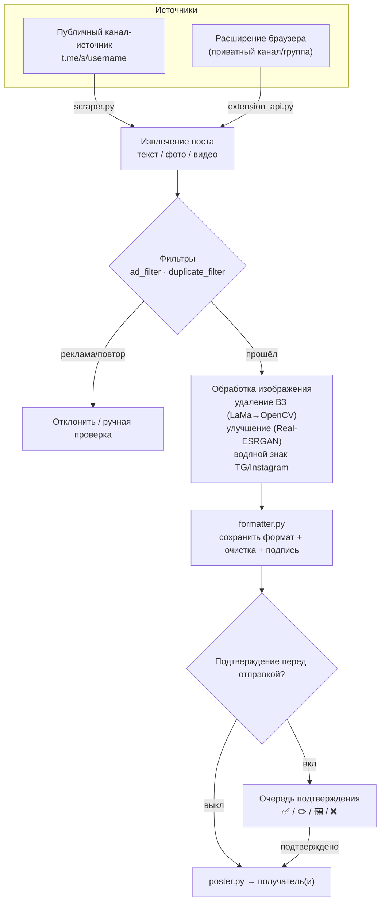

<a id="top"></a>

<div align="center">

🇮🇷 [فارسی](README.md) | 🇬🇧 [English](README.en.md) | 🇷🇺 **Русский** | 🇨🇳 [中文](README.zh_CN.md)


<h3>Умный репостинг, ИИ-обработка изображений и полная автоматизация Telegram-канала — всё из самого бота.</h3>

[](CHANGELOG.md)
[](tests/)
[](https://www.python.org/)
[](LICENSE)
[](https://core.telegram.org/bots/api)
[](#architecture)
[-FF7139?style=flat-square&logo=googlechrome&logoColor=white)](browser-extension/)
[](https://github.com/LiQTeam/telegram-repost/commits)
[](CONTRIBUTING.md)
[](#)

</div>

---

<a id="introduction"></a>

## 📖 Введение

**Полноценный движок автоматизации Telegram-канала, а не просто бот «скопировать-вставить».**

Messrs LiQ (внутреннее имя MR LiQ) — умный Telegram-бот репостинга на Python, который читает публикации из каналов-источников, обрабатывает и очищает их (водяные знаки, ИИ-улучшение качества, удаление ссылок/рекламы) и доставляет в каналы-получатели по вашему расписанию — причём все настройки управляются прямо из бота через инлайн-кнопки, без отдельной веб-панели.

Это полная переработка прежней PHP-панели, но отличие от простого бота-репостера принципиальное: вместо простой пересылки текста он **сохраняет исходное форматирование** (жирный/курсив/ссылки/спойлеры), пропускает изображения через **ИИ-конвейер обработки** (удаление прежних водяных знаков моделью LaMa и улучшение качества через Real-ESRGAN), **автоматически фильтрует** рекламные и повторяющиеся посты и предлагает **очередь подтверждения перед отправкой**, позволяющую просмотреть и отредактировать каждый пост до публикации.

Поскольку источником служит публичная веб-превью-страница Telegram (`t.me/s/username`), боту нужен только токен и не требуются сессия или API ID (MTProto) — это означает простую и безопасную установку ценой того, что каналы-источники должны быть публичными. Для приватных каналов включено **расширение для браузера**, читающее контент из вашей же авторизованной вкладки Telegram Web.

<a id="toc"></a>

## 📑 Содержание

| | |
|---|---|
| 📖 [Введение](#introduction) | 🖼 [Скриншоты](#screenshots) |
| ⚠️ [Важное](#important) | 🚀 [Быстрый старт](#quick-start) |
| ✨ [Возможности](#features) | ⚙️ [Конфигурация](#configuration) |
| 🏗 [Архитектура](#architecture) | 🖥 [Требования](#requirements) |
| 📦 [Структура проекта](#structure) | ⚠️ [Ограничения](#limitations) |
| 🌐 [Языки и шрифты](#languages) | 🤝 [Участие](#contributing) |
| 📄 [Лицензия](#license) | ⭐ [Поддержка](#support) |

<a id="important"></a>

## ⚠️ Важное (прочитайте перед установкой)

> [!IMPORTANT]
> - **Каналы-источники должны быть публичными.** Источник читается со страницы публичного превью `t.me/s/username`. Для приватных каналов/групп используйте **расширение для браузера**.
> - **Это не Userbot/MTProto-клиент.** Он работает только с токеном; поэтому «мгновенный» режим происходит с задержкой до 30 секунд (интервал опроса бота), а не точно в момент публикации.
> - **ИИ-функции опциональны.** Удаление водяных знаков (LaMa) и улучшение качества (Real-ESRGAN) требуют файлов моделей (~220 МБ) и `torch`. Без них бот работает полностью, а эти две функции просто отключаются без ошибок.
> - **ИИ-арбитраж фильтра рекламы и генерация изображений требуют API-ключей** (Mistral/Groq и Pollinations/DeepAI/Stable Horde). Без ключей фильтр использует свою локальную логику (ключевые слова/ссылки/упоминания).
> - **Не открывайте API расширения в открытый интернет.** Токен передаётся открытым текстом; включайте его только за файрволом или в доверенной сети.
> - **ИИ-обработка изображений нагружает CPU.** На небольших VPS держите `MAX_CONCURRENT_HEAVY_JOBS` низким.

<a id="features"></a>

## ✨ Возможности

Каждая возможность взята прямо из исходного кода с указанием соответствующих модулей.

### 📡 Управление каналами
- **Несколько каналов-источников и получателей** — любое число публичных источников и получателей, каждый включается/отключается отдельно. `database.py`
- **Произвольное сопоставление источник ↔ получатель** — один источник во множество получателей и наоборот; полный fan-out. `scheduler.py`
- **Пользовательские имена каналов** — читаемая метка в списках вместо «сырого» username. `handlers/inputs.py`

### ⏱ Планирование и доставка
- **Семислотовое почасовое расписание** — у каждого источника семь независимых слотов (по времени Тегерана), каждый отдельно включается и перенастраивается. `scheduler.py`
- **Три режима отправки** — семислотовое расписание, мгновенный (опрос каждые 30 с) или интервальный (каждые N минут); для источника активен ровно один. `scheduler.py`
- **Наверстывание после простоя** — если бот был выключен в момент слота, он один раз отправит отложенный пост сразу после запуска. `scheduler.py`
- **Мгновенная отправка последних 10/20/30 постов** — берёт свежие посты канала и отправляет по правилу подтверждения этого канала. `manual_poster.py`
- **Умное планирование (экспериментально)** — анализ статистики и подсказка лучшего времени (ограничено данными Bot API). `smart_scheduler.py`

### 🛡 Подтверждение контента
- **Очередь подтверждения перед отправкой** — финальный предпросмотр каждого поста с четырьмя кнопками: **✅ Подтвердить**, **✏️ Изменить подпись**, **🖼 Заменить фото**, **❌ Отклонить**. `poster.py`
- **Выделенный канал подтверждения на пользователя** — у каждого оператора своя очередь в отдельном канале/группе. `cli.py add-user`

### 🖼 Обработка изображений
- **ИИ-улучшение качества** — повышение чёткости/масштаба слабых изображений через `SRVGGNetCompact` (семейство Real-ESRGAN, самостоятельная реализация на чистом torch, без `basicsr`), оптимизировано под CPU. `sr_model.py`
- **Роутер обработки с контролем параллелизма** — вся тяжёлая работа выполняется в отдельном потоке под семафором. `image_router.py` · `concurrency.py`

### 🎨 Система водяных знаков
- **Независимые графические водяные знаки для Telegram и Instagram** — текст, 6 позиций, сплошной/градиентный цвет из 10 пресетов, прозрачность, размер шрифта, отступ от края и живой предпросмотр. `custom_watermark.py` · `watermark.py`
- **Полностью настраивается из бота владельцем** — без правки кода. `button_config.py`

### 🤖 ИИ-конвейер
- **ИИ-удаление водяных знаков** — обнаружение через Template Matching (`data/watermark_templates/`) и угловые эвристики, затем локальное восстановление моделью **LaMa** (TorchScript, `torch.jit`), с **автоматическим откатом к `cv2.inpaint`** при отсутствии модели или ошибке. `ai_watermark.py` · `lama_model.py`
- **Роутер текстового ИИ-арбитража** — автоматический выбор между **Mistral** и **Groq** по длине/типу текста. `ai_router.py`
- **Генерация изображений с цепочкой отказоустойчивости** — Pollinations → DeepAI → Stable Horde; ошибки/таймауты/лимиты автоматически переключают на следующий сервис. `image_router.py`

### 🧠 Умная фильтрация
- **Фильтр рекламных постов (движок v3)** — контекстный анализ по ключевым словам, числу ссылок/упоминаний, режиму «коллекция» и обнаружению файлов конфигов VPN/прокси, плюс **опциональный ИИ-арбитраж по каждому посту**; действие — «отклонить» или «на ручную проверку». `ad_filter.py`
- **Фильтр повторов** — точное (по хешу) сопоставление плюс **нечёткий** слой для одной и той же новости с разными метками/подписями в разных источниках. `duplicate_filter.py`
- **Сохранение форматирования + умная очистка** — перенос безопасного для Telegram HTML и удаление ссылок/упоминаний/телефонов канала-источника, плюс подпись-ссылка в конце поста. `formatter.py`
- **Отчёт обратной связи фильтра (+ экспорт в Excel)** — статистика и детали работы фильтра в виде загружаемой книги из двух листов. `ad_feedback_report.py`

### 📰 Автопубликация (изолированный модуль)
- **Новости, цены и реклама** — полностью отдельная подсистема со своей базой (`auto_poster.db`): автопубликация цен (фиат/крипто/золото/рынки), запланированная реклама с кнопками и новости с очередью подтверждения администратора. `bot/auto_poster/`

### 🛠 Эксплуатация и устойчивость
- **Шифрованный бэкап и полное восстановление** — бэкапы с паролем, отправка в канал и восстановление с SAVEPOINT на каждую таблицу. `backup_manager.py`
- **Кэш загрузок** — временное хранение файлов с TTL и лимитами по числу/байтам. `cache.py`
- **Монитор ресурсов** — мониторинг CPU/RAM/диска в реальном времени с автоматическими оповещениями. `resource_monitor.py`
- **Менеджер уведомлений** — направляет уведомления администратора в отдельный приватный канал. `notification_manager.py`
- **Публичный канал отчётов** — прозрачные отчёты об успехах, предупреждения о простое (с тегом ответственного) и ответные благодарности. `public_report_channel.py`

### 🌐 Расширение для браузера
- **Коннектор Telegram Web (Chrome MV3)** — читает контент открытого приватного канала/группы в вашей авторизованной вкладке и отправляет боту через локальный API (`aiohttp`), с живым статусом соединения и очередью при сбоях сети. `browser-extension/` · `extension_api.py`

### 🖥 Панель, CLI и инструменты
- **Полная панель внутри бота** — цветные инлайн-кнопки (Bot API 9.4: синий/зелёный/красный, внедрение через `api_kwargs`), осмысленная и зависящая от времени раскраска. `button_style.py` · `button_config.py`
- **Инструмент командной строки (CLI)** — `add-source`, `add-destination`, `add-user`, `list-sources`, `list-destinations`, `stats`, `backup`. `cli.py`
- **Джалали (персидский) календарь** — полный вывод даты/времени по-персидски. `jdatetime_utils.py`

<a id="architecture"></a>

## 🏗 Архитектура

Путь одного поста от источника к получателю:



Тяжёлая работа (`concurrency.py`) выполняется в отдельном потоке под семафором, чтобы бот никогда не «зависал». Модуль `auto_poster/` (цены/реклама/новости) работает рядом с этим путём, полностью отдельно и со своей базой данных.

<a id="screenshots"></a>

## 🖼 Скриншоты

<details>
<summary><b>Нажмите, чтобы развернуть</b></summary>

<br/>

<!-- Добавьте сюда скриншоты панели бота и расширения браузера -->
<!--


-->

_Скриншоты пока не добавлены._

</details>

<a id="quick-start"></a>

## 🚀 Быстрый старт

### Установка одной строкой (рекомендуется)

На Linux-сервере (Ubuntu / Debian / CentOS):

```bash
curl -fsSL https://raw.githubusercontent.com/LiQTeam/telegram-repost/main/install.sh | sudo bash
```

Установщик **интерактивный** и запрашивает:

| Запрос | Описание |
|---|---|
| Токен бота | от [@BotFather](https://t.me/BotFather) |
| ID администратора(ов) | от [@userinfobot](https://t.me/userinfobot), через запятую |
| Канал-получатель по умолчанию | опционально — можно добавить позже из бота |
| Ключ Mistral / Groq | опционально — для ИИ-арбитража фильтра рекламы |

Далее он установит зависимости, `virtualenv`, пакеты (включая CPU-`torch` и файлы моделей LaMa/Real-ESRGAN), создаст `.env` и запустит бота как сервис **systemd** (всегда включён + автоперезапуск, таймзона `Asia/Tehran`).

### Управление сервисом

```bash
systemctl status  mrliq-bot     # статус
systemctl restart mrliq-bot     # перезапуск (после правки .env)
journalctl -u mrliq-bot -f      # живые логи
```

### Ручная установка (альтернатива)

```bash
git clone https://github.com/LiQTeam/telegram-repost.git
cd telegram-repost
python3 -m venv venv && source venv/bin/activate
pip install -r requirements.txt --extra-index-url https://download.pytorch.org/whl/cpu
cp .env.example .env      # затем заполните .env токеном/ID
python3 main.py
```

После установки отправьте боту `/start` в Telegram, чтобы открыть панель администратора.

> [!NOTE]
> Docker сейчас не поддерживается; официальное развёртывание — через systemd.

<a id="configuration"></a>

## ⚙️ Конфигурация

Все переменные читаются из `.env` (полный пример: [`.env.example`](.env.example)). Обязательны только `BOT_TOKEN` и `ADMIN_IDS`.

| Переменная | Обязат. | По умолчанию | Описание |
|---|:---:|---|---|
| `BOT_TOKEN` | ✅ | — | Токен бота от @BotFather |
| `ADMIN_IDS` | ✅ | — | Числовые ID администраторов, через запятую |
| `TARGET_CHAT_ID` | — | — | Канал-получатель по умолчанию |
| `DB_PATH` | — | `data/bot.sqlite` | Путь к базе SQLite |
| `TIMEZONE` | — | `Asia/Tehran` | Таймзона планирования |
| `MAX_CONCURRENT_HEAVY_JOBS` | — | `3` | Макс. изображений в обработке одновременно |
| `DOWNLOAD_CACHE_MAX_ITEMS` | — | `200` | Лимит элементов кэша загрузок |
| `DOWNLOAD_CACHE_TTL_SECONDS` | — | `1800` | Время хранения элемента (сек) |
| `DOWNLOAD_CACHE_MAX_BYTES` | — | `157286400` | Общий лимит кэша (байт, 150 МБ) |
| `MAX_DOWNLOAD_BYTES` | — | `62914560` | Лимит на файл (байт, 60 МБ) |
| `AD_FILTER_CACHE_MAX_ITEMS` | — | `2000` | Лимит кэша результатов ИИ |
| `AD_FILTER_CACHE_TTL_SECONDS` | — | `21600` | TTL кэша фильтра рекламы (сек) |
| `TEMPLATE_MATCH_THRESHOLD` | — | `0.75` | Порог совпадения шаблона ВЗ |
| `MAX_WATERMARK_AREA_RATIO` | — | `0.3` | Макс. доля площади зоны восстановления |
| `MISTRAL_API_KEY` | — | — | Ключ Mistral (ИИ-арбитраж) |
| `GROQ_API_KEY` | — | — | Ключ Groq (ИИ-арбитраж) |
| `POLLINATIONS_API_KEY` | — | — | Ключ генерации изображений Pollinations |
| `DEEPAI_API_KEY` | — | — | Ключ генерации изображений DeepAI |
| `STABLEHORDE_API_KEY` | — | — | Ключ генерации изображений Stable Horde |
| `IMAGE_GEN_TIMEOUT` | — | `30` | Таймаут генерации (сек) |
| `IMAGE_GEN_MAX_RETRIES` | — | `2` | Макс. повторов генерации |
| `STABLEHORDE_POLL_TIMEOUT` | — | `180` | Таймаут опроса Stable Horde |
| `STABLEHORDE_POLL_INTERVAL` | — | `5` | Интервал опроса (сек) |
| `EXTENSION_API_ENABLED` | — | `false` | Включить API расширения |
| `EXTENSION_API_HOST` | — | `0.0.0.0` | Хост API расширения |
| `EXTENSION_API_PORT` | — | `8843` | Порт API расширения |
| `EXTENSION_API_TOKEN` | — | — | Общий токен бот ↔ расширение |

<a id="requirements"></a>

## 🖥 Требования

| Пункт | Минимум / Рекомендуется |
|---|---|
| **Python** | 3.10 или новее |
| **ОС** | Linux (Ubuntu / Debian / CentOS и производные); автоустановка через `apt`/`yum`/`dnf` |
| **RAM** | минимум 1 ГБ для ядра; **2 ГБ+ рекомендуется** с ИИ-функциями (torch + модели) |
| **Диск** | ~500 МБ для ядра и зависимостей; **+~220 МБ** для файлов моделей ИИ (`big-lama.pt` ~200 МБ, `realesr-general-x4v3.pth` ~17 МБ) |
| **Сеть** | доступ к `api.telegram.org` и (для загрузки моделей) `github.com` |

**Ключевые зависимости:** `python-telegram-bot 21.6`, `aiohttp`, `beautifulsoup4` + `lxml`, `Pillow`, `numpy`, `opencv-python-headless`, `torch 2.4.1 (CPU)`, `cryptography`, `psutil`, `jdatetime` + `tzdata`, `arabic-reshaper` + `python-bidi`, `openpyxl`. Полный список в [`requirements.txt`](requirements.txt).

> ИИ-функции (LaMa, Real-ESRGAN) нагружают CPU; на слабых серверах работают медленнее, но никогда не блокируют репостинг (автоматический откат).

<a id="structure"></a>

## 📦 Структура проекта

```
telegram-repost/
├── main.py                     # точка входа: бот + планировщик + монитор + auto/manual poster + API расширения
├── cli.py                      # инструмент CLI (каналы/пользователи, списки, статистика, бэкап)
├── install.sh                  # автоустановка на VPS (systemd, загрузка моделей)
├── requirements.txt
├── .env.example                # полный пример конфигурации
├── CHANGELOG.md
├── assets/                     # баннер, кнопка доната, иконки водяных знаков
├── fonts/                      # персидский шрифт Vazirmatn (корректный RTL-рендер ВЗ)
├── data/                       # база SQLite + логи (создаются при запуске)
├── docs/                       # доп. документация (гайд развёртывания, отчёт отладки)
├── scripts/                    # генератор кнопки доната (Pillow)
├── tests/                      # автотесты — python3 tests/run_all.py
├── browser-extension/          # коннектор Telegram Web (Chrome MV3): background/content/popup/options
└── bot/
    ├── config.py               # чтение настроек из .env
    ├── database.py             # слой SQLite: каналы, сопоставления, слоты, логи
    ├── scraper.py              # получение постов с t.me/s/username (+ пагинация, восстановление видео)
    ├── formatter.py            # сырой HTML → безопасный HTML Telegram + очистка ссылок/упоминаний/телефонов
    ├── poster.py               # финальная подпись, очередь подтверждения, отправка получателю
    ├── scheduler.py            # тик планировщика: слоты/мгновенный/интервал + fan-out
    ├── smart_scheduler.py      # умное планирование (анализ + подсказка времени)
    ├── manual_poster.py        # ручная/мгновенная отправка + управление очередью (префикс manual:)
    ├── watermark.py            # построение блока ВЗ через Pillow
    ├── custom_watermark.py     # независимые ВЗ Telegram/Instagram
    ├── ai_watermark.py         # обнаружение ВЗ (Template + OpenCV) + оркестрация удаления
    ├── lama_model.py           # восстановление LaMa (TorchScript) + откат OpenCV
    ├── sr_model.py             # улучшение качества (SRVGGNetCompact / Real-ESRGAN)
    ├── image_router.py         # генерация изображений с цепочкой отказоустойчивости
    ├── ai_router.py            # текстовый ИИ-арбитраж (Mistral / Groq)
    ├── ad_filter.py            # фильтр рекламы (v3, контекстный + ИИ)
    ├── duplicate_filter.py     # фильтр повторов (хеш + нечёткий)
    ├── ad_feedback_report.py   # отчёт обратной связи фильтра + экспорт в Excel
    ├── cache.py                # кэш загрузок
    ├── concurrency.py          # семафор + поток для тяжёлых задач
    ├── backup_manager.py       # шифрованный бэкап + восстановление
    ├── extension_api.py        # сервер aiohttp для расширения браузера
    ├── resource_monitor.py     # монитор CPU/RAM/диска + оповещения
    ├── notification_manager.py # уведомления администратора в отдельный приватный канал
    ├── public_report_channel.py# публичный канал отчётов/прозрачности
    ├── button_style.py         # цветные кнопки (Bot API 9.4 через api_kwargs)
    ├── button_config.py        # центральная конфигурация цвета/текста/расписания кнопок
    ├── jdatetime_utils.py      # утилиты даты Джалали (персидский)
    ├── utils.py · keyboards.py
    ├── handlers/               # menu.py (роутер кнопок) · inputs.py (ввод админа) · common.py
    └── auto_poster/            # изолированный модуль «цены/реклама/новости», отдельная БД (auto_poster.db)
        └── config.py · db.py · scheduler.py · ads.py · menu.py · keyboards.py
```

<a id="limitations"></a>

## ⚠️ Ограничения

- **Каналы-источники должны быть публичными** (кроме приватных случаев через расширение браузера).
- **Задержка ~30 с в мгновенном режиме** — из-за отсутствия MTProto/Userbot.
- **Большие видео** иногда не имеют прямой ссылки на публичной превью-странице и пропускаются (ограничение Telegram).
- **Качество исходных фото** уже сжато Telegram; «ИИ-улучшение» частично компенсирует, но не восстанавливает оригинал.
- **Дневной лимит отправки** в режиме расписания равен числу активных слотов (до 7) в день.
- **Умное планирование** практически ограничено без данных о просмотрах — Bot API Telegram не отдаёт просмотры сообщений.
- **Цвета кнопок** — только три варианта (синий/зелёный/красный) и видны лишь в актуальных клиентах Telegram; старые версии показывают обычную серую кнопку (без ошибки).
- **Редактирование фото альбома** в предпросмотре подтверждения меняет только первое (обложечное) фото.
- **Модели ИИ и API-ключи опциональны**; без них соответствующие функции просто отключаются.

<a id="languages"></a>

## 🌐 Языки и шрифты

- **Язык интерфейса бота:** персидский (с календарём Джалали/персидским из `jdatetime_utils.py`).
- **Документация:** 🇮🇷 فارسی · 🇬🇧 English · 🇷🇺 Русский · 🇨🇳 中文.
- **Шрифт водяных знаков:** персидский шрифт **Vazirmatn** (Bold/Medium) поставляется в `fonts/`. Для корректного рендеринга персидского/арабского (соединение букв + справа-налево) используются `arabic-reshaper` и `python-bidi`; без персидского шрифта латиница отображается нормально, но персидский может выглядеть неполно.

<a id="contributing"></a>

## 🤝 Участие

Вклад приветствуется! Пожалуйста, прочитайте [`CONTRIBUTING.md`](CONTRIBUTING.md) перед созданием Pull Request. Кратко: сделайте форк, работайте в отдельной ветке, запустите тесты `python3 tests/run_all.py` и откройте PR с понятным описанием. Для багов и предложений открывайте Issue.

<a id="license"></a>

## 📄 Лицензия

Распространяется под лицензией **MIT** — см. [`LICENSE`](LICENSE).

<a id="support"></a>

## ⭐ Поддержка

Если проект вам помог, поставьте ⭐ — это лучшая мотивация продолжать разработку.

<div align="center">
<br/>
<!-- Замените на свою ссылку для доната -->
<a href="https://github.com/LiQTeam/telegram-repost"></a>
<br/><br/>
<sub><a href="#top">⬆️ Наверх</a></sub>
</div>
