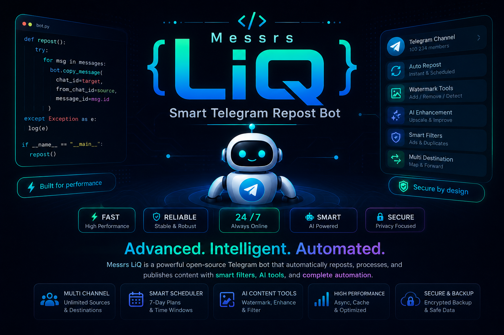
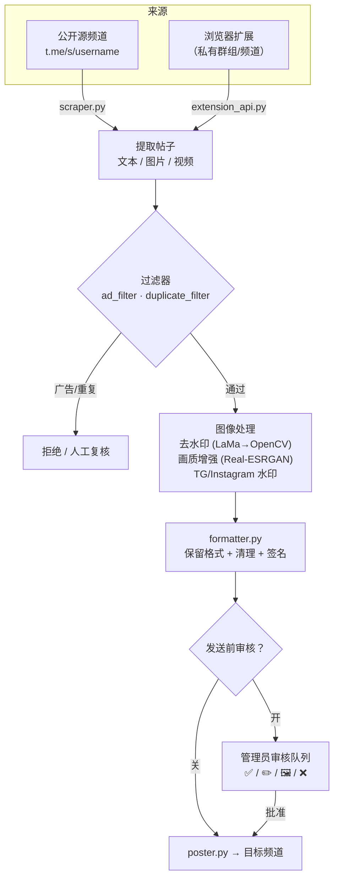

<a id="top"></a>

<div align="center">

🇮🇷 [فارسی](README.md) | 🇬🇧 [English](README.en.md) | 🇷🇺 [Русский](README.ru_RU.md) | 🇨🇳 **中文**



<h3>智能转发、AI 图像处理与完整的 Telegram 频道自动化 —— 一切都在机器人内部完成。</h3>

[](CHANGELOG.md)
[](tests/)
[](https://www.python.org/)
[](LICENSE)
[](https://core.telegram.org/bots/api)
[](#architecture)
[-FF7139?style=flat-square&logo=googlechrome&logoColor=white)](browser-extension/)
[](https://github.com/LiQTeam/telegram-repost/commits)
[](CONTRIBUTING.md)
[](#)

</div>

---

<a id="introduction"></a>

## 📖 简介

**一个完整的 Telegram 频道自动化引擎，而非简单的「复制粘贴」机器人。**

Messrs LiQ（内部名 MR LiQ）是一个用 Python 编写的智能 Telegram 转发机器人：它读取源频道的帖子，进行处理与清理（水印、AI 画质增强、去除链接/广告），并按你的计划投递到目标频道 —— 所有设置都通过内联玻璃按钮在机器人内部完成，无需独立的网页面板。

它是此前 PHP 面板的完全重写，但与简单转发机器人的差异是根本性的：它不仅仅转发文本，而是**保留原帖格式**（粗体/斜体/链接/剧透），让图片经过 **基于 AI 的图像流水线**（用 LaMa 模型去除旧水印、用 Real-ESRGAN 增强画质），**自动过滤**广告与重复帖子，并提供**发送前审核队列**，让你在发布前查看并编辑每条帖子。

由于数据来源是 Telegram 的公开网页预览页（`t.me/s/username`），机器人只需一个 bot token，无需 Telegram 会话或 API ID（MTProto）—— 这意味着安装简单又安全，代价是源频道必须是公开的。对于私有频道，项目附带一个**浏览器扩展**，从你自己已登录的 Telegram Web 标签页读取内容。

<a id="toc"></a>

## 📑 目录

| | |
|---|---|
| 📖 [简介](#introduction) | 🖼 [截图](#screenshots) |
| ⚠️ [重要提示](#important) | 🚀 [快速开始](#quick-start) |
| ✨ [功能特性](#features) | ⚙️ [配置](#configuration) |
| 🏗 [架构](#architecture) | 🖥 [环境要求](#requirements) |
| 📦 [项目结构](#structure) | ⚠️ [已知限制](#limitations) |
| 🌐 [语言与字体](#languages) | 🤝 [参与贡献](#contributing) |
| 📄 [许可证](#license) | ⭐ [支持](#support) |

<a id="important"></a>

## ⚠️ 重要提示（安装前必读）

> [!IMPORTANT]
> - **源频道必须是公开的。** 内容读取自公开的 `t.me/s/username` 预览页。私有频道/群组请使用**浏览器扩展**。
> - **这不是 Userbot/MTProto 客户端。** 仅凭 bot token 工作；因此「即时」模式会有最多 30 秒的延迟（机器人的轮询间隔），而非在发布的同一刻。
> - **AI 功能为可选。** 水印去除（LaMa）与画质增强（Real-ESRGAN）需要模型文件（约 220MB）和 `torch`。若未下载，机器人仍可完整运行，仅这两项功能会被优雅地禁用。
> - **广告过滤的 AI 裁决与图像生成需要 API 密钥**（Mistral/Groq 与 Pollinations/DeepAI/Stable Horde）。没有密钥时，过滤器会退回到本地逻辑（关键词/链接/提及）。
> - **请勿将扩展 API 暴露到公网。** token 以明文传输；仅在防火墙之后或可信网络中启用。
> - **AI 图像处理很吃 CPU。** 在小型 VPS 上请将 `MAX_CONCURRENT_HEAVY_JOBS` 保持较低。

<a id="features"></a>

## ✨ 功能特性

以下每项功能均直接取自源码，并标注相关模块。

### 📡 频道管理
- **多源频道与多目标频道** —— 任意数量的公开源与目标，各自独立开关。`database.py`
- **任意的 源 ↔ 目标 映射** —— 一源可到多目标，一目标可收多源；完整 fan-out。`scheduler.py`
- **自定义频道名称** —— 列表中显示易读标签，而非原始 username。`handlers/inputs.py`

### ⏱ 计划与投递
- **七时段每小时计划** —— 每个源有七个独立时段（德黑兰时间），各自可开关与改时。`scheduler.py`
- **三种发送模式** —— 七时段计划、即时（每 30 秒轮询）或间隔（每 N 分钟）；每个源仅一种生效。`scheduler.py`
- **停机补发** —— 若时段到点时机器人处于关闭状态，重启后会一次性补发该积压帖子。`scheduler.py`
- **即时发送最近 10/20/30 条** —— 抓取某频道的最新帖子，按该频道的审核规则发送。`manual_poster.py`
- **智能计划（实验性）** —— 分析统计并建议最佳时间（受 Bot API 数据限制）。`smart_scheduler.py`

### 🛡 内容审核
- **发送前审核队列** —— 每条帖子的最终预览，含四个按钮：**✅ 批准发送**、**✏️ 编辑说明**、**🖼 替换图片**、**❌ 拒绝**。`poster.py`
- **每用户专属审核频道** —— 每位操作者可在单独的频道/群组中拥有自己的审核队列。`cli.py add-user`

### 🖼 图像处理
- **AI 画质增强** —— 用 `SRVGGNetCompact`（Real-ESRGAN 系列，基于原生 torch 独立实现，无需 `basicsr`）对低质图片锐化/放大，针对 CPU 优化。`sr_model.py`
- **带并发控制的处理路由** —— 所有重任务在独立线程、信号量之下运行。`image_router.py` · `concurrency.py`

### 🎨 水印系统
- **Telegram 与 Instagram 的独立图形水印** —— 文本、6 个位置、来自 10 种预设的纯色/渐变色、透明度、字号、边距，以及实时预览。`custom_watermark.py` · `watermark.py`
- **由拥有者驱动，可在机器人内完全配置** —— 无需改代码。`button_config.py`

### 🤖 AI 流水线
- **AI 水印去除** —— 通过模板匹配（`data/watermark_templates/`）与角落启发式检测，再用 **LaMa** 模型（TorchScript，`torch.jit`）局部修复，模型缺失或出错时**自动回退到 `cv2.inpaint`**。`ai_watermark.py` · `lama_model.py`
- **AI 文本裁决路由** —— 依据文本长度/类型在 **Mistral** 与 **Groq** 之间自动选择。`ai_router.py`
- **带故障转移链的图像生成** —— Pollinations → DeepAI → Stable Horde；出错/超时/限流会自动切换到下一个服务。`image_router.py`

### 🧠 智能过滤
- **广告帖过滤（v3 引擎）** —— 基于关键词、链接/提及数量、「合集」模式与 VPN/代理配置文件检测的上下文分析，并可选**对每条帖子进行 AI 裁决**；动作为「拒绝」或「转人工复核」。`ad_filter.py`
- **重复帖过滤** —— 精确（哈希）匹配，外加一层**模糊**检测，用于跨源、带不同标记/签名的同一新闻。`duplicate_filter.py`
- **格式保留 + 智能清理** —— 转移 Telegram 安全 HTML，并去除源频道的链接/提及/电话号码，附带帖尾的带链接签名。`formatter.py`
- **过滤反馈报告（+ Excel 导出）** —— 过滤器性能统计与明细，导出为可下载的双工作表表格。`ad_feedback_report.py`

### 📰 自动发布（隔离模块）
- **新闻、价格与广告** —— 拥有独立数据库（`auto_poster.db`）的完全独立子系统：自动发布价格（法币/加密/黄金/市场）、带玻璃按钮的定时广告，以及带管理员审核队列的新闻。`bot/auto_poster/`

### 🛠 运维与稳健性
- **加密备份与完整恢复** —— 带密码的备份、发送到频道，以及按表 SAVEPOINT 的恢复。`backup_manager.py`
- **下载缓存** —— 带 TTL 与数量/字节上限的临时文件保留。`cache.py`
- **资源监控** —— 实时 CPU/RAM/磁盘监控并自动告警。`resource_monitor.py`
- **通知管理器** —— 将管理员通知分流到单独的私有频道。`notification_manager.py`
- **公开报告频道** —— 透明的成功报告、不活跃告警（@ 相关负责人）与线程式致谢。`public_report_channel.py`

### 🌐 浏览器扩展
- **Telegram Web 连接器（Chrome MV3）** —— 从你已登录标签页中打开的私有群组/频道读取内容，经本地 API（`aiohttp`）发送给机器人，具备实时连接状态显示与断网时的排队。`browser-extension/` · `extension_api.py`

### 🖥 面板、CLI 与工具
- **机器人内完整面板** —— 彩色内联按钮（Bot API 9.4：蓝/绿/红，经 `api_kwargs` 注入），语义化且随时间窗口变化的着色。`button_style.py` · `button_config.py`
- **命令行工具（CLI）** —— `add-source`、`add-destination`、`add-user`、`list-sources`、`list-destinations`、`stats`、`backup`。`cli.py`
- **贾拉里（波斯）历** —— 完整的波斯语日期/时间渲染。`jdatetime_utils.py`

<a id="architecture"></a>

## 🏗 架构

一条帖子从源到目标的路径：



重任务（`concurrency.py`）在信号量之下的独立线程中运行，使机器人永不卡死。`auto_poster/` 模块（价格/广告/新闻）与该路径并行运行，完全独立并使用自己的数据库。

<a id="screenshots"></a>

## 🖼 截图

<details>
<summary><b>点击展开</b></summary>

<br/>

<!-- 在此添加机器人面板与浏览器扩展的截图 -->
<!--


-->

_尚未添加截图。_

</details>

<a id="quick-start"></a>

## 🚀 快速开始

### 一行安装（推荐）

在 Linux 服务器（Ubuntu / Debian / CentOS）上：

```bash
curl -fsSL https://raw.githubusercontent.com/LiQTeam/telegram-repost/main/install.sh | sudo bash
```

安装器为**交互式**，会依次询问：

| 询问项 | 说明 |
|---|---|
| Bot token | 来自 [@BotFather](https://t.me/BotFather) |
| 管理员 ID | 来自 [@userinfobot](https://t.me/userinfobot)，多个用逗号分隔 |
| 默认目标频道 | 可选 —— 之后可在机器人内添加 |
| Mistral / Groq 密钥 | 可选 —— 用于广告过滤的 AI 裁决 |

随后它会安装依赖、`virtualenv`、各软件包（含 CPU 版 `torch` 及 LaMa/Real-ESRGAN 模型文件），生成 `.env`，并将机器人作为 **systemd** 服务运行（常驻 + 自动重启，时区 `Asia/Tehran`）。

### 服务管理

```bash
systemctl status  mrliq-bot     # 状态
systemctl restart mrliq-bot     # 重启（编辑 .env 后）
journalctl -u mrliq-bot -f      # 实时日志
```

### 手动安装（备选）

```bash
git clone https://github.com/LiQTeam/telegram-repost.git
cd telegram-repost
python3 -m venv venv && source venv/bin/activate
pip install -r requirements.txt --extra-index-url https://download.pytorch.org/whl/cpu
cp .env.example .env      # 然后用你的 token/ID 填写 .env
python3 main.py
```

安装后，在 Telegram 中向机器人发送 `/start` 以打开管理面板。

> [!NOTE]
> 目前不支持 Docker；官方部署方式为 systemd。

<a id="configuration"></a>

## ⚙️ 配置

所有变量均从 `.env` 读取（完整示例：[`.env.example`](.env.example)）。仅 `BOT_TOKEN` 与 `ADMIN_IDS` 为必填。

| 变量 | 必填 | 默认值 | 说明 |
|---|:---:|---|---|
| `BOT_TOKEN` | ✅ | — | 来自 @BotFather 的 bot token |
| `ADMIN_IDS` | ✅ | — | 管理员数字 ID，逗号分隔 |
| `TARGET_CHAT_ID` | — | — | 默认目标频道 |
| `DB_PATH` | — | `data/bot.sqlite` | SQLite 数据库路径 |
| `TIMEZONE` | — | `Asia/Tehran` | 计划所用时区 |
| `MAX_CONCURRENT_HEAVY_JOBS` | — | `3` | 同时处理的最大图片数 |
| `DOWNLOAD_CACHE_MAX_ITEMS` | — | `200` | 下载缓存条目上限 |
| `DOWNLOAD_CACHE_TTL_SECONDS` | — | `1800` | 缓存条目保留时长（秒） |
| `DOWNLOAD_CACHE_MAX_BYTES` | — | `157286400` | 缓存总量上限（字节，150MB） |
| `MAX_DOWNLOAD_BYTES` | — | `62914560` | 单文件下载上限（字节，60MB） |
| `AD_FILTER_CACHE_MAX_ITEMS` | — | `2000` | AI 结果缓存上限 |
| `AD_FILTER_CACHE_TTL_SECONDS` | — | `21600` | 广告过滤缓存 TTL（秒） |
| `TEMPLATE_MATCH_THRESHOLD` | — | `0.75` | 水印模板匹配阈值 |
| `MAX_WATERMARK_AREA_RATIO` | — | `0.3` | 修复区域最大面积占比 |
| `MISTRAL_API_KEY` | — | — | Mistral 密钥（AI 裁决） |
| `GROQ_API_KEY` | — | — | Groq 密钥（AI 裁决） |
| `POLLINATIONS_API_KEY` | — | — | Pollinations 图像生成密钥 |
| `DEEPAI_API_KEY` | — | — | DeepAI 图像生成密钥 |
| `STABLEHORDE_API_KEY` | — | — | Stable Horde 图像生成密钥 |
| `IMAGE_GEN_TIMEOUT` | — | `30` | 图像生成超时（秒） |
| `IMAGE_GEN_MAX_RETRIES` | — | `2` | 图像生成最大重试 |
| `STABLEHORDE_POLL_TIMEOUT` | — | `180` | Stable Horde 轮询超时 |
| `STABLEHORDE_POLL_INTERVAL` | — | `5` | 轮询间隔（秒） |
| `EXTENSION_API_ENABLED` | — | `false` | 启用扩展 API |
| `EXTENSION_API_HOST` | — | `0.0.0.0` | 扩展 API 主机 |
| `EXTENSION_API_PORT` | — | `8843` | 扩展 API 端口 |
| `EXTENSION_API_TOKEN` | — | — | 机器人 ↔ 扩展 共享 token |

<a id="requirements"></a>

## 🖥 环境要求

| 项目 | 最低 / 推荐 |
|---|---|
| **Python** | 3.10 或更高 |
| **操作系统** | Linux（Ubuntu / Debian / CentOS 及衍生版）；通过 `apt`/`yum`/`dnf` 自动安装 |
| **内存** | 内核最低 1GB；启用 AI 功能（torch + 模型）时**推荐 2GB+** |
| **磁盘** | 内核与依赖约 500MB；AI 模型文件**另需约 220MB**（`big-lama.pt` 约 200MB，`realesr-general-x4v3.pth` 约 17MB） |
| **网络** | 可访问 `api.telegram.org` 及（下载模型用）`github.com` |

**关键依赖：** `python-telegram-bot 21.6`、`aiohttp`、`beautifulsoup4` + `lxml`、`Pillow`、`numpy`、`opencv-python-headless`、`torch 2.4.1 (CPU)`、`cryptography`、`psutil`、`jdatetime` + `tzdata`、`arabic-reshaper` + `python-bidi`、`openpyxl`。完整列表见 [`requirements.txt`](requirements.txt)。

> AI 功能（LaMa、Real-ESRGAN）很吃 CPU；在弱服务器上更慢，但绝不会阻塞转发（自动回退）。

<a id="structure"></a>

## 📦 项目结构

```
telegram-repost/
├── main.py                     # 入口：机器人 + 计划器 + 监控 + auto/manual poster + 扩展 API
├── cli.py                      # 命令行工具（添加频道/用户、列表、统计、备份）
├── install.sh                  # VPS 自动安装（systemd、下载模型）
├── requirements.txt
├── .env.example                # 完整配置示例
├── CHANGELOG.md
├── assets/                     # 横幅、捐赠按钮、水印徽标图标
├── fonts/                      # 波斯语 Vazirmatn 字体（正确的 RTL 水印渲染）
├── data/                       # SQLite 数据库 + 日志（运行时生成）
├── docs/                       # 补充文档（部署指南、调试报告）
├── scripts/                    # 捐赠按钮生成器（Pillow）
├── tests/                      # 自动化测试 —— python3 tests/run_all.py
├── browser-extension/          # Telegram Web 连接器（Chrome MV3）：background/content/popup/options
└── bot/
    ├── config.py               # 从 .env 读取设置
    ├── database.py             # SQLite 层：频道、映射、时段、日志
    ├── scraper.py              # 从 t.me/s/username 抓取帖子（+ 分页、视频恢复）
    ├── formatter.py            # 原始 HTML → Telegram 安全 HTML + 清理链接/提及/电话
    ├── poster.py               # 最终说明、审核队列、发送到单个目标
    ├── scheduler.py            # 计划器 tick：时段/即时/间隔 + fan-out
    ├── smart_scheduler.py      # 智能计划（分析 + 时间建议）
    ├── manual_poster.py        # 手动/即时发送 + 队列管理（前缀 manual:）
    ├── watermark.py            # 用 Pillow 构建水印框
    ├── custom_watermark.py     # Telegram/Instagram 独立水印
    ├── ai_watermark.py         # 水印检测（模板 + OpenCV）+ 去除编排
    ├── lama_model.py           # LaMa 修复（TorchScript）+ OpenCV 回退
    ├── sr_model.py             # 画质增强（SRVGGNetCompact / Real-ESRGAN）
    ├── image_router.py         # 带故障转移链的图像生成
    ├── ai_router.py            # AI 文本裁决（Mistral / Groq）
    ├── ad_filter.py            # 广告过滤（v3，上下文感知 + AI）
    ├── duplicate_filter.py     # 重复过滤（哈希 + 模糊）
    ├── ad_feedback_report.py   # 过滤反馈报告 + Excel 导出
    ├── cache.py                # 下载缓存
    ├── concurrency.py          # 信号量 + 重任务线程
    ├── backup_manager.py       # 加密备份 + 恢复
    ├── extension_api.py        # 浏览器扩展的 aiohttp 服务器
    ├── resource_monitor.py     # CPU/RAM/磁盘监控 + 告警
    ├── notification_manager.py # 管理员通知到单独的私有频道
    ├── public_report_channel.py# 公开透明报告频道
    ├── button_style.py         # 彩色按钮（Bot API 9.4，经 api_kwargs）
    ├── button_config.py        # 按钮颜色/文本/计划的中央配置
    ├── jdatetime_utils.py      # 贾拉里（波斯）日期工具
    ├── utils.py · keyboards.py
    ├── handlers/               # menu.py（按钮路由）· inputs.py（管理员输入）· common.py
    └── auto_poster/            # 隔离的「价格/广告/新闻」模块，独立数据库（auto_poster.db）
        └── config.py · db.py · scheduler.py · ads.py · menu.py · keyboards.py
```

<a id="limitations"></a>

## ⚠️ 已知限制

- **源频道必须是公开的**（私有情形除外，可用浏览器扩展）。
- **即时模式约 30 秒延迟** —— 因为没有 MTProto/Userbot。
- **大体积视频**有时在公开预览页没有直链而被跳过（Telegram 的限制）。
- **源图片画质**已被 Telegram 压缩；「AI 增强」只能部分补偿，无法还原原图。
- **每日发送上限**在计划模式下等于当天启用的时段数（最多 7）。
- **智能计划**在缺少浏览量数据时实际受限 —— Telegram Bot API 不提供消息浏览量。
- **按钮颜色**仅三种（蓝/绿/红），且只在较新的 Telegram 客户端可见；旧版本显示普通灰色按钮（不报错）。
- **相册图片编辑**在审核预览中仅替换第一张（封面）图片。
- **AI 模型与 API 密钥为可选**；缺失时相关功能会被优雅地禁用。

<a id="languages"></a>

## 🌐 语言与字体

- **机器人界面语言：** 波斯语（使用 `jdatetime_utils.py` 的贾拉里/波斯历）。
- **文档：** 🇮🇷 فارسی · 🇬🇧 English · 🇷🇺 Русский · 🇨🇳 中文。
- **水印字体：** 项目在 `fonts/` 中附带波斯语 **Vazirmatn** 字体（Bold/Medium）。为正确渲染波斯语/阿拉伯语（字母连写 + 从右到左），使用 `arabic-reshaper` 与 `python-bidi`；没有波斯语字体时拉丁文正常，但波斯文可能显示不全。

<a id="contributing"></a>

## 🤝 参与贡献

欢迎贡献！提交 Pull Request 前请阅读 [`CONTRIBUTING.md`](CONTRIBUTING.md)。简言之：Fork 仓库、在单独分支上工作、用 `python3 tests/run_all.py` 运行测试，并附清晰说明提交 PR。Bug 与建议请开 Issue。

<a id="license"></a>

## 📄 许可证

以 **MIT** 许可证发布 —— 见 [`LICENSE`](LICENSE)。

<a id="support"></a>

## ⭐ 支持

如果本项目对你有帮助，请点一个 ⭐ —— 这是持续开发的最好动力。

<div align="center">
<br/>
<!-- 替换为你自己的捐赠链接 -->
<a href="https://github.com/LiQTeam/telegram-repost"></a>
<br/><br/>
<sub><a href="#top">⬆️ 回到顶部</a></sub>
</div>
