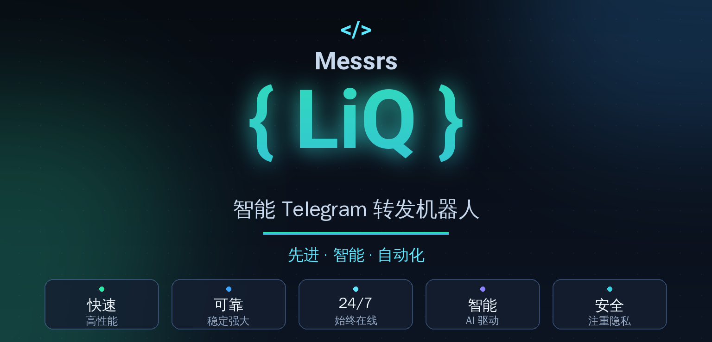
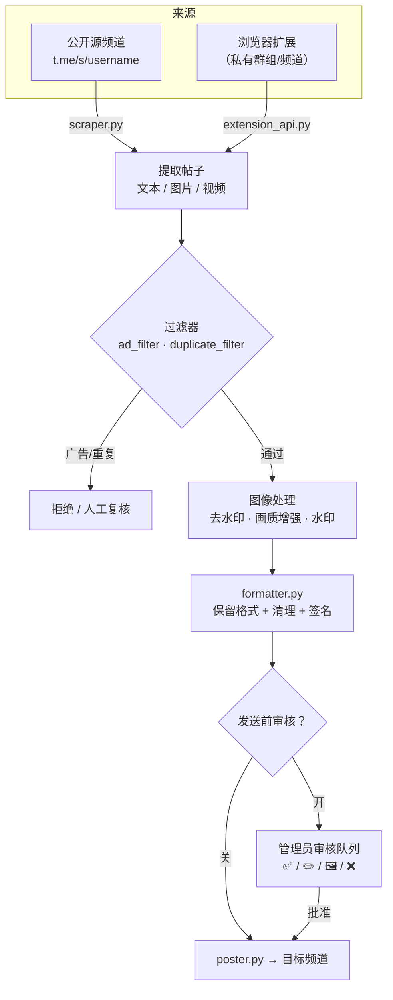

<a id="top"></a>

<div align="center">

🇮🇷 [فارسی](README.md) | 🇬🇧 [English](README.en.md) | 🇷🇺 [Русский](README.ru_RU.md) | 🇨🇳 **中文**



<h3>智能转发、AI 图像处理与完整的 Telegram 频道自动化 —— 一切都在机器人内部完成。</h3>

[](CHANGELOG.md)
[](tests/)
[](https://www.python.org/)
[](LICENSE)
[](https://core.telegram.org/bots/api)
[](#architecture)
[-FF7139?style=flat-square&logo=googlechrome&logoColor=white)](browser-extension/)
[](https://github.com/LiQTeam/telegram-repost/commits)
[](CONTRIBUTING.md)
[](#)

</div>

---

<a id="introduction"></a>

## 📖 简介

**一个完整的 Telegram 频道自动化引擎，而非简单的「复制粘贴」机器人。**

Messrs LiQ 是一个用 **Python** 编写的智能 Telegram 转发机器人：它读取源频道的帖子，进行处理与清理（水印、AI 画质增强、去除链接/广告），并按你的计划投递到目标频道 —— 所有设置都通过内联玻璃按钮在机器人内部完成，无需独立的网页面板。

与简单的转发机器人不同，它**保留原帖格式**（粗体/斜体/链接/剧透），让图片经过 **AI 图像流水线**（用 LaMa 去除水印、用 Real-ESRGAN 增强画质），**自动过滤**广告与重复帖子，并提供**发送前审核队列**，让你在发布前查看并编辑每条帖子。

帖子读取自 Telegram 的公开网页预览页（`t.me/s/username`），因此机器人只需一个 bot token，无需 Telegram 会话或 API ID（MTProto）—— 安装简单又安全，代价是源频道必须公开。对于私有频道，项目附带一个**浏览器扩展**。

<a id="toc"></a>

## 📑 目录

<table align="center" width="100%">
<tr>
  <td align="center" width="25%">📖 <a href="#introduction">简介</a></td>
  <td align="center" width="25%">⚠️ <a href="#important">重要提示</a></td>
  <td align="center" width="25%">✨ <a href="#features">功能特性</a></td>
  <td align="center" width="25%">🏗 <a href="#architecture">架构</a></td>
</tr>
<tr>
  <td align="center">🚀 <a href="#quick-start">快速开始</a></td>
  <td align="center">⚙️ <a href="#configuration">配置</a></td>
  <td align="center">🖥 <a href="#requirements">环境要求</a></td>
  <td align="center">📦 <a href="#structure">项目结构</a></td>
</tr>
<tr>
  <td align="center">⚠️ <a href="#limitations">已知限制</a></td>
  <td align="center">🤝 <a href="#contributing">参与贡献</a></td>
  <td align="center">📄 <a href="#license">许可证</a></td>
  <td align="center">⭐ <a href="#support">支持</a></td>
</tr>
</table>

<a id="important"></a>

## ⚠️ 重要提示（安装前必读）

> [!IMPORTANT]
> - **源频道必须是公开的** —— 内容读取自 `t.me/s/username`。私有频道/群组请使用**浏览器扩展**。
> - **这不是 Userbot/MTProto 客户端** —— 仅凭 bot token 工作；因此「即时」模式有最多 30 秒的延迟，而非在发布的同一刻。
> - **AI 功能为可选** —— 水印去除（LaMa）与画质增强（Real-ESRGAN）需要模型文件（约 220MB）和 `torch`；缺失时机器人仍完整运行，仅这两项被禁用。
> - **AI 裁决与图像生成需要 API 密钥** —— 没有密钥时，过滤器退回本地逻辑（关键词/链接/提及）。
> - **请勿将扩展 API 暴露到公网** —— token 以明文传输；仅在防火墙之后启用。

<a id="features"></a>

## ✨ 功能特性

以下每项功能均直接取自源码，并标注相关模块。

### 📡 频道管理
- **多源频道与多目标频道** —— 任意数量的公开源与目标，各自独立开关。`database.py`
- **任意的 源 ↔ 目标 映射** —— 一源到多目标、一目标收多源（完整 fan-out）。`scheduler.py`
- **自定义频道名称** —— 列表中显示易读标签，而非原始 username。`handlers/inputs.py`

### ⏱ 计划与投递
- **七时段每小时计划** —— 每个源有七个独立时段（德黑兰时间），各自可开关与改时。`scheduler.py`
- **三种发送模式** —— 计划、即时（每 30 秒轮询）或间隔（每 N 分钟）；每个源仅一种生效。`scheduler.py`
- **停机补发** —— 时段的积压帖子在机器人重启后一次性补发。`scheduler.py`
- **即时发送最近 10/20/30 条** —— 按该频道的审核规则发送。`manual_poster.py`

### 🛡 内容审核
- **发送前审核队列** —— 每条帖子的预览，含四个按钮：**✅ 批准**、**✏️ 编辑说明**、**🖼 替换图片**、**❌ 拒绝**。`poster.py`
- **每用户专属审核频道** —— 每位操作者在单独频道中拥有自己的队列。`cli.py`

### 🖼 图像处理与水印
- **AI 画质增强** —— 用 `SRVGGNetCompact`（Real-ESRGAN 系列）锐化/放大，针对 CPU 优化。`sr_model.py`
- **Telegram 与 Instagram 独立水印** —— 文本、6 个位置、纯色/渐变色（10 种预设）、透明度、字号与实时预览。`custom_watermark.py`
- **AI 水印去除** —— 通过模板匹配与角落启发式检测，用 **LaMa** 修复并自动回退到 `cv2.inpaint`。`ai_watermark.py` · `lama_model.py`

### 🤖 人工智能
- **文本裁决路由** —— 依据文本长度/类型在 **Mistral** 与 **Groq** 间自动选择。`ai_router.py`
- **带故障转移链的图像生成** —— Pollinations → DeepAI → Stable Horde。`image_router.py`

### 🧠 智能过滤
- **广告帖过滤（v3）** —— 上下文分析（关键词、链接/提及数量、合集模式、VPN/代理配置文件）+ 可选 AI 裁决；动作为「拒绝」或「人工复核」。`ad_filter.py`
- **重复帖过滤** —— 精确（哈希）匹配 + 模糊层，用于带不同签名的同一新闻。`duplicate_filter.py`
- **格式保留与清理** —— Telegram 安全 HTML + 去除源频道的链接/提及/电话号码及帖尾签名。`formatter.py`

### 📰 自动发布（隔离模块）
- **新闻、价格与广告** —— 拥有独立数据库（`auto_poster.db`）的独立子系统：价格（法币/加密/黄金/市场）、定时广告与带审核队列的新闻。`bot/auto_poster/`

### 🛠 运维与稳健性
- **加密备份与恢复** —— 带密码的备份、发送到频道，以及按表 SAVEPOINT 的恢复。`backup_manager.py`
- **缓存与并发** —— 带 TTL 的下载缓存，重任务在信号量之下的独立线程运行。`cache.py` · `concurrency.py`
- **监控与通知** —— CPU/RAM/磁盘监控、管理员通知到私有频道，以及公开报告频道。`resource_monitor.py` · `notification_manager.py` · `public_report_channel.py`
- **过滤反馈报告（+ Excel）** —— 过滤器性能统计与明细，导出为 Excel 文件。`ad_feedback_report.py`

### 🌐 浏览器扩展与工具
- **Telegram Web 连接器（Chrome MV3）** —— 从你已登录标签页中打开的私有群组/频道读取内容，经本地 API 发送给机器人。`browser-extension/` · `extension_api.py`
- **完整面板 + CLI** —— 彩色内联按钮（Bot API 9.4）与命令行工具，用于添加频道/用户、列表、查看统计与备份。`button_style.py` · `cli.py`

<a id="architecture"></a>

## 🏗 架构

一条帖子从源到目标的路径：



重任务在信号量之下的独立线程中运行，使机器人永不卡死。

<a id="quick-start"></a>

## 🚀 快速开始

在 Linux 服务器（Ubuntu / Debian / CentOS）上，一行命令安装：

```bash
curl -fsSL https://raw.githubusercontent.com/LiQTeam/telegram-repost/main/install.sh | sudo bash
```

安装器为**交互式**，会询问：

| 询问项 | 说明 |
|---|---|
| Bot token | 来自 [@BotFather](https://t.me/BotFather) |
| 管理员 ID | 来自 [@userinfobot](https://t.me/userinfobot)，逗号分隔 |
| 默认目标频道 | 可选 —— 之后可添加 |
| Mistral / Groq 密钥 | 可选 —— 用于 AI 裁决 |

随后它会安装依赖、`virtualenv`、软件包与 AI 模型，生成 `.env`，并将机器人作为 **systemd** 服务运行（常驻 + 自动重启，时区 `Asia/Tehran`）。最后在 Telegram 中向机器人发送 `/start`。

<details>
<summary><b>服务管理与手动安装</b></summary>

<br/>

**服务管理：**

```bash
systemctl status  mrliq-bot     # 状态
systemctl restart mrliq-bot     # 重启（编辑 .env 后）
journalctl -u mrliq-bot -f      # 实时日志
```

**手动安装：**

```bash
git clone https://github.com/LiQTeam/telegram-repost.git
cd telegram-repost
python3 -m venv venv && source venv/bin/activate
pip install -r requirements.txt --extra-index-url https://download.pytorch.org/whl/cpu
cp .env.example .env      # 然后用你的 token/ID 填写 .env
python3 main.py
```

> 不支持 Docker；官方部署方式为 systemd。

</details>

<a id="configuration"></a>

## ⚙️ 配置

所有变量均从 `.env` 读取（示例：[`.env.example`](.env.example)）。仅 `BOT_TOKEN` 与 `ADMIN_IDS` 为必填。

| 变量 | 必填 | 默认值 | 说明 |
|---|:---:|---|---|
| `BOT_TOKEN` | ✅ | — | 来自 @BotFather 的 bot token |
| `ADMIN_IDS` | ✅ | — | 管理员数字 ID，逗号分隔 |
| `TARGET_CHAT_ID` | — | — | 默认目标频道 |
| `DB_PATH` | — | `data/bot.sqlite` | SQLite 数据库路径 |
| `TIMEZONE` | — | `Asia/Tehran` | 计划所用时区 |
| `MAX_CONCURRENT_HEAVY_JOBS` | — | `3` | 同时处理的最大图片数 |
| `DOWNLOAD_CACHE_MAX_ITEMS` | — | `200` | 下载缓存条目上限 |
| `DOWNLOAD_CACHE_TTL_SECONDS` | — | `1800` | 缓存条目保留时长（秒） |
| `DOWNLOAD_CACHE_MAX_BYTES` | — | `157286400` | 缓存总量上限（字节，150MB） |
| `MAX_DOWNLOAD_BYTES` | — | `62914560` | 单文件下载上限（60MB） |
| `AD_FILTER_CACHE_MAX_ITEMS` | — | `2000` | AI 结果缓存上限 |
| `AD_FILTER_CACHE_TTL_SECONDS` | — | `21600` | 广告过滤缓存 TTL（秒） |
| `TEMPLATE_MATCH_THRESHOLD` | — | `0.75` | 水印模板匹配阈值 |
| `MAX_WATERMARK_AREA_RATIO` | — | `0.3` | 修复区域最大面积占比 |
| `MISTRAL_API_KEY` / `GROQ_API_KEY` | — | — | AI 裁决密钥（可选） |
| `POLLINATIONS_API_KEY` / `DEEPAI_API_KEY` / `STABLEHORDE_API_KEY` | — | — | 图像生成密钥（可选） |
| `EXTENSION_API_ENABLED` | — | `false` | 启用扩展 API |
| `EXTENSION_API_HOST` / `EXTENSION_API_PORT` | — | `0.0.0.0` / `8843` | 扩展 API 主机与端口 |
| `EXTENSION_API_TOKEN` | — | — | 机器人 ↔ 扩展 共享 token |

<a id="requirements"></a>

## 🖥 环境要求

| 项目 | 最低 / 推荐 |
|---|---|
| **Python** | 3.10 或更高 |
| **操作系统** | Linux（Ubuntu / Debian / CentOS 及衍生版） |
| **内存** | 最低 1GB；启用 AI 功能时**推荐 2GB+** |
| **磁盘** | 内核约 500MB + AI 模型**约 220MB**（`big-lama.pt` 约 200MB，`realesr-general-x4v3.pth` 约 17MB） |

**关键依赖：** `python-telegram-bot 21.6`、`aiohttp`、`beautifulsoup4`、`Pillow`、`opencv-python-headless`、`torch 2.4.1 (CPU)`、`cryptography`、`psutil`、`jdatetime`。完整列表见 [`requirements.txt`](requirements.txt)。

<a id="structure"></a>

## 📦 项目结构

```
telegram-repost/
├── main.py                  # 入口：机器人 + 计划器 + 监控 + 扩展 API
├── cli.py                   # 命令行工具（频道/用户、列表、统计、备份）
├── install.sh               # VPS 自动安装（systemd、下载模型）
├── requirements.txt · .env.example · CHANGELOG.md
├── assets/                  # 横幅与捐赠按钮
├── fonts/                   # 波斯语 Vazirmatn 字体（水印）
├── data/                    # SQLite 数据库 + 日志（运行时生成）
├── docs/                    # 补充文档（部署、调试）
├── scripts/                 # 横幅/按钮生成器（Pillow）
├── tests/                   # 自动化测试 —— python3 tests/run_all.py
├── browser-extension/       # Telegram Web 连接器（Chrome MV3）
└── bot/
    ├── config.py · database.py · scraper.py · formatter.py
    ├── poster.py · scheduler.py · smart_scheduler.py · manual_poster.py
    ├── watermark.py · custom_watermark.py · ai_watermark.py · lama_model.py · sr_model.py
    ├── image_router.py · ai_router.py · ad_filter.py · duplicate_filter.py · ad_feedback_report.py
    ├── cache.py · concurrency.py · backup_manager.py · extension_api.py
    ├── resource_monitor.py · notification_manager.py · public_report_channel.py
    ├── button_style.py · button_config.py · jdatetime_utils.py · utils.py · keyboards.py
    ├── handlers/            # menu.py · inputs.py · common.py
    └── auto_poster/         # 隔离的「价格/广告/新闻」模块（独立数据库）
```

<a id="limitations"></a>

## ⚠️ 已知限制

- 源频道必须公开（私有仅可通过扩展）。
- 即时模式有最多 30 秒延迟（无 MTProto/Userbot）。
- 大体积视频有时在公开预览页没有直链而被跳过。
- 源图片画质已被 Telegram 压缩；「AI 增强」只能部分补偿，无法还原原图。
- 计划模式下，源的每日发送上限等于其启用的时段数（最多 7）。
- 按钮颜色仅在较新的 Telegram 客户端可见（三种：蓝/绿/红）。
- AI 模型与 API 密钥为可选；缺失时相关功能会被禁用。

<a id="contributing"></a>

## 🤝 参与贡献

欢迎贡献！提交 Pull Request 前请阅读 [`CONTRIBUTING.md`](CONTRIBUTING.md)。简言之：Fork 仓库、在单独分支上工作、用 `python3 tests/run_all.py` 运行测试，并附清晰说明提交 PR。

<a id="license"></a>

## 📄 许可证

以 **MIT** 许可证发布 —— 见 [`LICENSE`](LICENSE)。

<a id="support"></a>

## ⭐ 支持

如果本项目对你有帮助，请点一个 ⭐ —— 这是持续开发的最好动力。

<div align="center">
<br/>
<!-- 替换为你自己的捐赠链接 -->
<a href="https://github.com/LiQTeam/telegram-repost"></a>
<br/><br/>
<sub><a href="#top">⬆️ 回到顶部</a></sub>
</div>
